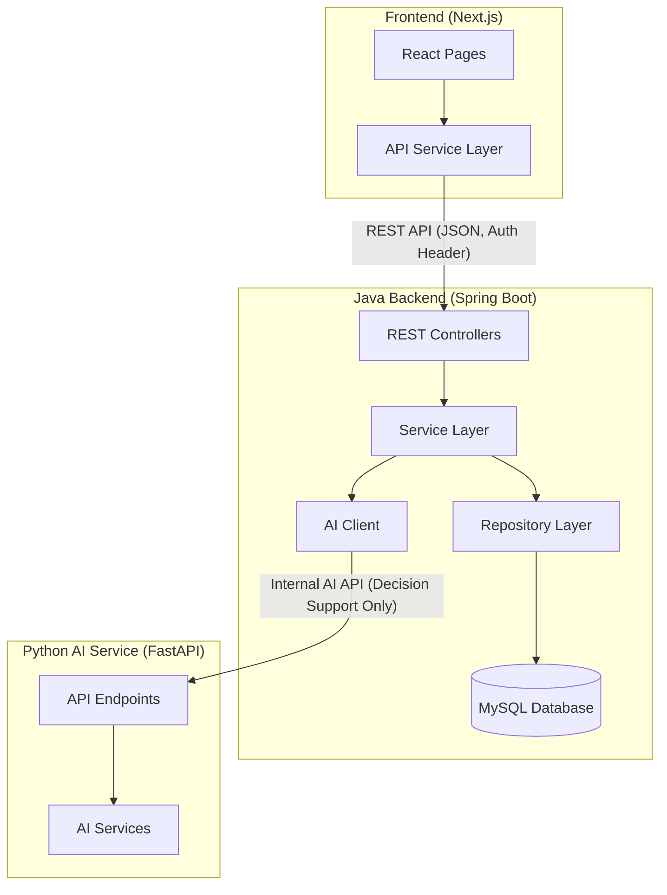
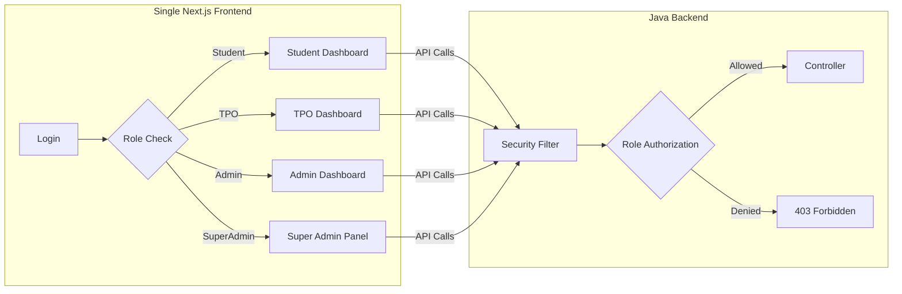

# AI-Assisted Smart Campus Placement & Career Management System

## Implementation Plan - Project Skeleton

This document outlines the complete implementation plan for creating a **clean, scalable, and interview-ready project skeleton** for the AI-Assisted Smart Campus Placement System.

---

## 1. Executive Summary

### 1.1 Project Overview

A modular monolithic system for managing campus placements with AI-assisted decision support. The skeleton provides:

- **Java Spring Boot Backend** - Core business logic, REST APIs, authentication
- **Python FastAPI AI Service** - Eligibility scoring, skill gap analysis
- **Next.js Frontend** - Modern React-based UI with file-based routing

> **"The AI module acts strictly as a decision-support system and does not autonomously make placement decisions."**

### 1.2 Architecture Diagram



### 1.3 Key Design Principles

| Principle | Implementation |
|-----------|----------------|
| Modular Monolith | Feature-based package structure, not microservices |
| Separation of Concerns | Controller → Service → Repository pattern |
| Loose Coupling | Interface-based design, DTOs for data transfer |
| Future-Ready | Clean abstractions, easy to extend |
| Interview-Defensible | Industry-standard patterns, well-documented |

---

## 2. Non-Functional Design Considerations

| Quality Attribute | Design Approach |
|-------------------|-----------------|
| **Scalability (Logical)** | Modular monolithic design allows independent scaling of AI module in future |
| **Security** | Authentication & authorization enforced at backend; AI service is internal-only |
| **Maintainability** | Feature-based package structure, DTO separation, service abstraction |
| **Testability** | Clear separation enables unit testing of services and isolated testing of AI logic |

---

## 3. Role-Based Access Control (RBAC) Design

The system implements role-based access control using a **single frontend** and a **single backend** architecture.

### 3.1 Supported Roles

| Role | Access Scope |
|------|--------------|
| **Student** | Profile, placement drives, applications, eligibility results, career insights |
| **Placement Coordinator (TPO)** | Manage placement drives, shortlist students, view analytics, company coordination |
| **College Admin** | Manage users, departments, system configuration, reports |
| **Super Admin** | Global system administration, role management, audit logs |

### 3.2 Design Approach



| Aspect | Implementation |
|--------|----------------|
| **Frontend Routing** | Role-based dynamic routing with protected route components |
| **Backend Authorization** | Spring Security with `@PreAuthorize` annotations |
| **Token-Based Auth** | JWT tokens containing user role claims |
| **Unauthorized Access** | Redirected to `/forbidden` page with appropriate message |

### 3.3 Benefits

| Benefit | Description |
|---------|-------------|
| **No Code Duplication** | Single frontend codebase serves all roles |
| **Maintainability** | Centralized authorization logic in backend |
| **Scalability** | Easy to add new roles without architectural changes |
| **Industry Alignment** | Matches modern SaaS multi-tenant architecture patterns |

---

## 4. User Review Required

> [!IMPORTANT]
> **Technology Stack Confirmation Required**
> Please confirm the following technology choices before proceeding:
> - Java 21+ with Spring Boot 3.x
> - Python 3.10+ with FastAPI
> - Next.js 14+ with App Router
> - MySQL 8.x for database
> - Maven for Java build

> [!NOTE]
> **Skeleton-Only Implementation**
> This plan produces ONLY project structure with:
> - Method signatures with `// TODO` comments
> - Entity classes with basic fields (no complex relationships)
> - API endpoint placeholders
> - **No actual business logic implementation**

---

## 5. Proposed Changes

### 5.1 Project Root Structure

```text
Placement Management/
├── backend/                    # Java Spring Boot Application
├── ai-service/                 # Python FastAPI AI Service
├── frontend/                   # Next.js React Application
├── docs/                       # Documentation & UML placeholders
│   ├── architecture.md
│   ├── api-specs.md
│   └── uml-diagrams/
└── README.md                   # Root documentation
```

---

### 5.2 Backend (Java Spring Boot)

#### Component Overview

| Module | Purpose | Key Files |
|--------|---------|-----------|
| `auth` | Authentication & Authorization | Controller, Service, Repository, DTOs |
| `users` | User management (Admin, TPO) | Controller, Service, Repository, Entity |
| `students` | Student profile management | Controller, Service, Repository, Entity |
| `companies` | Company/Recruiter management | Controller, Service, Repository, Entity |
| `drives` | Placement drive management | Controller, **Service Interface + Impl**, Repository, Entity |
| `applications` | Job application tracking | Controller, **Service Interface + Impl**, Repository, Entity |
| `eligibility` | Eligibility result storage | Controller, **Service Interface + Impl**, Repository, Entity |
| `analytics` | Placement analytics | Controller, Service |
| `ai` | AI service integration client | AIClient, AIResponseDTO |
| `common` | Shared utilities | BaseEntity, ApiResponse, Constants |
| `config` | Application configuration | SecurityConfig, CorsConfig |

#### Service Interface Pattern (Clean Architecture)

For key modules (`drives`, `applications`, `eligibility`), we use the interface-implementation pattern:

```text
drives/
├── DriveService.java           # Interface defining contract
├── DriveServiceImpl.java       # Implementation class
```

> [!TIP]
> This pattern enables:
> - Clean UML Class Diagrams with interface dependencies
> - Easy mocking for unit tests
> - CRC card documentation
> - Dependency Inversion principle demonstration

---

#### [NEW] [pom.xml](file:///c:/Users/urvag/Downloads/Projects/Placement%20Management/backend/pom.xml)

Maven configuration with dependencies:
- Spring Boot Starter Web
- Spring Boot Starter Data JPA
- Spring Boot Starter Security
- Spring Boot Starter Validation
- MySQL Connector
- Lombok
- SpringDoc OpenAPI (Swagger)

---

#### [NEW] [CampusPlacementApplication.java](file:///c:/Users/urvag/Downloads/Projects/Placement%20Management/backend/src/main/java/com/campusplacement/CampusPlacementApplication.java)

Main Spring Boot application entry point with `@SpringBootApplication` annotation.

---

#### [NEW] Config Module

##### [SecurityConfig.java](file:///c:/Users/urvag/Downloads/Projects/Placement%20Management/backend/src/main/java/com/campusplacement/config/SecurityConfig.java)

```java
// Basic Spring Security configuration skeleton
// - CSRF disabled for REST API
// - CORS configuration
// - Basic authentication placeholder
// - Endpoint protection rules (TODO)
```

##### [CorsConfig.java](file:///c:/Users/urvag/Downloads/Projects/Placement%20Management/backend/src/main/java/com/campusplacement/config/CorsConfig.java)

```java
// Cross-origin configuration for frontend integration
// - Allow localhost:3000 (Next.js dev)
// - Allow production origins (TODO)
```

---

#### [NEW] Common Module

##### [BaseEntity.java](file:///c:/Users/urvag/Downloads/Projects/Placement%20Management/backend/src/main/java/com/campusplacement/common/BaseEntity.java)

```java
@MappedSuperclass
public abstract class BaseEntity {
    @Id @GeneratedValue(strategy = GenerationType.IDENTITY)
    private Long id;

    private LocalDateTime createdAt;
    private LocalDateTime updatedAt;

    @PrePersist // Auto-set timestamps
    @PreUpdate
}
```

##### [ApiResponse.java](file:///c:/Users/urvag/Downloads/Projects/Placement%20Management/backend/src/main/java/com/campusplacement/common/ApiResponse.java)

```java
// Generic API response wrapper
// - success: boolean
// - message: String
// - data: T (generic payload)
// - errors: List<String>
```

##### [Constants.java](file:///c:/Users/urvag/Downloads/Projects/Placement%20Management/backend/src/main/java/com/campusplacement/common/Constants.java)

```java
// Application-wide constants
// - Role names (ADMIN, TPO, STUDENT, COMPANY)
// - Status enums
// - API version prefix: "/api/v1"
```

---

#### [NEW] Auth Module

| File | Description |
|------|-------------|
| [AuthController.java](file:///c:/Users/urvag/Downloads/Projects/Placement%20Management/backend/src/main/java/com/campusplacement/auth/AuthController.java) | `/api/v1/auth/**` endpoints for login, register, logout |
| [AuthService.java](file:///c:/Users/urvag/Downloads/Projects/Placement%20Management/backend/src/main/java/com/campusplacement/auth/AuthService.java) | Authentication business logic with TODO placeholders |
| [AuthRepository.java](file:///c:/Users/urvag/Downloads/Projects/Placement%20Management/backend/src/main/java/com/campusplacement/auth/AuthRepository.java) | Extends JpaRepository for User entity |
| [LoginRequestDTO.java](file:///c:/Users/urvag/Downloads/Projects/Placement%20Management/backend/src/main/java/com/campusplacement/auth/dto/LoginRequestDTO.java) | email, password fields |
| [LoginResponseDTO.java](file:///c:/Users/urvag/Downloads/Projects/Placement%20Management/backend/src/main/java/com/campusplacement/auth/dto/LoginResponseDTO.java) | token, user details |
| [RegisterRequestDTO.java](file:///c:/Users/urvag/Downloads/Projects/Placement%20Management/backend/src/main/java/com/campusplacement/auth/dto/RegisterRequestDTO.java) | Registration payload |

---

#### [NEW] Users Module

| File | Description |
|------|-------------|
| [User.java](file:///c:/Users/urvag/Downloads/Projects/Placement%20Management/backend/src/main/java/com/campusplacement/users/User.java) | Entity with id, email, password, role, name, createdAt |
| [UserController.java](file:///c:/Users/urvag/Downloads/Projects/Placement%20Management/backend/src/main/java/com/campusplacement/users/UserController.java) | CRUD endpoints for user management |
| [UserService.java](file:///c:/Users/urvag/Downloads/Projects/Placement%20Management/backend/src/main/java/com/campusplacement/users/UserService.java) | User business logic placeholders |
| [UserRepository.java](file:///c:/Users/urvag/Downloads/Projects/Placement%20Management/backend/src/main/java/com/campusplacement/users/UserRepository.java) | JPA repository with findByEmail |
| [UserDTO.java](file:///c:/Users/urvag/Downloads/Projects/Placement%20Management/backend/src/main/java/com/campusplacement/users/dto/UserDTO.java) | User data transfer object |

---

#### [NEW] Students Module

| File | Description |
|------|-------------|
| [StudentProfile.java](file:///c:/Users/urvag/Downloads/Projects/Placement%20Management/backend/src/main/java/com/campusplacement/students/StudentProfile.java) | Entity: userId, enrollmentNo, department, cgpa, skills, resumeUrl |
| [StudentController.java](file:///c:/Users/urvag/Downloads/Projects/Placement%20Management/backend/src/main/java/com/campusplacement/students/StudentController.java) | Profile CRUD, skill update endpoints |
| [StudentService.java](file:///c:/Users/urvag/Downloads/Projects/Placement%20Management/backend/src/main/java/com/campusplacement/students/StudentService.java) | Student business logic |
| [StudentRepository.java](file:///c:/Users/urvag/Downloads/Projects/Placement%20Management/backend/src/main/java/com/campusplacement/students/StudentRepository.java) | JPA repository |
| [StudentProfileDTO.java](file:///c:/Users/urvag/Downloads/Projects/Placement%20Management/backend/src/main/java/com/campusplacement/students/dto/StudentProfileDTO.java) | Profile DTO |
| [StudentSkillsDTO.java](file:///c:/Users/urvag/Downloads/Projects/Placement%20Management/backend/src/main/java/com/campusplacement/students/dto/StudentSkillsDTO.java) | Skills update DTO |

---

#### [NEW] Companies Module

| File | Description |
|------|-------------|
| [Company.java](file:///c:/Users/urvag/Downloads/Projects/Placement%20Management/backend/src/main/java/com/campusplacement/companies/Company.java) | Entity: name, industry, website, description, logoUrl |
| [CompanyController.java](file:///c:/Users/urvag/Downloads/Projects/Placement%20Management/backend/src/main/java/com/campusplacement/companies/CompanyController.java) | Company CRUD endpoints |
| [CompanyService.java](file:///c:/Users/urvag/Downloads/Projects/Placement%20Management/backend/src/main/java/com/campusplacement/companies/CompanyService.java) | Company business logic |
| [CompanyRepository.java](file:///c:/Users/urvag/Downloads/Projects/Placement%20Management/backend/src/main/java/com/campusplacement/companies/CompanyRepository.java) | JPA repository |
| [CompanyDTO.java](file:///c:/Users/urvag/Downloads/Projects/Placement%20Management/backend/src/main/java/com/campusplacement/companies/dto/CompanyDTO.java) | Company DTO |

---

#### [NEW] Drives Module (With Interface Pattern)

| File | Description |
|------|-------------|
| [PlacementDrive.java](file:///c:/Users/urvag/Downloads/Projects/Placement%20Management/backend/src/main/java/com/campusplacement/drives/PlacementDrive.java) | Entity: companyId, title, description, eligibilityCriteria, driveDate, status |
| [DriveController.java](file:///c:/Users/urvag/Downloads/Projects/Placement%20Management/backend/src/main/java/com/campusplacement/drives/DriveController.java) | Drive management endpoints |
| [DriveService.java](file:///c:/Users/urvag/Downloads/Projects/Placement%20Management/backend/src/main/java/com/campusplacement/drives/DriveService.java) | **Interface** defining drive operations |
| [DriveServiceImpl.java](file:///c:/Users/urvag/Downloads/Projects/Placement%20Management/backend/src/main/java/com/campusplacement/drives/DriveServiceImpl.java) | **Implementation** of DriveService |
| [DriveRepository.java](file:///c:/Users/urvag/Downloads/Projects/Placement%20Management/backend/src/main/java/com/campusplacement/drives/DriveRepository.java) | JPA repository |
| [DriveDTO.java](file:///c:/Users/urvag/Downloads/Projects/Placement%20Management/backend/src/main/java/com/campusplacement/drives/dto/DriveDTO.java) | Drive DTO |
| [CreateDriveRequestDTO.java](file:///c:/Users/urvag/Downloads/Projects/Placement%20Management/backend/src/main/java/com/campusplacement/drives/dto/CreateDriveRequestDTO.java) | Create drive request |

---

#### [NEW] Applications Module (With Interface Pattern)

| File | Description |
|------|-------------|
| [Application.java](file:///c:/Users/urvag/Downloads/Projects/Placement%20Management/backend/src/main/java/com/campusplacement/applications/Application.java) | Entity: studentId, driveId, status, appliedAt, notes |
| [ApplicationController.java](file:///c:/Users/urvag/Downloads/Projects/Placement%20Management/backend/src/main/java/com/campusplacement/applications/ApplicationController.java) | Application management endpoints |
| [ApplicationService.java](file:///c:/Users/urvag/Downloads/Projects/Placement%20Management/backend/src/main/java/com/campusplacement/applications/ApplicationService.java) | **Interface** defining application operations |
| [ApplicationServiceImpl.java](file:///c:/Users/urvag/Downloads/Projects/Placement%20Management/backend/src/main/java/com/campusplacement/applications/ApplicationServiceImpl.java) | **Implementation** of ApplicationService |
| [ApplicationRepository.java](file:///c:/Users/urvag/Downloads/Projects/Placement%20Management/backend/src/main/java/com/campusplacement/applications/ApplicationRepository.java) | JPA repository |
| [ApplicationDTO.java](file:///c:/Users/urvag/Downloads/Projects/Placement%20Management/backend/src/main/java/com/campusplacement/applications/dto/ApplicationDTO.java) | Application DTO |
| [ApplyRequestDTO.java](file:///c:/Users/urvag/Downloads/Projects/Placement%20Management/backend/src/main/java/com/campusplacement/applications/dto/ApplyRequestDTO.java) | Apply to drive request |

---

#### [NEW] Eligibility Module (With Interface Pattern)

| File | Description |
|------|-------------|
| [EligibilityResult.java](file:///c:/Users/urvag/Downloads/Projects/Placement%20Management/backend/src/main/java/com/campusplacement/eligibility/EligibilityResult.java) | Entity: studentId, driveId, score, isEligible, reasons, calculatedAt |
| [EligibilityController.java](file:///c:/Users/urvag/Downloads/Projects/Placement%20Management/backend/src/main/java/com/campusplacement/eligibility/EligibilityController.java) | Eligibility check endpoints |
| [EligibilityService.java](file:///c:/Users/urvag/Downloads/Projects/Placement%20Management/backend/src/main/java/com/campusplacement/eligibility/EligibilityService.java) | **Interface** for eligibility operations |
| [EligibilityServiceImpl.java](file:///c:/Users/urvag/Downloads/Projects/Placement%20Management/backend/src/main/java/com/campusplacement/eligibility/EligibilityServiceImpl.java) | **Implementation** orchestrating AI calls |
| [EligibilityRepository.java](file:///c:/Users/urvag/Downloads/Projects/Placement%20Management/backend/src/main/java/com/campusplacement/eligibility/EligibilityRepository.java) | JPA repository |
| [EligibilityResultDTO.java](file:///c:/Users/urvag/Downloads/Projects/Placement%20Management/backend/src/main/java/com/campusplacement/eligibility/dto/EligibilityResultDTO.java) | Eligibility result DTO |

---

#### [NEW] Analytics Module

| File | Description |
|------|-------------|
| [AnalyticsController.java](file:///c:/Users/urvag/Downloads/Projects/Placement%20Management/backend/src/main/java/com/campusplacement/analytics/AnalyticsController.java) | Analytics dashboard endpoints |
| [AnalyticsService.java](file:///c:/Users/urvag/Downloads/Projects/Placement%20Management/backend/src/main/java/com/campusplacement/analytics/AnalyticsService.java) | Analytics calculation logic |
| [PlacementStatsDTO.java](file:///c:/Users/urvag/Downloads/Projects/Placement%20Management/backend/src/main/java/com/campusplacement/analytics/dto/PlacementStatsDTO.java) | Overall placement statistics |
| [DepartmentStatsDTO.java](file:///c:/Users/urvag/Downloads/Projects/Placement%20Management/backend/src/main/java/com/campusplacement/analytics/dto/DepartmentStatsDTO.java) | Department-wise statistics |

---

#### [NEW] AI Client Module

| File | Description |
|------|-------------|
| [AIClient.java](file:///c:/Users/urvag/Downloads/Projects/Placement%20Management/backend/src/main/java/com/campusplacement/ai/AIClient.java) | HTTP client calling Python AI `/api/v1/**` endpoints |
| [AIResponseDTO.java](file:///c:/Users/urvag/Downloads/Projects/Placement%20Management/backend/src/main/java/com/campusplacement/ai/AIResponseDTO.java) | Response from AI service |
| [EligibilityRequestDTO.java](file:///c:/Users/urvag/Downloads/Projects/Placement%20Management/backend/src/main/java/com/campusplacement/ai/dto/EligibilityRequestDTO.java) | Request to AI for eligibility |
| [SkillGapRequestDTO.java](file:///c:/Users/urvag/Downloads/Projects/Placement%20Management/backend/src/main/java/com/campusplacement/ai/dto/SkillGapRequestDTO.java) | Request to AI for skill gap |

---

#### [NEW] [application.yml](file:///c:/Users/urvag/Downloads/Projects/Placement%20Management/backend/src/main/resources/application.yml)

```yaml
spring:
  datasource:
    url: jdbc:mysql://localhost:3306/campus_placement
    username: root
    password: # TODO: Configure
  jpa:
    hibernate:
      ddl-auto: update
    show-sql: true

ai-service:
  base-url: http://localhost:8000/api/v1

server:
  port: 8080
```

---

### 5.3 AI Service (Python FastAPI)

#### [NEW] Project Structure

```text
ai-service/
├── app.py                      # FastAPI application entry
├── requirements.txt            # Python dependencies
├── models/
│   ├── __init__.py
│   ├── student.py              # Student Pydantic model
│   └── job.py                  # Job/Drive Pydantic model
├── services/
│   ├── __init__.py
│   ├── eligibility_service.py  # Eligibility scoring logic
│   └── skill_gap_service.py    # Skill gap analysis logic
└── schemas/
    ├── __init__.py
    ├── eligibility.py          # Request/Response schemas
    └── skill_gap.py            # Skill gap schemas
```

---

#### [NEW] [app.py](file:///c:/Users/urvag/Downloads/Projects/Placement%20Management/ai-service/app.py)

```python
# FastAPI application with versioned API endpoints:
# - GET  /health                       - Health check endpoint
# - POST /api/v1/eligibility/score     - Calculate eligibility score
# - POST /api/v1/skills/gap-analysis   - Analyze skill gaps
# - POST /api/v1/career/insights       - Career recommendations (TODO)

# Note: All endpoints use /api/v1 prefix for API versioning consistency
```

---

#### [NEW] [requirements.txt](file:///c:/Users/urvag/Downloads/Projects/Placement%20Management/ai-service/requirements.txt)

```text
fastapi==0.109.0
uvicorn==0.27.0
pydantic==2.5.3
python-dotenv==1.0.0
httpx==0.26.0
```

---

#### [NEW] [models/student.py](file:///c:/Users/urvag/Downloads/Projects/Placement%20Management/ai-service/models/student.py)

```python
class StudentModel(BaseModel):
    student_id: int
    name: str
    department: str
    cgpa: float
    skills: List[str]
    certifications: List[str] = []
    projects_count: int = 0
    internship_months: int = 0
```

---

#### [NEW] [models/job.py](file:///c:/Users/urvag/Downloads/Projects/Placement%20Management/ai-service/models/job.py)

```python
class JobRequirements(BaseModel):
    min_cgpa: float
    required_skills: List[str]
    preferred_skills: List[str] = []
    eligible_departments: List[str]
```

---

#### [NEW] [services/eligibility_service.py](file:///c:/Users/urvag/Downloads/Projects/Placement%20Management/ai-service/services/eligibility_service.py)

```python
# EligibilityService class with:
# - calculate_score(student, job_requirements) -> EligibilityResult
# - Rule-based scoring:
#   - CGPA weight: 30%
#   - Skills match: 40%
#   - Experience: 20%
#   - Certifications: 10%
# - TODO: Implement actual scoring logic
```

---

#### [NEW] [services/skill_gap_service.py](file:///c:/Users/urvag/Downloads/Projects/Placement%20Management/ai-service/services/skill_gap_service.py)

```python
# SkillGapService class with:
# - analyze_gaps(student_skills, required_skills) -> SkillGapResult
# - get_recommendations(skill_gaps) -> List[str]
# - TODO: Implement skill gap analysis
```

---

### 5.4 Frontend (Next.js)

#### [NEW] Project Initialization

```bash
npx -y create-next-app@latest ./ --typescript --eslint --tailwind --app --src-dir --import-alias "@/*"
```

> [!NOTE]
> **Why Next.js?**
> - Industry-standard React framework (used by Netflix, Uber, Notion)
> - File-based routing eliminates boilerplate
> - Built-in API routes for BFF pattern if needed
> - TypeScript support out of the box
> - Strong resume signal for modern web development
> - **Next.js App Router was chosen to enable scalable, role-based dashboards with clear route boundaries for students and administrators.**

---

#### [NEW] Directory Structure

```text
frontend/
├── src/
│   ├── app/
│   │   ├── layout.tsx             # Root layout
│   │   ├── page.tsx               # Landing page
│   │   ├── login/
│   │   │   └── page.tsx           # Login page
│   │   ├── register/
│   │   │   └── page.tsx           # Registration page
│   │   ├── dashboard/
│   │   │   ├── layout.tsx         # Dashboard layout
│   │   │   └── page.tsx           # Dashboard home
│   │   ├── student/
│   │   │   ├── profile/
│   │   │   │   └── page.tsx       # Student profile
│   │   │   ├── drives/
│   │   │   │   └── page.tsx       # Available drives
│   │   │   └── applications/
│   │   │       └── page.tsx       # My applications
│   │   ├── admin/
│   │   │   ├── students/
│   │   │   │   └── page.tsx       # Manage students
│   │   │   ├── companies/
│   │   │   │   └── page.tsx       # Manage companies
│   │   │   └── drives/
│   │   │       └── page.tsx       # Manage drives
│   │   └── analytics/
│   │       └── page.tsx           # Analytics dashboard
│   ├── components/
│   │   ├── ui/
│   │   │   ├── Button.tsx
│   │   │   ├── Input.tsx
│   │   │   ├── Card.tsx
│   │   │   ├── Table.tsx
│   │   │   └── Modal.tsx
│   │   ├── layout/
│   │   │   ├── Navbar.tsx
│   │   │   ├── Sidebar.tsx
│   │   │   └── Footer.tsx
│   │   └── forms/
│   │       ├── LoginForm.tsx
│   │       └── ProfileForm.tsx
│   ├── services/
│   │   └── api.ts                 # API client service
│   ├── types/
│   │   ├── user.ts
│   │   ├── student.ts
│   │   ├── company.ts
│   │   ├── drive.ts
│   │   └── application.ts
│   └── utils/
│       ├── auth.ts
│       └── helpers.ts
├── public/
│   └── images/
├── next.config.js
├── tailwind.config.ts
└── package.json
```

---

#### [NEW] [services/api.ts](file:///c:/Users/urvag/Downloads/Projects/Placement%20Management/frontend/src/services/api.ts)

```typescript
// API client with:
// - Base URL configuration
// - Auth token injection
// - Error handling wrapper
// - Methods for each API endpoint:
//   - auth.login(), auth.register(), auth.logout()
//   - students.getProfile(), students.updateProfile()
//   - drives.getAll(), drives.getById(), drives.apply()
//   - applications.getMyApplications()
//   - analytics.getStats()
```

---

#### [NEW] [types/](file:///c:/Users/urvag/Downloads/Projects/Placement%20Management/frontend/src/types/)

TypeScript interfaces matching backend DTOs:

```typescript
// user.ts
interface User {
  id: number;
  email: string;
  name: string;
  role: 'ADMIN' | 'TPO' | 'STUDENT' | 'COMPANY';
}

// student.ts
interface StudentProfile {
  id: number;
  userId: number;
  enrollmentNo: string;
  department: string;
  cgpa: number;
  skills: string[];
  resumeUrl?: string;
}

// drive.ts
interface PlacementDrive {
  id: number;
  companyId: number;
  companyName: string;
  title: string;
  description: string;
  eligibilityCriteria: EligibilityCriteria;
  driveDate: string;
  status: 'UPCOMING' | 'ONGOING' | 'COMPLETED';
}
```

---

### 5.5 Documentation

#### [NEW] [README.md](file:///c:/Users/urvag/Downloads/Projects/Placement%20Management/README.md)

Comprehensive documentation including:
- Project overview and architecture
- Technology stack justification
- Setup instructions for each component
- API documentation references
- Contribution guidelines
- References to SRS, UML diagrams, Z-Notation

> *"Formal Z-specification will model eligibility rules and application state transitions derived from implemented logic."*

---

#### [NEW] [docs/architecture.md](file:///c:/Users/urvag/Downloads/Projects/Placement%20Management/docs/architecture.md)

Detailed architecture documentation:
- Component diagrams
- Data flow diagrams
- Module interaction patterns
- Scalability considerations

---

#### [NEW] [docs/api-specs.md](file:///c:/Users/urvag/Downloads/Projects/Placement%20Management/docs/api-specs.md)

API specification placeholders:
- Endpoint listing (all use `/api/v1` prefix)
- Request/response formats
- Authentication headers
- Error codes

---

## 6. File Count Summary

| Component | Files | Description |
|-----------|-------|-------------|
| Backend | ~48 files | Java Spring Boot skeleton (includes Service interfaces + impls) |
| AI Service | ~12 files | Python FastAPI skeleton |
| Frontend | ~25 files | Next.js skeleton |
| Documentation | ~5 files | README, architecture docs |
| **Total** | **~90 files** | Complete project skeleton |

---

## 7. Verification Plan

### 7.1 Automated Verification

#### Backend Compilation Test
```bash
cd backend
mvn clean compile
```
**Expected**: BUILD SUCCESS with no compilation errors

#### Python Syntax Check
```bash
cd ai-service
python -m py_compile app.py
python -m py_compile services/eligibility_service.py
python -m py_compile services/skill_gap_service.py
```
**Expected**: No syntax errors

#### Frontend Build Test
```bash
cd frontend
npm install
npm run build
```
**Expected**: Build completes successfully

---

### 7.2 Manual Verification

> [!NOTE]
> **For the User**
> After skeleton generation, please verify:

1. **Backend Structure Check**
   - Open `backend/` in your IDE
   - Confirm all packages are visible and properly structured
   - Verify no red underlines (compilation errors)

2. **AI Service Check**
   - Open `ai-service/` in VS Code
   - Run `pip install -r requirements.txt`
   - Run `uvicorn app:app --reload`
   - Access `http://localhost:8000/docs` for Swagger UI

3. **Frontend Check**
   - Open `frontend/` in VS Code
   - Run `npm run dev`
   - Access `http://localhost:3000`
   - Navigate to `/login`, `/dashboard` to verify routing

---

### 7.3 AI Module Testing Strategy

For the AI service, the following testing approaches are recommended:

| Test Type | Description |
|-----------|-------------|
| **Input Validation Tests** | Verify Pydantic models reject invalid data types and out-of-range values |
| **Boundary Value Testing** | Test CGPA at boundaries (0.0, 4.0, 10.0) and score thresholds |
| **Deterministic Output Testing** | Rule-based scoring must produce identical outputs for identical inputs |

> [!TIP]
> Since AI logic is rule-based and deterministic, unit tests can assert exact expected scores for given inputs.

---

## 8. Interview Defense Points

This skeleton demonstrates knowledge of:

| Topic | Evidence in Project |
|-------|---------------------|
| **Software Architecture** | Modular monolith, separation of concerns |
| **Design Patterns** | Repository pattern, DTO pattern, Service Interface pattern |
| **API Design** | RESTful endpoints with `/api/v1` versioning |
| **Database Design** | JPA entities, proper annotations |
| **Service Communication** | HTTP client for internal AI service (decision support only) |
| **Modern Frontend** | Next.js App Router, TypeScript |
| **DevOps Ready** | Maven/npm build tools, configurable properties |

---

## 9. Future Extension Points

The skeleton is designed for easy extension:

1. **Authentication**: Replace basic auth with JWT
2. **Database**: Add relationships, indexes, constraints
3. **AI Service**: Implement actual scoring algorithms
4. **Frontend**: Add state management (Zustand/Redux)
5. **Testing**: Add JUnit tests, pytest, Jest tests
6. **Deployment**: Add Docker, CI/CD configurations

---

## 10. Implementation Timeline

| Phase | Estimated Time | Files |
|-------|----------------|-------|
| Project Setup | 5 min | 3 directories |
| Backend Skeleton | 35 min | ~48 files |
| AI Service Skeleton | 15 min | ~12 files |
| Frontend Skeleton | 20 min | ~25 files |
| Documentation | 10 min | ~5 files |
| **Total** | **~85 min** | **~90 files** |

---

> [!IMPORTANT]
> **FINAL PLAN – Ready for Implementation**
> This implementation plan is academically safe, technically sound, resume-optimized, and interview-defensible.
> Upon approval, all skeleton files will be generated with proper structure, annotations, and TODO placeholders.
