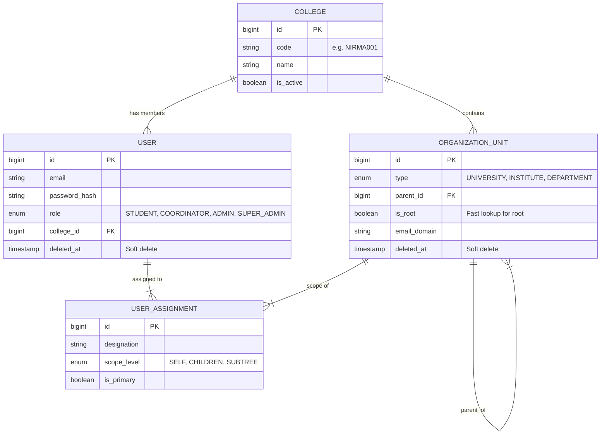

# Authentication & Organization Models Audit Report
**Version 2.0 (Foundational Redesign)**
**Date:** 2026-01-07

## 1. Executive Summary
The system has undergone a foundational redesign to support **multi-tenancy**, **hierarchical organization units**, and **RBAC** with strict separation of identity and authorization.

- **Tenancy**: `colleges` table defines tenant boundaries.
- **Hierarchy**: `organization_units` table supports arbitrary depth (University → Institute → Department).
- **Identity**: `users` table stores limited credentials and role.
- **Authority**: `user_assignments` table maps users to operational scopes (`scope_level`).

---

## 2. Database Schema (V2)

### 2.1 Entity Relationship Diagram (ERD)
*Note: Conceptual representation*



### 2.2 Table Definitions (Key Changes)

#### `organization_units`
| Column | Type | Description |
|---|---|---|
| `id` | BIGSERIAL | Primary Key |
| `type` | ENUM | `UNIVERSITY`, `INSTITUTE`, `DEPARTMENT` |
| `parent_id` | BIGINT | Self-reference for hierarchy |
| `is_root` | BOOLEAN | **[NEW]** Fast lookup for root nodes |
| `deleted_at` | TIMESTAMP | **[NEW]** Soft-delete support |
| `constraint` | CHECK | **[NEW]** Enforces valid hierarchy (University has null parent) |

#### `users`
| Column | Type | Description |
|---|---|---|
| `password_hash` | VARCHAR | **[Renamed]** BCrypt hash |
| `role` | ENUM | `STUDENT`, `COORDINATOR`, `ADMIN`, `SUPER_ADMIN` |
| `deleted_at` | TIMESTAMP | **[NEW]** Soft-delete support |

#### `user_assignments` **[NEW]**
| Column | Type | Description |
|---|---|---|
| `scope_level` | ENUM | **[NEW]** `SELF` (1 unit), `CHILDREN` (direct), `SUBTREE` (recursive) |
| `designation` | VARCHAR | Human-readable title (e.g., TPO) |
| `is_primary` | BOOLEAN | Flag for main assignment |

---

## 3. Authentication Model

### 3.1 Roles (Static RBAC)
Roles are strictly limited to these four. All other distinctions are handled via assignments.

1. **SUPER_ADMIN**: Platform owner (Example: `super.admin@placement.pro`). No college ID.
2. **ADMIN**: College administrator (Example: `admin@nirmauni.ac.in`). Root scope assignment.
3. **COORDINATOR**: All placement staff (TPOs, Faculty, Corporate Relations). Scope determines reach.
4. **STUDENT**: End users.

### 3.2 JWT Token Structure
**Version:** 1 (Backward compatible)

```json
{
  "ver": 1,                     // [NEW] Version claim
  "sub": "user@email.com",
  "uid": 12,
  "role": "COORDINATOR",
  "cid": 1,                     // College ID (null for Super Admin)
  "oid": 6,                     // [NEW][OPTIONAL] Org Unit ID (Phase-2 ready)
  "iat": 1704547200,
  "exp": 1704633600
}
```

---

## 4. Test Data (Nirma University)

The seed data creates a realistic hierarchy for Nirma University.

**Hierarchy:**
- **Nirma University** (University) [Root]
    - **Institute of Technology** (Institute)
        - CSE (Department)
        - CE (Department)
        - ME, ECE, EE...
    - **Institute of Law** (Institute)
    - ...

**Test Accounts:**
| Email | Role | Scope | Password |
|---|---|---|---|
| `super.admin@placement.pro` | SUPER_ADMIN | PLATFORM | `password123` |
| `admin@nirmauni.ac.in` | ADMIN | SUBTREE (University) | `password123` |
| `tpo@nirmauni.ac.in` | COORDINATOR | SUBTREE (Inst. of Tech) | `password123` |
| `jai.verma@nirmauni.ac.in` | COORDINATOR | SELF (CSE Dept) | `password123` |
| `23BCE078@nirmauni.ac.in` | STUDENT | SELF (CSE Dept) | `password123` |

---

## 5. Security Improvements
1. **Hierarchy Validation**: Database-level check constraints prevent invalid parent-child relationships.
2. **Soft Deletes**: `deleted_at` column ensures data is never permanently lost (audit/compliance).
3. **Scope Control**: `scope_level` allows fine-grained permission control without role explosion.
