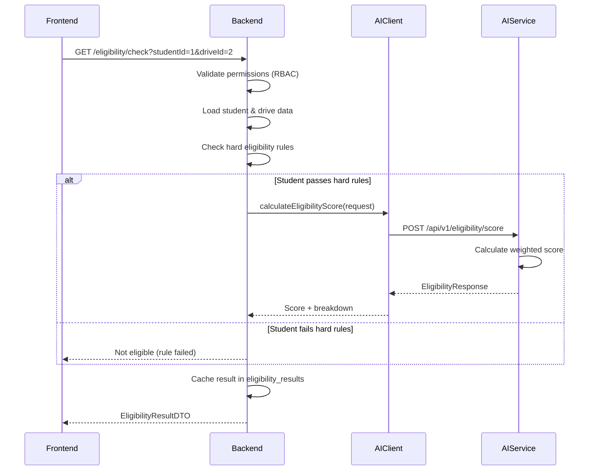

# AI Service Documentation

## Overview

The PlacementPro AI Service is a Python FastAPI microservice that provides **decision-support** capabilities for the placement management system. It operates as a stateless, context-agnostic scoring engine.

> **IMPORTANT**: The AI module acts strictly as a decision-support system and does not autonomously make placement decisions. All access control, filtering, and business rules are enforced by the Java backend.

---

## Architecture

```
┌─────────────────────────────────────────────────────────────────────────────┐
│                         JAVA BACKEND                                         │
│  ┌─────────────────────────────────────────────────────────────────────┐    │
│  │                    Scope Enforcement Layer                           │    │
│  │   • Role-based access control (RBAC)                                │    │
│  │   • College/Department filtering                                     │    │
│  │   • Eligibility rules validation                                     │    │
│  └─────────────────────────────────────────────────────────────────────┘    │
│                                    │                                         │
│                                    │ Sanitized Request                       │
│                                    ▼                                         │
│  ┌─────────────────────────────────────────────────────────────────────┐    │
│  │                    AIClient (HTTP Client)                            │    │
│  │   • Circuit breaker (Resilience4j)                                   │    │
│  │   • Retry logic                                                      │    │
│  │   • Fallback responses                                               │    │
│  └─────────────────────────────────────────────────────────────────────┘    │
└─────────────────────────────────────────────────────────────────────────────┘
                                     │
                                     │ HTTP POST (JSON)
                                     ▼
┌─────────────────────────────────────────────────────────────────────────────┐
│                         PYTHON AI SERVICE                                    │
│                         (FastAPI - Port 8000)                               │
│                                                                              │
│  ┌──────────────┐  ┌──────────────┐  ┌──────────────┐  ┌──────────────┐   │
│  │   Resume     │  │  Eligibility │  │   Ranking    │  │  Skill Gap   │   │
│  │   Parser     │  │   Service    │  │   Service    │  │   Service    │   │
│  └──────────────┘  └──────────────┘  └──────────────┘  └──────────────┘   │
│          │                 │                 │                 │            │
│          └─────────────────┴─────────────────┴─────────────────┘            │
│                                    │                                         │
│                         ┌──────────────────────┐                            │
│                         │   Insights Service   │                            │
│                         └──────────────────────┘                            │
│                                                                              │
│  ┌─────────────────────────────────────────────────────────────────────┐   │
│  │                    Design Principle: "DUMB" Service                  │   │
│  │   • NO knowledge of roles or permissions                            │   │
│  │   • NO knowledge of organization scope                              │   │
│  │   • NO knowledge of college/tenant boundaries                       │   │
│  │   • NO knowledge of eligibility rules                               │   │
│  │   • Receives ONLY sanitized, pre-filtered data                      │   │
│  └─────────────────────────────────────────────────────────────────────┘   │
└─────────────────────────────────────────────────────────────────────────────┘
```

---

## Technology Stack

| Component | Technology | Version |
|-----------|------------|---------|
| Framework | FastAPI | Latest |
| Language | Python | 3.10+ |
| Server | Uvicorn | ASGI |
| Validation | Pydantic | v2 |
| HTTP | httpx | Async support |

---

## API Endpoints

### Health Check

```http
GET /health
```

**Response:**
```json
{
  "status": "healthy",
  "service": "ai-service",
  "version": "2.0.0"
}
```

---

### Resume Parsing

```http
POST /api/v1/resume/parse
```

Extracts structured data from resume text.

**Request:**
```json
{
  "student_id": 123,
  "resume_text": "John Doe\nSoftware Engineer with 2 years experience in Java, Python..."
}
```

**Response:**
```json
{
  "success": true,
  "student_id": 123,
  "skills": ["Java", "Python", "SQL", "Spring Boot"],
  "experience_level": "BEGINNER",
  "confidence_score": 0.85,
  "project_keywords": ["e-commerce", "microservices"],
  "education_signals": ["B.Tech", "Computer Science"],
  "explanation": {
    "factors": ["Detected 4 technical skills", "2 years experience mentioned"],
    "breakdown": {"skills_found": 4, "education_detected": true},
    "human_readable": "Extracted 4 skills with 85% confidence."
  }
}
```

**Experience Levels:**
- `FRESHER` - No work experience
- `BEGINNER` - 0-2 years
- `INTERMEDIATE` - 2-5 years
- `ADVANCED` - 5+ years

---

### Eligibility Scoring

```http
POST /api/v1/eligibility/score
```

Calculates eligibility score using rule-based weighted scoring.

**Request:**
```json
{
  "student_id": 123,
  "student_name": "John Doe",
  "department": "CSE",
  "cgpa": 8.5,
  "skills": ["Python", "Java", "SQL"],
  "certifications": ["AWS Cloud Practitioner"],
  "projects_count": 5,
  "internship_months": 6,
  "min_cgpa": 7.0,
  "required_skills": ["Python", "SQL"],
  "preferred_skills": ["Machine Learning"],
  "eligible_departments": ["CSE", "IT", "ECE"]
}
```

**Response:**
```json
{
  "success": true,
  "score": 75.5,
  "is_eligible": true,
  "reasons": ["Student meets all eligibility criteria"],
  "cgpa_score": 85.0,
  "skills_score": 70.0,
  "experience_score": 80.0,
  "certifications_score": 50.0
}
```

**Scoring Weights:**

| Component | Weight | Description |
|-----------|--------|-------------|
| CGPA | 30% | How much student exceeds minimum CGPA |
| Skills | 40% | Required skills match + preferred bonus |
| Experience | 20% | Projects + internship months |
| Certifications | 10% | Professional certifications |

**Eligibility Threshold:** 50.0 (out of 100)

---

### Student Ranking

```http
POST /api/v1/ranking/rank
```

Ranks students by similarity to drive requirements.

**Request:**
```json
{
  "drive_id": 456,
  "student_ids": [1, 2, 3, 4, 5],
  "required_skills": ["Java", "Spring Boot"],
  "preferred_skills": ["Docker", "Kubernetes"],
  "job_role": "Backend Developer",
  "student_profiles": [
    {
      "student_id": 1,
      "skills": ["Java", "Spring Boot", "Docker"]
    },
    {
      "student_id": 2,
      "skills": ["Python", "Django"]
    }
  ]
}
```

**Response:**
```json
{
  "success": true,
  "rankings": [
    {
      "student_id": 1,
      "similarity_score": 85.5,
      "rank": 1,
      "matched_skills": ["Java", "Spring Boot", "Docker"],
      "missing_skills": ["Kubernetes"],
      "reason": "Strong match on required skills"
    },
    {
      "student_id": 2,
      "similarity_score": 30.0,
      "rank": 2,
      "matched_skills": [],
      "missing_skills": ["Java", "Spring Boot"],
      "reason": "Missing required skills"
    }
  ],
  "explanation": {
    "factors": ["Required skills: 70% weight", "Preferred skills: 30% weight"],
    "breakdown": {"total_students": 2, "average_score": 57.75},
    "human_readable": "Ranked 2 students. Top match score: 85.5%"
  }
}
```

**Ranking Weights:**
- Required Skills: 70%
- Preferred Skills: 30%

---

### Skill Gap Analysis

```http
POST /api/v1/skills/gap-analysis
```

Analyzes skill gaps and provides learning recommendations.

**Request:**
```json
{
  "current_skills": ["Python", "SQL"],
  "required_skills": ["Python", "SQL", "Java", "Spring Boot"],
  "preferred_skills": ["Docker", "Kubernetes"],
  "target_role": "Backend Developer"
}
```

**Response:**
```json
{
  "success": true,
  "missing_skills": ["Java", "Spring Boot"],
  "missing_preferred_skills": ["Docker", "Kubernetes"],
  "recommendations": [
    "Priority: Learn these required skills - Java, Spring Boot",
    "Complete Java certification on Oracle Academy",
    "Optional: Consider learning - Docker, Kubernetes"
  ],
  "match_percentage": 50.0
}
```

---

### Aggregated Insights

```http
POST /api/v1/insights/aggregate
```

Generates insights from pre-aggregated data.

**Request:**
```json
{
  "insight_type": "skill_trends",
  "data": {
    "skill_gaps": {
      "Machine Learning": {"demand": 100, "supply": 30},
      "Java": {"demand": 80, "supply": 75}
    }
  }
}
```

**Response:**
```json
{
  "success": true,
  "insight_type": "skill_trends",
  "insights": [
    {
      "category": "Machine Learning",
      "value": 70.0,
      "trend": "up",
      "recommendation": "High demand for Machine Learning. Consider training programs."
    },
    {
      "category": "Java",
      "value": 6.25,
      "trend": "stable",
      "recommendation": null
    }
  ],
  "summary": "Analyzed 2 skill trends. 1 skills have significant gaps."
}
```

**Insight Types:**
- `skill_trends` - Skill demand vs supply analysis
- `placement_patterns` - Department-wise placement rates
- `selection_factors` - Factors contributing to selection

---

## Service Components

### 1. Resume Parser Service

**Location:** `services/resume_parser.py`

Extracts structured data from resume text using pattern matching:

| Extraction | Method | Examples |
|------------|--------|----------|
| Skills | Keyword matching against known skills dictionary | Python, Java, React |
| Experience Level | Pattern matching for years/experience keywords | "2 years", "senior" |
| Education | Regex patterns for degree types | B.Tech, M.S., MBA |
| Projects | Keyword extraction | e-commerce, microservices |

**Known Skills Dictionary (100+ skills):**
- Programming Languages: Python, Java, JavaScript, TypeScript, C++, etc.
- Web Technologies: React, Angular, Vue, Node.js, Spring Boot, etc.
- Databases: MySQL, PostgreSQL, MongoDB, Redis, etc.
- Cloud/DevOps: AWS, Azure, GCP, Docker, Kubernetes, etc.
- Data/ML: TensorFlow, PyTorch, Pandas, NumPy, etc.

---

### 2. Eligibility Service

**Location:** `services/eligibility_service.py`

Rule-based scoring with deterministic outputs:

```python
# Scoring Algorithm
total_score = (
    cgpa_score * 0.30 +
    skills_score * 0.40 +
    experience_score * 0.20 +
    certifications_score * 0.10
)

is_eligible = total_score >= 50.0
```

**CGPA Scoring Logic:**
```python
if cgpa < min_cgpa:
    score = (cgpa / min_cgpa) * 50  # Penalized
else:
    score = 50 + ((cgpa - min_cgpa) / (10.0 - min_cgpa)) * 50
```

---

### 3. Ranking Service

**Location:** `services/ranking_service.py`

Similarity-based ranking with skill matching:

```python
# Similarity Calculation
required_score = (matched_required / total_required) * 70
preferred_score = (matched_preferred / total_preferred) * 30
similarity_score = required_score + preferred_score
```

**Skill Matching:**
- Case-insensitive comparison
- Partial matching for variations (e.g., "nodejs" matches "Node.js")

---

### 4. Skill Gap Service

**Location:** `services/skill_gap_service.py`

Identifies missing skills and generates recommendations:

```python
# Gap Detection
missing_skills = required_skills - current_skills
match_percentage = len(matched) / len(required) * 100

# Recommendations
skill_recommendations = {
    "python": "Take Python fundamentals course on Coursera",
    "java": "Complete Java certification on Oracle Academy",
    "sql": "Practice SQL on LeetCode and HackerRank",
    # ... more mappings
}
```

---

### 5. Insights Service

**Location:** `services/insights_service.py`

Generates analytics from pre-aggregated data:

| Insight Type | Input | Output |
|--------------|-------|--------|
| skill_trends | Demand/supply per skill | Gap ratio, trend direction |
| placement_patterns | Department placement rates | Performance insights |
| selection_factors | Selection data | Success factor analysis |

---

## Integration with Java Backend

### AIClient Class

**Location:** `backend/.../ai/AIClient.java`

```java
@Component
public class AIClient {

    @CircuitBreaker(name = "aiService", fallbackMethod = "fallback...")
    @Retry(name = "aiService")
    public ResponseDTO callAIService(RequestDTO request) {
        // HTTP POST to Python service
    }

    public ResponseDTO fallbackMethod(RequestDTO request, Exception e) {
        // Graceful degradation
    }
}
```

**Resilience Features:**
- Circuit Breaker: Opens after repeated failures
- Retry: 3 attempts with exponential backoff
- Fallback: Returns default response when service unavailable

---

### Data Flow



---

## Configuration

### Environment Variables

```bash
# Required
AI_SERVICE_HOST=localhost
AI_SERVICE_PORT=8000

# Optional
LOG_LEVEL=INFO
CORS_ORIGINS=http://localhost:8080,http://localhost:3000
```

### Running the Service

```bash
# Install dependencies
cd ai-service
pip install -r requirements.txt

# Development mode (with hot reload)
uvicorn app:app --reload --host 0.0.0.0 --port 8000

# Production mode
uvicorn app:app --host 0.0.0.0 --port 8000 --workers 4
```

### API Documentation

- Swagger UI: http://localhost:8000/docs
- ReDoc: http://localhost:8000/redoc
- OpenAPI JSON: http://localhost:8000/openapi.json

---

## Error Handling

### Standard Error Response

```json
{
  "detail": "Error message here"
}
```

### HTTP Status Codes

| Code | Meaning | Example |
|------|---------|---------|
| 200 | Success | Score calculated |
| 400 | Bad Request | Invalid input data |
| 422 | Validation Error | Missing required field |
| 500 | Server Error | Internal processing error |

---

## Security Considerations

### Design Principles

1. **No Direct Frontend Access**: AI service only accepts calls from Java backend
2. **No Sensitive Data**: Service doesn't receive or store PII beyond what's needed
3. **Stateless**: No session storage or persistent state
4. **CORS Restricted**: Only allows backend origins

### CORS Configuration

```python
app.add_middleware(
    CORSMiddleware,
    allow_origins=[
        "http://localhost:8080",  # Java backend only
    ],
    allow_credentials=True,
    allow_methods=["*"],
    allow_headers=["*"],
)
```

---

## Testing

### Health Check

```bash
curl http://localhost:8000/health
```

### Eligibility Score

```bash
curl -X POST http://localhost:8000/api/v1/eligibility/score \
  -H "Content-Type: application/json" \
  -d '{
    "student_id": 1,
    "cgpa": 8.5,
    "skills": ["Python", "Java"],
    "min_cgpa": 7.0,
    "required_skills": ["Python"],
    "projects_count": 3,
    "internship_months": 6,
    "certifications": []
  }'
```

---

## Related Documentation

- [Architecture Overview](../architecture.md)
- [Backend Integration](applications.md)
- [Eligibility Feature](eligibility.md)
