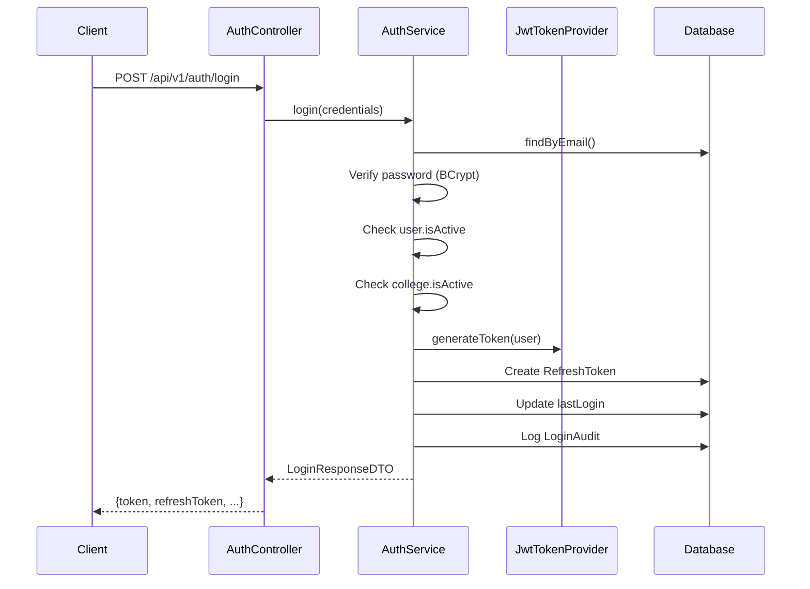
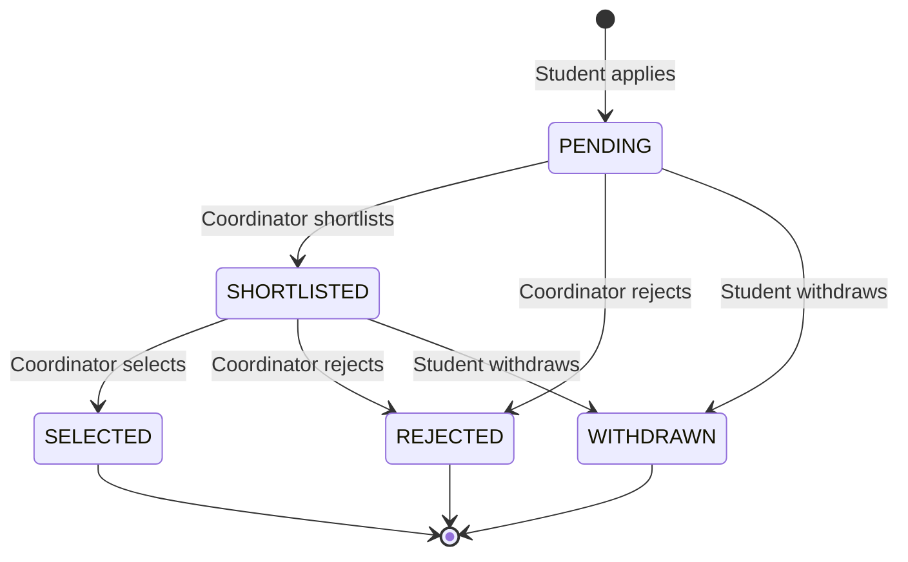
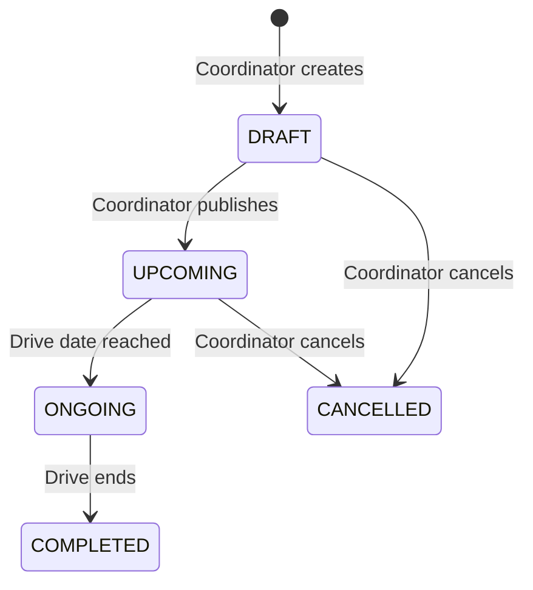
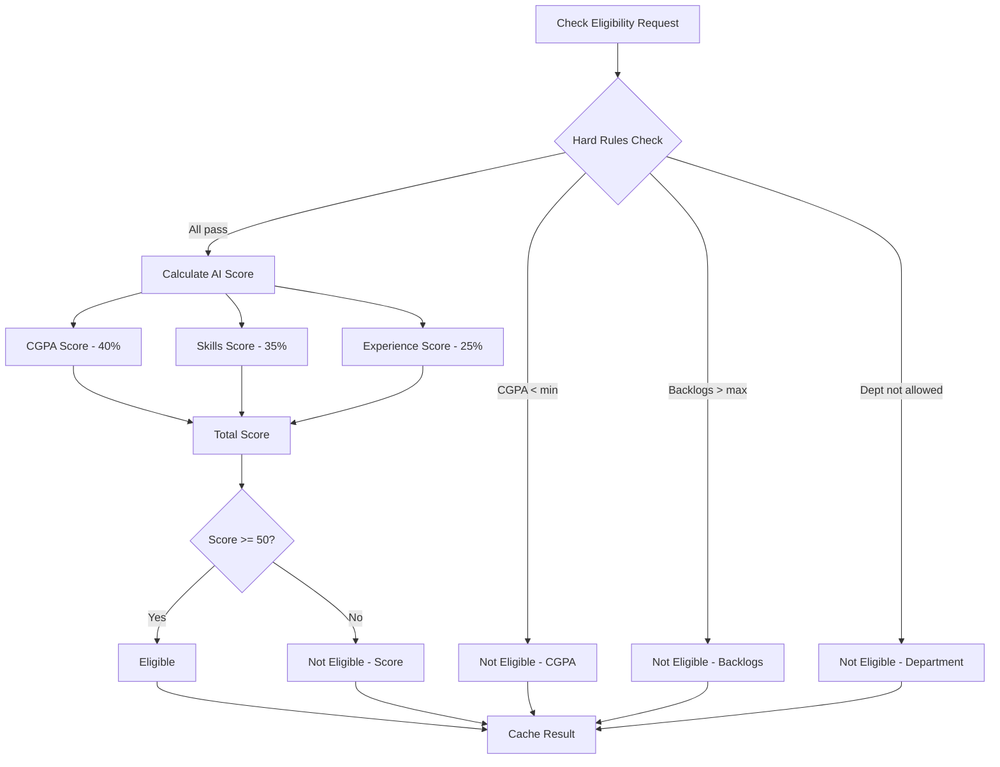

# Backend Module Documentation

## Overview

The PlacementPro backend is a **modular monolith** built with Java 21 and Spring Boot 3.2.x. It follows a layered architecture with clear separation of concerns.

---

## Architecture Diagram

```
┌─────────────────────────────────────────────────────────────────────────────┐
│                           REST API Layer                                     │
│  ┌──────────┐ ┌──────────┐ ┌──────────┐ ┌──────────┐ ┌──────────┐          │
│  │   Auth   │ │ Students │ │  Drives  │ │  Apps    │ │Analytics │          │
│  │Controller│ │Controller│ │Controller│ │Controller│ │Controller│          │
│  └────┬─────┘ └────┬─────┘ └────┬─────┘ └────┬─────┘ └────┬─────┘          │
│       │            │            │            │            │                  │
│  ┌────┴────────────┴────────────┴────────────┴────────────┴─────┐           │
│  │                     Service Interface Layer                   │           │
│  │    DriveService  │  ApplicationService  │  EligibilityService │          │
│  └─────────────────────────────────────────────────────────────┘           │
│       │                                                                      │
│  ┌────┴──────────────────────────────────────────────────────────┐          │
│  │                     Service Implementation Layer               │          │
│  │  DriveServiceImpl │ ApplicationServiceImpl │ EligibilityImpl   │          │
│  │                                                                 │          │
│  │  ┌─────────────────────────────────────────────────────────┐   │          │
│  │  │              OrganizationScopeService                    │   │          │
│  │  │         (Scope Resolution - Single Source of Truth)      │   │          │
│  │  └─────────────────────────────────────────────────────────┘   │          │
│  └─────────────────────────────────────────────────────────────────┘          │
│       │                                                                      │
│  ┌────┴──────────────────────────────────────────────────────────┐          │
│  │                     Repository Layer (JPA)                     │          │
│  │  UserRepository │ DriveRepository │ ApplicationRepository     │          │
│  └─────────────────────────────────────────────────────────────────┘          │
│       │                                                                      │
│  ┌────┴──────────────────────────────────────────────────────────┐          │
│  │                     External Services                          │          │
│  │  ┌──────────────┐                                              │          │
│  │  │   AIClient   │────────────────────► Python AI Service       │          │
│  │  └──────────────┘                      (localhost:8000)        │          │
│  └─────────────────────────────────────────────────────────────────┘          │
└─────────────────────────────────────────────────────────────────────────────┘
                              │
                              ▼
┌─────────────────────────────────────────────────────────────────────────────┐
│                         PostgreSQL Database                                  │
└─────────────────────────────────────────────────────────────────────────────┘
```

---

## Module Structure

```
backend/src/main/java/com/campusplacement/
├── CampusPlacementApplication.java    # Spring Boot entry point
├── ai/                                 # AI service integration
│   ├── AIClient.java                  # HTTP client for Python service
│   ├── AIOrchestrationService.java    # Orchestrates AI calls
│   └── dto/                           # AI request/response DTOs
├── analytics/                          # Placement statistics
│   ├── AnalyticsController.java
│   └── AnalyticsService.java
├── applications/                       # Job applications
│   ├── Application.java               # Entity
│   ├── ApplicationController.java
│   ├── ApplicationService.java        # Interface
│   ├── ApplicationServiceImpl.java    # Implementation
│   ├── ApplicationRepository.java
│   └── ApplicationStatusType.java     # Enum
├── auth/                               # Authentication
│   ├── AuthController.java
│   ├── AuthService.java
│   ├── LoginAudit.java                # Audit entity
│   ├── RefreshToken.java              # Token entity
│   ├── SecurityAlert.java             # Alert entity
│   └── dto/                           # Auth DTOs
├── colleges/                           # College/tenant management
│   ├── College.java
│   └── CollegeRepository.java
├── common/                             # Shared utilities
│   ├── ApiResponse.java               # Standard response wrapper
│   ├── BaseEntity.java                # Common entity fields
│   ├── Constants.java                 # System constants
│   ├── GlobalExceptionHandler.java    # Centralized error handling
│   └── UserRole.java                  # Role enum
├── companies/                          # Company management
│   ├── Company.java
│   ├── CompanyController.java
│   ├── CompanyService.java
│   └── CompanyRepository.java
├── config/                             # Spring configuration
│   └── SecurityConfig.java
├── drives/                             # Placement drives
│   ├── PlacementDrive.java            # Entity
│   ├── DriveController.java
│   ├── DriveService.java              # Interface
│   ├── DriveServiceImpl.java          # Implementation
│   └── DriveRepository.java
├── eligibility/                        # Eligibility scoring
│   ├── EligibilityResult.java         # Entity
│   ├── EligibilityController.java
│   ├── EligibilityService.java        # Interface
│   ├── EligibilityServiceImpl.java    # Implementation
│   └── DriveEligibilityService.java   # Validation
├── organizations/                      # Org hierarchy & scope
│   ├── OrganizationUnit.java          # Entity
│   ├── UserAssignment.java            # Entity
│   ├── OrganizationScopeService.java  # Scope resolution
│   ├── ScopeContext.java              # Scope data record
│   └── ScopeContextHolder.java        # Request-scoped cache
├── security/                           # Spring Security
│   ├── JwtAuthenticationFilter.java
│   ├── JwtTokenProvider.java
│   ├── CustomUserDetails.java
│   ├── CustomUserDetailsService.java
│   ├── CustomAccessDeniedHandler.java
│   └── CustomAuthenticationEntryPoint.java
├── students/                           # Student management
│   ├── StudentProfile.java            # Entity
│   ├── StudentController.java
│   ├── StudentService.java
│   └── StudentRepository.java
└── users/                              # User management
    ├── User.java                       # Entity
    ├── UserController.java
    └── UserRepository.java
```

---

## Key Design Patterns

### 1. Service Interface Pattern

All business services use interface + implementation:

```java
// Interface defines contract
public interface DriveService {
    DriveDTO createDrive(CreateDriveRequestDTO request);
    DriveDTO getDriveById(Long id);
    List<DriveDTO> getAllDrives();
}

// Implementation contains business logic
@Service
@RequiredArgsConstructor
public class DriveServiceImpl implements DriveService {
    private final DriveRepository driveRepository;
    private final OrganizationScopeService scopeService;

    @Override
    public DriveDTO createDrive(CreateDriveRequestDTO request) {
        // Implementation with scope enforcement
    }
}
```

**Benefits:**
- Clean dependency inversion
- Easy mocking for unit tests
- Clear API contracts

---

### 2. DTO at API Boundaries

Controllers always use DTOs, never expose JPA entities:

```java
@RestController
@RequestMapping("/api/v1/drives")
public class DriveController {

    @GetMapping("/{id}")
    public ResponseEntity<ApiResponse<DriveDTO>> getDriveById(@PathVariable Long id) {
        DriveDTO drive = driveService.getDriveById(id);  // Returns DTO
        return ResponseEntity.ok(ApiResponse.success(drive));
    }
}
```

**Benefits:**
- API stability (entities can evolve independently)
- Security (no lazy-loading leaks)
- Clear contract documentation

---

### 3. Centralized Scope Resolution

`OrganizationScopeService` is the **single source of truth** for access control:

```java
@Service
public class OrganizationScopeService {

    public ScopeContext resolveScope(Long userId) {
        // 1. Get user with college
        // 2. Get all assignments
        // 3. Resolve allowed department IDs based on scope level
        // 4. Cache in request-scoped holder
        return new ScopeContext(userId, collegeId, role, allowedDepts, ...);
    }
}
```

**Scope Resolution Algorithm:**
```
1. Fetch User with college_id
2. For each UserAssignment:
   - SELF scope → Add only assigned org unit
   - CHILDREN scope → Add org unit + direct children
   - SUBTREE scope → Add org unit + all descendants
3. Filter to only DEPARTMENT type units
4. Return Set<Long> of allowed department IDs
```

---

### 4. Scope-Aware Repository Queries

Repositories include methods for scoped access:

```java
public interface ApplicationRepository extends JpaRepository<Application, Long> {

    // College-scoped query
    @Query("SELECT a FROM Application a " +
           "JOIN a.student s " +
           "JOIN s.user u " +
           "WHERE u.college.id = :collegeId")
    List<Application> findByCollegeId(@Param("collegeId") Long collegeId);

    // Department-scoped query
    @Query("SELECT a FROM Application a " +
           "WHERE a.student.department.id IN :departmentIds " +
           "AND a.student.user.college.id = :collegeId")
    List<Application> findByStudentDepartmentIdInAndCollegeId(
        @Param("departmentIds") Set<Long> departmentIds,
        @Param("collegeId") Long collegeId
    );
}
```

---

### 5. API Response Wrapper

All responses use `ApiResponse<T>`:

```java
@Data
@Builder
public class ApiResponse<T> {
    private boolean success;
    private T data;
    private String message;
    private Map<String, String> errors;

    public static <T> ApiResponse<T> success(T data) {
        return ApiResponse.<T>builder()
            .success(true)
            .data(data)
            .build();
    }

    public static <T> ApiResponse<T> error(String message) {
        return ApiResponse.<T>builder()
            .success(false)
            .message(message)
            .build();
    }
}
```

**Standard Response Format:**
```json
{
  "success": true,
  "data": { ... },
  "message": "Operation completed successfully",
  "errors": null
}
```

---

## Module Details

### Auth Module

Handles authentication and token management.

**Components:**

| File | Purpose |
|------|---------|
| `AuthController` | Login, logout, refresh endpoints |
| `AuthService` | Credential validation, token generation |
| `RefreshTokenService` | Token rotation, family tracking |
| `LoginAuditRepository` | Security audit logging |
| `SecurityAlertService` | Anomaly detection |

**Login Flow:**


---

### Applications Module

Handles student applications to placement drives.

**Application Status Lifecycle:**


**Status Transition Validation:**
```java
private static final EnumSet<ApplicationStatusType> TERMINAL_STATUSES =
    EnumSet.of(SELECTED, REJECTED, WITHDRAWN);

public void validateTransition(String current, ApplicationStatusType target) {
    ApplicationStatusType currentStatus = ApplicationStatusType.valueOf(current);
    if (TERMINAL_STATUSES.contains(currentStatus)) {
        throw new IllegalStateException("Cannot change status of terminal application");
    }
}
```

---

### Drives Module

Manages placement drive lifecycle.

**Drive Status Lifecycle:**


**Scope Enforcement in Service:**
```java
@Override
public List<DriveDTO> getAllDrives() {
    ScopeContext scope = scopeService.resolveScope(getCurrentUserId());

    if (scope.isSuperAdmin()) {
        return driveRepository.findAll().stream()...;
    }

    // All other roles: Only drives in their college
    return driveRepository.findByCollegeId(scope.collegeId()).stream()...;
}
```

---

### Eligibility Module

Calculates student eligibility using rule-first, AI-second approach.

**Eligibility Check Flow:**


---

### Organizations Module

Manages hierarchical organization structure and scope resolution.

**Organization Hierarchy:**
```
UNIVERSITY (root)
├── INSTITUTE (School of Engineering)
│   ├── DEPARTMENT (Computer Science)
│   ├── DEPARTMENT (Electronics)
│   └── DEPARTMENT (Mechanical)
└── INSTITUTE (School of Business)
    ├── DEPARTMENT (Finance)
    └── DEPARTMENT (Marketing)
```

**Scope Levels:**

| Level | Description | Allowed Units |
|-------|-------------|---------------|
| SELF | Only assigned unit | Just that department |
| CHILDREN | Unit + direct children | Institute + its departments |
| SUBTREE | Unit + all descendants | University + all institutes + all departments |

---

### Security Module

Implements Spring Security with JWT authentication.

**Filter Chain:**
```java
@Bean
public SecurityFilterChain filterChain(HttpSecurity http) {
    http
        .csrf(csrf -> csrf.disable())
        .sessionManagement(sm -> sm.sessionCreationPolicy(STATELESS))
        .addFilterBefore(jwtFilter, UsernamePasswordAuthenticationFilter.class)
        .authorizeHttpRequests(auth -> auth
            .requestMatchers("/api/v1/auth/login").permitAll()
            .requestMatchers("/api/v1/superadmin/**").hasRole("SUPER_ADMIN")
            .requestMatchers("/api/v1/admin/**").hasAnyRole("ADMIN", "SUPER_ADMIN")
            .requestMatchers("/api/v1/**").authenticated()
        );
    return http.build();
}
```

**JWT Token Structure:**
```json
{
  "ver": 1,
  "sub": "user@email.com",
  "uid": 12,
  "role": "COORDINATOR",
  "cid": 3,
  "iat": 1704547200,
  "exp": 1704633600
}
```

---

## Configuration

### Application Properties

```yaml
# Database
spring:
  datasource:
    url: jdbc:postgresql://localhost:5432/placement_db
    username: ${DB_USER}
    password: ${DB_PASS}

# JWT
app:
  jwt:
    secret: ${JWT_SECRET}
    access-expiration-ms: 900000      # 15 minutes
    refresh-expiration-days: 7

# AI Service
ai-service:
  base-url: http://localhost:8000/api/v1
```

### Environment Variables

| Variable | Purpose | Example |
|----------|---------|---------|
| `DB_URL` | PostgreSQL connection | `jdbc:postgresql://localhost:5432/placement_db` |
| `DB_USER` | Database username | `postgres` |
| `DB_PASS` | Database password | `secret` |
| `JWT_SECRET` | JWT signing key | 64+ character string |
| `AI_SERVICE_URL` | Python AI service | `http://localhost:8000` |

---

## Build & Run

```bash
# Navigate to backend
cd backend

# Compile
mvn clean compile

# Run tests
mvn test

# Run application
mvn spring-boot:run

# Package for production
mvn clean package -DskipTests

# Run JAR
java -jar target/campus-placement-0.0.1-SNAPSHOT.jar
```

---

## Related Documentation

- [Error Handling](error-handling.md)
- [Database Schema](../database/ER-DIAGRAM.md)
- [API Specifications](../api-specs.md)

