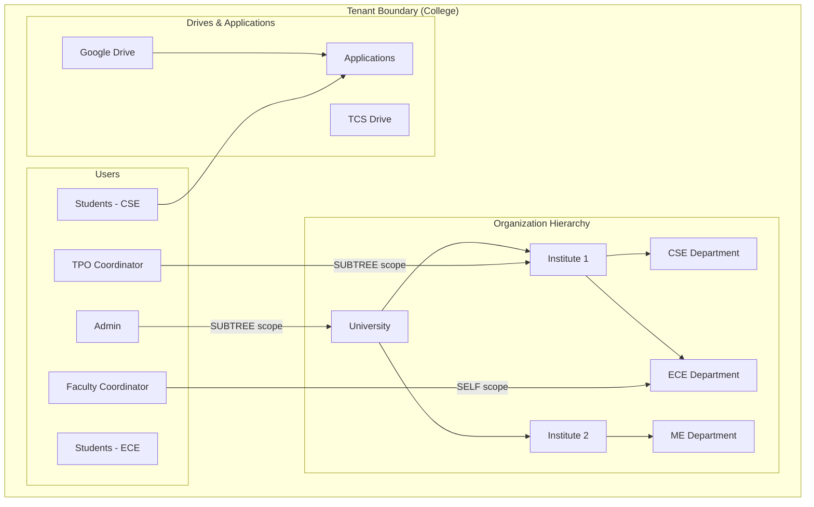

# Database Entity-Relationship Diagram

## Overview

PlacementPro uses PostgreSQL 14+ with a multi-tenant architecture. Each college operates as an isolated tenant with its own data.

---

## Complete ER Diagram

```mermaid
erDiagram
    %% ==================== TENANT LAYER ====================
    COLLEGES {
        bigserial id PK
        varchar name
        varchar code UK
        text address
        varchar website
        varchar contact_email
        varchar contact_phone
        varchar accreditation_code
        date established_date
        boolean is_active
        timestamp created_at
        timestamp updated_at
    }

    %% ==================== ORGANIZATION HIERARCHY ====================
    ORGANIZATION_UNITS {
        bigserial id PK
        varchar name
        enum type "UNIVERSITY|INSTITUTE|DEPARTMENT"
        varchar code
        bigint parent_unit_id FK
        bigint college_id FK
        varchar email_domain
        boolean is_root
        boolean is_active
        timestamp deleted_at
        timestamp created_at
        timestamp updated_at
    }

    %% ==================== IDENTITY & AUTH ====================
    USERS {
        bigserial id PK
        varchar username UK
        varchar password_hash
        varchar email
        varchar full_name
        varchar role "STUDENT|COORDINATOR|ADMIN|SUPER_ADMIN"
        bigint college_id FK
        varchar phone_number
        varchar profile_image_url
        timestamp last_login
        boolean is_active
        timestamp deleted_at
        timestamp created_at
        timestamp updated_at
    }

    USER_ASSIGNMENTS {
        bigserial id PK
        bigint user_id FK
        bigint organization_unit_id FK
        varchar role
        varchar scope "SELF|CHILDREN|SUBTREE"
        varchar designation
        boolean is_primary
        date start_date
        date end_date
        boolean is_active
        timestamp assigned_at
        timestamp created_at
        timestamp updated_at
    }

    %% ==================== STUDENT PROFILE ====================
    STUDENT_PROFILES {
        bigserial id PK
        bigint user_id FK "UK"
        varchar enrollment_number UK
        bigint department_id FK
        varchar program
        integer current_semester
        integer batch_year
        double cgpa
        double tenth_percentage
        double twelfth_percentage
        integer active_backlogs
        integer history_backlogs
        text skills
        varchar resume_url
        varchar linkedin_url
        varchar github_url
        varchar portfolio_url
        integer projects_count
        integer internship_months
        text certifications
        text career_interests
        timestamp created_at
        timestamp updated_at
    }

    %% ==================== COMPANIES ====================
    COMPANIES {
        bigserial id PK
        varchar name
        varchar industry
        varchar website
        text description
        varchar logo_url
        varchar location
        varchar contact_email
        varchar contact_phone
        boolean is_active
        timestamp created_at
        timestamp updated_at
    }

    %% ==================== PLACEMENT DRIVES ====================
    PLACEMENT_DRIVES {
        bigserial id PK
        bigint company_id FK
        bigint college_id FK
        varchar title
        text description
        varchar job_role
        double package_lpa
        date drive_date
        date registration_deadline
        varchar status "DRAFT|UPCOMING|ONGOING|COMPLETED|CANCELLED"
        double min_cgpa
        integer max_backlogs
        text required_skills
        varchar location
        boolean is_remote
        timestamp created_at
        timestamp updated_at
    }

    DRIVE_ELIGIBLE_DEPARTMENTS {
        bigint drive_id FK "PK"
        bigint department_id FK "PK"
    }

    %% ==================== APPLICATIONS ====================
    APPLICATIONS {
        bigserial id PK
        bigint student_id FK
        bigint drive_id FK
        varchar status "PENDING|SHORTLISTED|SELECTED|REJECTED|WITHDRAWN"
        timestamp applied_at
        varchar resume_url
        text cover_letter
        text internal_notes
        timestamp shortlisted_at
        timestamp rejected_at
        timestamp selected_at
        timestamp withdrawn_at
        timestamp created_at
        timestamp updated_at
    }

    %% ==================== ELIGIBILITY ====================
    ELIGIBILITY_RESULTS {
        bigserial id PK
        bigint student_id FK
        bigint drive_id FK
        boolean is_eligible
        double score
        double cgpa_score
        double skills_score
        double experience_score
        text reasons
        text skill_gaps
        timestamp calculated_at
        timestamp created_at
        timestamp updated_at
    }

    %% ==================== AUTH & SECURITY ====================
    LOGIN_AUDIT {
        bigserial id PK
        bigint user_id FK
        varchar email
        timestamp login_time
        varchar ip_address
        varchar user_agent
        varchar event_type "LOGIN|LOGOUT|TOKEN_REFRESH|etc"
        boolean success
        varchar failure_reason
        timestamp created_at
        timestamp updated_at
    }

    REFRESH_TOKENS {
        bigserial id PK
        varchar token UK
        bigint user_id FK
        timestamp expires_at
        boolean is_revoked
        timestamp created_at
        varchar created_ip
        varchar user_agent
        varchar device_fingerprint
        varchar family_id
        varchar parent_token
        timestamp last_used_at
    }

    SECURITY_ALERTS {
        bigserial id PK
        bigint user_id FK
        varchar email
        varchar alert_type "BRUTE_FORCE|SUSPICIOUS_IP|etc"
        varchar severity "LOW|MEDIUM|HIGH|CRITICAL"
        text message
        varchar ip_address
        timestamp created_at
        boolean is_resolved
    }

    PASSWORD_RESET_TOKENS {
        bigserial id PK
        varchar token UK
        bigint user_id FK
        varchar token_type
        timestamp expires_at
        varchar requested_ip
        boolean is_used
        timestamp created_at
    }

    %% ==================== RELATIONSHIPS ====================

    %% Tenant Hierarchy
    COLLEGES ||--o{ ORGANIZATION_UNITS : "has"
    ORGANIZATION_UNITS ||--o| ORGANIZATION_UNITS : "parent"

    %% User Relationships
    COLLEGES ||--o{ USERS : "has"
    USERS ||--o{ USER_ASSIGNMENTS : "has"
    ORGANIZATION_UNITS ||--o{ USER_ASSIGNMENTS : "assigned to"

    %% Student Relationships
    USERS ||--o| STUDENT_PROFILES : "has"
    ORGANIZATION_UNITS ||--o{ STUDENT_PROFILES : "department"

    %% Drive Relationships
    COMPANIES ||--o{ PLACEMENT_DRIVES : "conducts"
    COLLEGES ||--o{ PLACEMENT_DRIVES : "hosts"
    PLACEMENT_DRIVES ||--o{ DRIVE_ELIGIBLE_DEPARTMENTS : "has"
    ORGANIZATION_UNITS ||--o{ DRIVE_ELIGIBLE_DEPARTMENTS : "eligible"

    %% Application Relationships
    STUDENT_PROFILES ||--o{ APPLICATIONS : "submits"
    PLACEMENT_DRIVES ||--o{ APPLICATIONS : "receives"

    %% Eligibility Relationships
    STUDENT_PROFILES ||--o{ ELIGIBILITY_RESULTS : "has"
    PLACEMENT_DRIVES ||--o{ ELIGIBILITY_RESULTS : "for"

    %% Auth Relationships
    USERS ||--o{ LOGIN_AUDIT : "logs"
    USERS ||--o{ REFRESH_TOKENS : "has"
    USERS ||--o{ SECURITY_ALERTS : "triggers"
    USERS ||--o{ PASSWORD_RESET_TOKENS : "requests"
```



---

## Table Relationships Summary

### Core Business Entities

| Relationship | Type | Description |
|--------------|------|-------------|
| College → Organization Units | 1:N | A college has many organization units (University → Institute → Department) |
| Organization Units → Self | 1:N | Self-referential hierarchy via `parent_unit_id` |
| College → Users | 1:N | A college has many users (NULL for SUPER_ADMIN) |
| User → Student Profile | 1:1 | Each student has exactly one profile |
| Company → Placement Drives | 1:N | A company can conduct many drives |
| College → Placement Drives | 1:N | Drives are scoped to a single college |
| Drive → Applications | 1:N | A drive receives many applications |
| Student → Applications | 1:N | A student can apply to many drives |
| Drive ↔ Departments | M:N | Via `drive_eligible_departments` join table |

### Authorization Entities

| Relationship | Type | Description |
|--------------|------|-------------|
| User → User Assignments | 1:N | Users can have multiple assignments |
| Organization Unit → User Assignments | 1:N | Org units can have multiple users assigned |

---

## Data Isolation Model



---

## Key Constraints

### Unique Constraints

| Table | Constraint | Purpose |
|-------|------------|---------|
| `colleges` | `code` | Unique college identifier |
| `users` | `username` | Global login uniqueness |
| `users` | `(email, college_id)` | Email unique per tenant |
| `student_profiles` | `user_id` | One profile per user |
| `student_profiles` | `enrollment_number` | Unique enrollment ID |
| `applications` | `(student_id, drive_id)` | One application per student per drive |
| `user_assignments` | `(user_id, organization_unit_id)` | No duplicate assignments |

### Foreign Key Cascades

| Parent → Child | ON DELETE | Reason |
|----------------|-----------|--------|
| College → Org Units | CASCADE | Remove hierarchy with college |
| College → Users | CASCADE | Remove users with college |
| User → Student Profile | CASCADE | Remove profile with user |
| Drive → Applications | CASCADE | Remove applications with drive |
| Student → Applications | CASCADE | Remove applications with student |

---

## Indexes Strategy

### Performance-Critical Indexes

```sql
-- Authentication (most frequent operations)
CREATE INDEX idx_users_username ON users(username);
CREATE INDEX idx_users_email ON users(email);

-- Scope Resolution (every authenticated request)
CREATE INDEX idx_assignments_user ON user_assignments(user_id);
CREATE INDEX idx_org_units_college ON organization_units(college_id);
CREATE INDEX idx_org_units_parent ON organization_units(parent_unit_id);

-- Application Queries
CREATE INDEX idx_applications_student ON applications(student_id);
CREATE INDEX idx_applications_drive ON applications(drive_id);
CREATE INDEX idx_applications_status ON applications(status);

-- Drive Filtering
CREATE INDEX idx_drives_college ON placement_drives(college_id);
CREATE INDEX idx_drives_status ON placement_drives(status);
CREATE INDEX idx_drives_date ON placement_drives(drive_date);

-- Eligibility Lookups
CREATE INDEX idx_eligibility_student ON eligibility_results(student_id);
CREATE INDEX idx_eligibility_drive ON eligibility_results(drive_id);
```

### Partial Indexes (Soft Delete Optimization)

```sql
-- Only index non-deleted records
CREATE INDEX idx_users_not_deleted ON users(id) WHERE deleted_at IS NULL;
CREATE INDEX idx_org_units_not_deleted ON organization_units(id) WHERE deleted_at IS NULL;
```

---

## Database Functions

### Hierarchy Traversal

```sql
-- Get all ancestors of an org unit
SELECT * FROM get_org_ancestors(target_org_unit_id);

-- Get all descendants of an org unit
SELECT * FROM get_org_descendants(target_org_unit_id);
```

### Use Cases

| Function | Used By | Purpose |
|----------|---------|---------|
| `get_org_ancestors()` | Breadcrumb UI, Permission inheritance | Navigate up hierarchy |
| `get_org_descendants()` | SUBTREE scope resolution, Reporting | Navigate down hierarchy |

---

## Migration Notes

### Version History

| Version | Date | Changes |
|---------|------|---------|
| 2.0.0 | 2026-01-09 | Comprehensive documentation, industry-standard formatting |
| 1.1.0 | 2025-12-01 | Added `login_audit.event_type` column |
| 1.0.0 | 2025-01-01 | Initial schema release |

### Running Migrations

The schema is designed to be **idempotent** - safe to re-run:

```bash
# In backend directory
psql -U postgres -d placement_db -f src/main/resources/schema.sql
psql -U postgres -d placement_db -f src/main/resources/seed-data-v2.sql
```

---

## Related Documentation

- [Architecture Overview](../architecture.md)
- [Security Model](../security.md)
- [API Specifications](../api-specs.md)
- [Multi-Tenancy Design](features/multi-tenancy.md)
