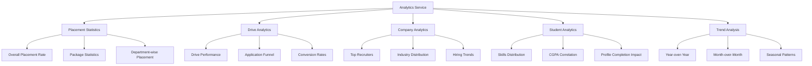

# Analytics Feature

## Overview

The Analytics module provides comprehensive placement statistics and reporting for coordinators and administrators. It aggregates data across drives, applications, and student outcomes to enable data-driven decision-making.

---

## Analytics Categories



---

## API Endpoints

### Dashboard Overview

```http
GET /api/v1/analytics/dashboard
Authorization: Bearer <coordinator_token>
```

**Response:**
```json
{
  "success": true,
  "data": {
    "academicYear": "2025-26",
    "totalStudents": 500,
    "eligibleStudents": 450,
    "placedStudents": 320,
    "placementRate": 71.1,
    "activeDrives": 5,
    "upcomingDrives": 8,
    "averagePackage": 850000,
    "highestPackage": 2400000,
    "totalOffers": 385,
    "multipleOfferStudents": 45,
    "topRecruiter": {
      "name": "Tech Corp",
      "hires": 42
    },
    "recentActivity": [
      {
        "type": "DRIVE_STARTED",
        "message": "Google hiring drive started",
        "timestamp": "2026-01-11T09:00:00"
      }
    ]
  }
}
```

### Placement Statistics

```http
GET /api/v1/analytics/placements?year=2025&department=all
Authorization: Bearer <coordinator_token>
```

**Response:**
```json
{
  "success": true,
  "data": {
    "academicYear": "2025-26",
    "summary": {
      "totalEligible": 450,
      "totalPlaced": 320,
      "placementRate": 71.1,
      "totalOffers": 385,
      "averageOffers": 1.2
    },
    "packageStats": {
      "average": 850000,
      "median": 750000,
      "highest": 2400000,
      "lowest": 400000,
      "standardDeviation": 320000
    },
    "departmentWise": [
      {
        "department": "Computer Science",
        "eligible": 150,
        "placed": 135,
        "rate": 90.0,
        "avgPackage": 1200000
      },
      {
        "department": "Electronics",
        "eligible": 100,
        "placed": 75,
        "rate": 75.0,
        "avgPackage": 850000
      },
      {
        "department": "Mechanical",
        "eligible": 80,
        "placed": 48,
        "rate": 60.0,
        "avgPackage": 650000
      }
    ],
    "monthlyTrend": [
      {"month": "Aug 2025", "placements": 25},
      {"month": "Sep 2025", "placements": 45},
      {"month": "Oct 2025", "placements": 80},
      {"month": "Nov 2025", "placements": 95},
      {"month": "Dec 2025", "placements": 75}
    ]
  }
}
```

### Drive Analytics

```http
GET /api/v1/analytics/drives/{driveId}
Authorization: Bearer <coordinator_token>
```

**Response:**
```json
{
  "success": true,
  "data": {
    "driveId": 123,
    "company": "Tech Corp",
    "jobTitle": "Software Engineer",
    "funnel": {
      "eligible": 200,
      "applied": 150,
      "shortlisted": 80,
      "interviewed": 60,
      "selected": 25,
      "rejected": 55,
      "withdrawn": 5
    },
    "conversionRates": {
      "applicationRate": 75.0,
      "shortlistRate": 53.3,
      "selectionRate": 31.3,
      "overallConversion": 16.7
    },
    "departmentBreakdown": [
      {"department": "CSE", "applied": 80, "selected": 15},
      {"department": "IT", "applied": 45, "selected": 8},
      {"department": "ECE", "applied": 25, "selected": 2}
    ],
    "cgpaDistribution": {
      "selected": {
        "average": 8.7,
        "min": 7.5,
        "max": 9.8
      },
      "rejected": {
        "average": 7.4,
        "min": 6.0,
        "max": 9.2
      }
    }
  }
}
```

### Company Analytics

```http
GET /api/v1/analytics/companies?year=2025&limit=10
Authorization: Bearer <coordinator_token>
```

**Response:**
```json
{
  "success": true,
  "data": {
    "topRecruiters": [
      {
        "rank": 1,
        "company": "Tech Corp",
        "industry": "IT",
        "hires": 42,
        "drives": 3,
        "avgPackage": 1500000
      },
      {
        "rank": 2,
        "company": "Finance Inc",
        "industry": "Banking",
        "hires": 35,
        "drives": 2,
        "avgPackage": 1200000
      }
    ],
    "industryDistribution": [
      {"industry": "IT", "hires": 180, "percentage": 56.3},
      {"industry": "Banking", "hires": 65, "percentage": 20.3},
      {"industry": "Consulting", "hires": 45, "percentage": 14.1},
      {"industry": "Others", "hires": 30, "percentage": 9.3}
    ],
    "newRecruiters": 8,
    "recurringRecruiters": 22
  }
}
```

### Skills Analytics

```http
GET /api/v1/analytics/skills
Authorization: Bearer <coordinator_token>
```

**Response:**
```json
{
  "success": true,
  "data": {
    "mostDemanded": [
      {"skill": "Java", "demand": 85, "supply": 120},
      {"skill": "Python", "demand": 78, "supply": 150},
      {"skill": "SQL", "demand": 72, "supply": 180},
      {"skill": "AWS", "demand": 45, "supply": 30}
    ],
    "skillGaps": [
      {"skill": "AWS", "gap": 15, "recommendation": "High priority"},
      {"skill": "Docker", "gap": 12, "recommendation": "Medium priority"},
      {"skill": "Kubernetes", "gap": 10, "recommendation": "Medium priority"}
    ],
    "correlationWithPlacement": [
      {"skill": "Spring Boot", "placementRate": 92.5},
      {"skill": "React", "placementRate": 88.3},
      {"skill": "Machine Learning", "placementRate": 85.0}
    ]
  }
}
```

### Trend Analysis

```http
GET /api/v1/analytics/trends?years=3
Authorization: Bearer <coordinator_token>
```

**Response:**
```json
{
  "success": true,
  "data": {
    "yearOverYear": [
      {
        "year": "2023-24",
        "placementRate": 65.2,
        "avgPackage": 720000,
        "totalOffers": 280
      },
      {
        "year": "2024-25",
        "placementRate": 68.5,
        "avgPackage": 780000,
        "totalOffers": 320
      },
      {
        "year": "2025-26",
        "placementRate": 71.1,
        "avgPackage": 850000,
        "totalOffers": 385
      }
    ],
    "growth": {
      "placementRateChange": 3.8,
      "packageChange": 9.0,
      "offerChange": 20.3
    },
    "seasonalPattern": {
      "peakMonths": ["October", "November", "January"],
      "lowMonths": ["June", "July", "December"]
    }
  }
}
```

### Export Reports

```http
GET /api/v1/analytics/export?type=placement&year=2025&format=xlsx
Authorization: Bearer <coordinator_token>
```

**Response:** Binary file download

---

## Service Layer

### AnalyticsService Interface

```java
public interface AnalyticsService {

    DashboardDTO getDashboard();

    PlacementStatsDTO getPlacementStats(Integer year, Long departmentId);

    DriveAnalyticsDTO getDriveAnalytics(Long driveId);

    CompanyAnalyticsDTO getCompanyAnalytics(Integer year, Integer limit);

    SkillsAnalyticsDTO getSkillsAnalytics();

    TrendAnalyticsDTO getTrendAnalytics(Integer years);

    byte[] exportReport(ReportType type, Integer year, ExportFormat format);
}
```

### AnalyticsServiceImpl

```java
@Service
@RequiredArgsConstructor
public class AnalyticsServiceImpl implements AnalyticsService {

    private final ApplicationRepository applicationRepository;
    private final DriveRepository driveRepository;
    private final StudentRepository studentRepository;
    private final CompanyRepository companyRepository;
    private final OrganizationScopeService scopeService;

    @Override
    public DashboardDTO getDashboard() {
        ScopeContext scope = scopeService.getCurrentUserScope();
        Long collegeId = scope.getCollegeId();
        Integer currentYear = LocalDate.now().getYear();

        // Aggregate statistics
        long totalStudents = studentRepository.countByCollegeId(collegeId);
        long eligibleStudents = studentRepository.countEligibleByCollegeId(collegeId);
        long placedStudents = applicationRepository.countPlacedByCollegeId(collegeId, currentYear);

        // Package statistics
        PackageStatsDTO packageStats = applicationRepository.getPackageStats(collegeId, currentYear);

        // Active drives
        long activeDrives = driveRepository.countByCollegeIdAndStatus(
            collegeId, DriveStatus.ONGOING
        );
        long upcomingDrives = driveRepository.countByCollegeIdAndStatus(
            collegeId, DriveStatus.UPCOMING
        );

        return DashboardDTO.builder()
            .totalStudents(totalStudents)
            .eligibleStudents(eligibleStudents)
            .placedStudents(placedStudents)
            .placementRate(calculateRate(placedStudents, eligibleStudents))
            .activeDrives(activeDrives)
            .upcomingDrives(upcomingDrives)
            .averagePackage(packageStats.getAverage())
            .highestPackage(packageStats.getHighest())
            .build();
    }

    @Override
    public PlacementStatsDTO getPlacementStats(Integer year, Long departmentId) {
        ScopeContext scope = scopeService.getCurrentUserScope();

        // Department-wise breakdown
        List<DepartmentStatsDTO> deptStats = applicationRepository
            .getPlacementsByDepartment(scope.getCollegeId(), year);

        // Monthly trend
        List<MonthlyTrendDTO> monthlyTrend = applicationRepository
            .getMonthlyPlacementTrend(scope.getCollegeId(), year);

        return PlacementStatsDTO.builder()
            .departmentWise(deptStats)
            .monthlyTrend(monthlyTrend)
            .build();
    }
}
```

---

## Repository Queries

### AnalyticsRepository Methods

```java
// In ApplicationRepository
@Query("""
    SELECT new com.placementpro.dto.PackageStatsDTO(
        AVG(d.salaryMax),
        MAX(d.salaryMax),
        MIN(d.salaryMin),
        COUNT(DISTINCT a.student.id)
    )
    FROM Application a
    JOIN a.drive d
    WHERE a.status = 'SELECTED'
    AND d.college.id = :collegeId
    AND YEAR(a.updatedAt) = :year
    """)
PackageStatsDTO getPackageStats(
    @Param("collegeId") Long collegeId,
    @Param("year") Integer year
);

@Query("""
    SELECT new com.placementpro.dto.DepartmentStatsDTO(
        s.department.name,
        COUNT(DISTINCT s.id),
        COUNT(DISTINCT CASE WHEN a.status = 'SELECTED' THEN s.id END),
        AVG(CASE WHEN a.status = 'SELECTED' THEN d.salaryMax END)
    )
    FROM StudentProfile s
    LEFT JOIN Application a ON a.student.id = s.id
    LEFT JOIN PlacementDrive d ON a.drive.id = d.id
    WHERE s.college.id = :collegeId
    AND (:year IS NULL OR YEAR(s.graduationYear) = :year)
    GROUP BY s.department.name
    """)
List<DepartmentStatsDTO> getPlacementsByDepartment(
    @Param("collegeId") Long collegeId,
    @Param("year") Integer year
);

@Query("""
    SELECT FUNCTION('TO_CHAR', a.updatedAt, 'Mon YYYY') as month,
           COUNT(DISTINCT a.student.id) as placements
    FROM Application a
    JOIN a.drive d
    WHERE a.status = 'SELECTED'
    AND d.college.id = :collegeId
    AND YEAR(a.updatedAt) = :year
    GROUP BY FUNCTION('TO_CHAR', a.updatedAt, 'Mon YYYY'),
             FUNCTION('TO_CHAR', a.updatedAt, 'YYYY-MM')
    ORDER BY FUNCTION('TO_CHAR', a.updatedAt, 'YYYY-MM')
    """)
List<MonthlyTrendDTO> getMonthlyPlacementTrend(
    @Param("collegeId") Long collegeId,
    @Param("year") Integer year
);
```

---

## AI-Powered Insights

The AI service generates intelligent insights from analytics data:

### Request to AI Service

```http
POST http://localhost:8000/api/v1/insights/generate
Content-Type: application/json

{
  "placement_data": {
    "total_eligible": 450,
    "total_placed": 320,
    "department_stats": [...],
    "package_stats": {...},
    "skill_demand": [...]
  },
  "comparison_year": 2024
}
```

### AI-Generated Insights

```json
{
  "success": true,
  "insights": [
    {
      "type": "POSITIVE",
      "category": "PLACEMENT_RATE",
      "message": "Placement rate improved by 3.8% compared to last year",
      "recommendation": "Continue focusing on skill development programs"
    },
    {
      "type": "WARNING",
      "category": "SKILL_GAP",
      "message": "AWS skills demand exceeds supply by 33%",
      "recommendation": "Consider organizing AWS certification workshops"
    },
    {
      "type": "INFO",
      "category": "TREND",
      "message": "IT sector accounts for 56% of all placements",
      "recommendation": "Diversify industry engagement for better resilience"
    }
  ]
}
```

---

## Dashboard Visualization Data

### Charts Configuration

```javascript
// Frontend chart configurations
const placementRateChart = {
  type: 'doughnut',
  data: {
    labels: ['Placed', 'Unplaced'],
    datasets: [{
      data: [320, 130],
      backgroundColor: ['#10B981', '#EF4444']
    }]
  }
};

const departmentChart = {
  type: 'bar',
  data: {
    labels: ['CSE', 'ECE', 'ME', 'CE', 'EE'],
    datasets: [{
      label: 'Placement Rate %',
      data: [90, 75, 60, 55, 68]
    }]
  }
};

const trendChart = {
  type: 'line',
  data: {
    labels: ['Aug', 'Sep', 'Oct', 'Nov', 'Dec', 'Jan'],
    datasets: [{
      label: 'Monthly Placements',
      data: [25, 45, 80, 95, 75, 60]
    }]
  }
};
```

---

## Export Formats

### Excel Report Structure

| Sheet | Contents |
|-------|----------|
| Summary | Overall statistics, rates, packages |
| Department Wise | Breakdown by department |
| Company Wise | Breakdown by company |
| Student Details | Individual student placement status |
| Monthly Trend | Month-by-month data |

### PDF Report

```java
@Override
public byte[] exportReport(ReportType type, Integer year, ExportFormat format) {
    ScopeContext scope = scopeService.getCurrentUserScope();

    PlacementStatsDTO stats = getPlacementStats(year, null);

    if (format == ExportFormat.XLSX) {
        return excelExporter.generatePlacementReport(stats);
    } else if (format == ExportFormat.PDF) {
        return pdfExporter.generatePlacementReport(stats);
    }

    throw new UnsupportedOperationException("Format not supported: " + format);
}
```

---

## Caching Strategy

Analytics queries are cached for performance:

```java
@Cacheable(value = "dashboard", key = "#collegeId")
public DashboardDTO getDashboard(Long collegeId) {
    // Expensive aggregation queries
}

@CacheEvict(value = "dashboard", key = "#collegeId")
public void invalidateDashboardCache(Long collegeId) {
    // Called when data changes
}
```

**Cache TTL:**
- Dashboard: 5 minutes
- Placement stats: 15 minutes
- Trend analysis: 1 hour

---

## Error Responses

| Scenario | Status | Message |
|----------|--------|---------|
| Invalid year | 400 | "Invalid year: 2030" |
| No data found | 200 | Returns empty dataset |
| Export failed | 500 | "Failed to generate report" |
| Unsupported format | 400 | "Export format not supported: csv" |

---

## Related Documentation

- [AI Service](../ai-service/README.md)
- [Placement Drives](drives.md)
- [Companies Feature](companies.md)
