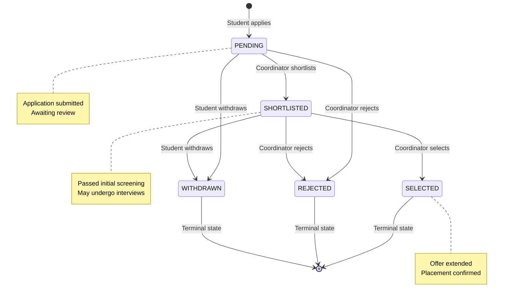
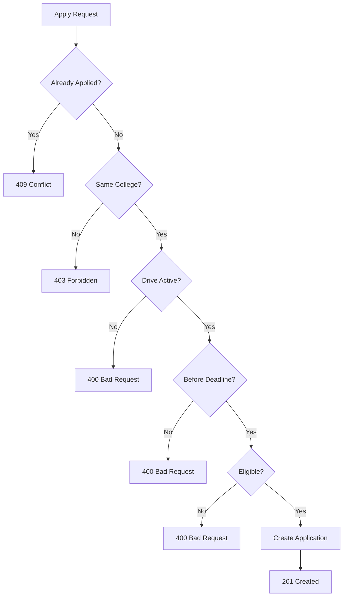

# Applications Feature

## Overview

The Applications module handles student applications to placement drives, including application submission, status tracking, and coordinator review workflows.

---

## Application Lifecycle



---

## Entity Model

### Application Entity

```java
@Entity
@Table(name = "applications")
public class Application extends BaseEntity {

    @Column(name = "student_id", nullable = false)
    private Long studentId;

    @ManyToOne(fetch = FetchType.LAZY)
    @JoinColumn(name = "student_id", insertable = false, updatable = false)
    private StudentProfile student;

    @Column(name = "drive_id", nullable = false)
    private Long driveId;

    @ManyToOne(fetch = FetchType.LAZY)
    @JoinColumn(name = "drive_id", insertable = false, updatable = false)
    private PlacementDrive drive;

    @Column(nullable = false)
    private String status = "PENDING";

    @Column(name = "applied_at", nullable = false)
    private LocalDateTime appliedAt;

    @Column(name = "resume_url")
    private String resumeUrl;  // Snapshot at application time

    @Column(name = "cover_letter")
    private String coverLetter;

    @Column(name = "internal_notes")
    private String internalNotes;  // Coordinator notes (not visible to student)

    // Status change timestamps
    private LocalDateTime shortlistedAt;
    private LocalDateTime selectedAt;
    private LocalDateTime rejectedAt;
    private LocalDateTime withdrawnAt;
}
```

### Application Status Types

```java
public enum ApplicationStatusType {
    PENDING,      // Initial state after application
    SHORTLISTED,  // Passed initial screening
    SELECTED,     // Final selection (terminal)
    REJECTED,     // Not selected (terminal)
    WITHDRAWN     // Student withdrew (terminal)
}
```

---

## Database Schema

```sql
CREATE TABLE applications (
    id                  BIGSERIAL PRIMARY KEY,
    student_id          BIGINT NOT NULL REFERENCES student_profiles(id) ON DELETE CASCADE,
    drive_id            BIGINT NOT NULL REFERENCES placement_drives(id) ON DELETE CASCADE,
    status              VARCHAR(50) DEFAULT 'PENDING',
    applied_at          TIMESTAMP NOT NULL DEFAULT NOW(),
    resume_url          VARCHAR(500),
    cover_letter        TEXT,
    internal_notes      TEXT,
    shortlisted_at      TIMESTAMP,
    rejected_at         TIMESTAMP,
    selected_at         TIMESTAMP,
    withdrawn_at        TIMESTAMP,
    created_at          TIMESTAMP NOT NULL DEFAULT NOW(),
    updated_at          TIMESTAMP,

    -- One application per student per drive
    CONSTRAINT uq_application_student_drive UNIQUE(student_id, drive_id)
);

-- Indexes
CREATE INDEX idx_applications_student ON applications(student_id);
CREATE INDEX idx_applications_drive ON applications(drive_id);
CREATE INDEX idx_applications_status ON applications(status);
```

---

## API Endpoints

### Student Endpoints

| Method | Path | Description |
|--------|------|-------------|
| `GET` | `/api/v1/applications/my` | Get student's own applications |
| `POST` | `/api/v1/applications/apply` | Apply to a drive |
| `DELETE` | `/api/v1/applications/{id}/withdraw` | Withdraw application |

### Coordinator/Admin Endpoints

| Method | Path | Description |
|--------|------|-------------|
| `GET` | `/api/v1/applications` | Get all applications (scoped) |
| `GET` | `/api/v1/applications/drive/{driveId}` | Get applications for a drive |
| `PATCH` | `/api/v1/applications/{id}/status` | Update application status |

---

## Application Submission

### Request

```http
POST /api/v1/applications/apply
Authorization: Bearer <student_token>
Content-Type: application/json

{
  "driveId": 1,
  "resumeUrl": "https://drive.google.com/...",
  "coverLetter": "I am interested in this position..."
}
```

### Response

```json
{
  "success": true,
  "data": {
    "id": 123,
    "studentId": 45,
    "driveId": 1,
    "status": "PENDING",
    "appliedAt": "2026-01-11T10:30:00",
    "resumeUrl": "https://drive.google.com/..."
  },
  "message": "Application submitted successfully"
}
```

### Validation Rules

1. **Duplicate Check**: Student cannot apply twice to same drive
2. **College Match**: Student's college must match drive's college
3. **Eligibility Check**: Student must meet drive eligibility criteria
4. **Deadline Check**: Application must be before registration deadline
5. **Drive Status**: Drive must be in UPCOMING or ONGOING status

### Validation Flow



---

## Status Transitions

### Valid Transitions

| From | To | Actor |
|------|-----|-------|
| PENDING | SHORTLISTED | Coordinator |
| PENDING | REJECTED | Coordinator |
| PENDING | WITHDRAWN | Student |
| SHORTLISTED | SELECTED | Coordinator |
| SHORTLISTED | REJECTED | Coordinator |
| SHORTLISTED | WITHDRAWN | Student |

### Invalid Transitions

- Cannot change status of terminal states (SELECTED, REJECTED, WITHDRAWN)
- Students cannot shortlist or select themselves
- Coordinators cannot withdraw applications

### Status Update Request

```http
PATCH /api/v1/applications/123/status
Authorization: Bearer <coordinator_token>
Content-Type: application/json

{
  "status": "SHORTLISTED"
}
```

### Status Update Response

```json
{
  "success": true,
  "data": {
    "id": 123,
    "status": "SHORTLISTED",
    "shortlistedAt": "2026-01-11T14:00:00"
  },
  "message": "Application status updated"
}
```

---

## Scope Enforcement

### Access Control Matrix

| Role | View Own | View All | By Drive | Update Status |
|------|----------|----------|----------|---------------|
| STUDENT | ✅ | ❌ | ❌ | ❌ (withdraw only) |
| COORDINATOR | ✅ | Scoped | Scoped | Scoped |
| ADMIN | ✅ | College | College | College |
| SUPER_ADMIN | ✅ | All | All | All |

### Service Implementation

```java
@Override
public List<ApplicationDTO> getAllApplications() {
    ScopeContext scope = scopeService.resolveScope(getCurrentUserId());

    if (scope.isStudent()) {
        return getCurrentStudentApplications();
    }

    if (scope.isSuperAdmin()) {
        return applicationRepository.findAll()...;
    }

    if (scope.hasFullCollegeAccess()) {
        return applicationRepository.findByCollegeId(scope.collegeId())...;
    }

    // COORDINATOR with limited scope
    return applicationRepository.findByStudentDepartmentIdInAndCollegeId(
        scope.allowedDepartmentIds(),
        scope.collegeId()
    )...;
}
```

---

## Repository Queries

### Scope-Aware Queries

```java
public interface ApplicationRepository extends JpaRepository<Application, Long> {

    // Student's applications
    List<Application> findByStudentId(Long studentId);

    // Drive applications
    List<Application> findByDriveId(Long driveId);

    // College-scoped
    @Query("SELECT a FROM Application a " +
           "JOIN a.student s " +
           "JOIN s.user u " +
           "WHERE u.college.id = :collegeId")
    List<Application> findByCollegeId(@Param("collegeId") Long collegeId);

    // Department-scoped
    @Query("SELECT a FROM Application a " +
           "WHERE a.student.department.id IN :departmentIds " +
           "AND a.student.user.college.id = :collegeId")
    List<Application> findByStudentDepartmentIdInAndCollegeId(
        @Param("departmentIds") Set<Long> departmentIds,
        @Param("collegeId") Long collegeId
    );

    // Drive + Department scoped
    @Query("SELECT a FROM Application a " +
           "WHERE a.driveId = :driveId " +
           "AND a.student.department.id IN :departmentIds")
    List<Application> findByDriveIdAndStudentDepartmentIdIn(
        @Param("driveId") Long driveId,
        @Param("departmentIds") Set<Long> departmentIds
    );

    // Duplicate check
    boolean existsByStudentIdAndDriveId(Long studentId, Long driveId);
}
```

---

## Withdrawal Flow

### Request

```http
DELETE /api/v1/applications/123/withdraw
Authorization: Bearer <student_token>
```

### Validation

1. Application must belong to current student
2. Application must not be in terminal state
3. Application cannot be withdrawn after selection

### Response

```json
{
  "success": true,
  "message": "Application withdrawn successfully"
}
```

---

## Internal Notes

Coordinators can add notes to applications that are not visible to students:

```http
PATCH /api/v1/applications/123
Authorization: Bearer <coordinator_token>
Content-Type: application/json

{
  "internalNotes": "Good technical skills, proceed to round 2"
}
```

---

## Error Responses

| Scenario | Status | Message |
|----------|--------|---------|
| Already applied | 409 | "Already applied to this drive" |
| Not eligible | 400 | "Student does not meet eligibility criteria" |
| Deadline passed | 400 | "Registration deadline has passed" |
| Drive not active | 400 | "Drive is not accepting applications" |
| College mismatch | 403 | "Cannot apply to drives outside your college" |
| Invalid transition | 400 | "Cannot change status of terminal application" |
| Not found | 404 | "Application not found" |

---

## Related Documentation

- [Eligibility Feature](eligibility.md)
- [Placement Drives](drives.md)
- [Business Workflows](../workflows/BUSINESS-WORKFLOWS.md)
