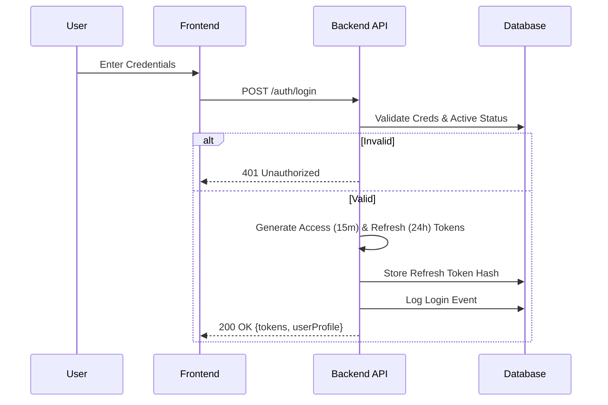
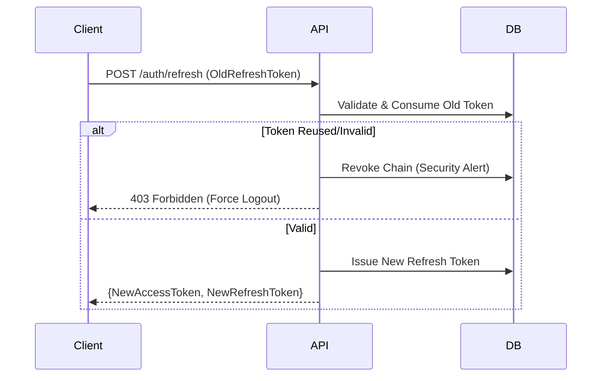
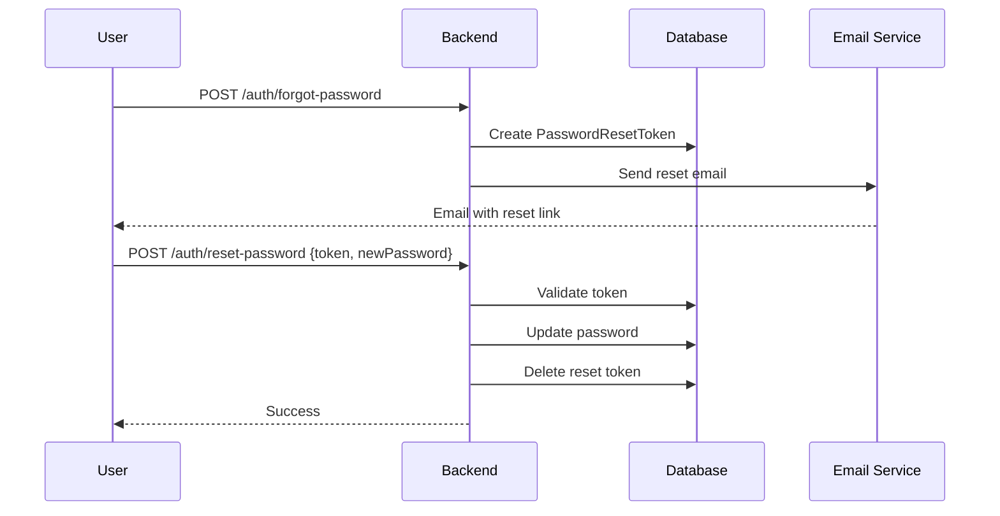

# Authentication System - Functional Specification

> **Scope**: High-level design, user flows, permissions, and security standards.
> **Implementation**: [Backend Details](../backend/README.md#auth-module) | [Frontend Details](../frontend/README.md)

## 1. System Overview

The Authentication System serves as the secure gateway to the PlacementPro platform. It implements a **stateless, token-based architecture** designed to support:
- **Multi-Tenancy**: Strict data isolation between colleges.
- **Role-Based Access Control (RBAC)**: Four-tier permission hierarchy.
- **Auditability**: Comprehensive logging of all security events.

## 2. User Roles & Access Control

Access is governed by a strict **Role-Based Access Control (RBAC)** model.

### 2.1 Role Matrix

| Capability | STUDENT | COORDINATOR | ADMIN | SUPER_ADMIN |
|:---|:---:|:---:|:---:|:---:|
| **View Own Profile** | ✅ | ✅ | ✅ | ✅ |
| **Apply to Drives** | ✅ | ❌ | ❌ | ❌ |
| **Manage Drives** | ❌ | ✅ | ✅ | ✅ |
| **View All Students** | ❌ | ✅ | ✅ | ✅ |
| **Manage Users** | ❌ | ❌ | ✅ | ✅ |
| **College Settings** | ❌ | ❌ | ✅ | ✅ |
| **Global Audit Logs** | ❌ | ❌ | ❌ | ✅ |

### 2.2 Role Definitions

#### **STUDENT**
End-users. Can only access their own data and public drive information.
- **Scope**: Self (User ID)

#### **COORDINATOR (TPO)**
Placement officers. Manage the recruitment process for their department/institute.
- **Scope**: Assigned Organization Unit (Department)

#### **ADMIN (College Admin)**
 Administrators for a specific college. Manage users and college-wide settings.
- **Scope**: Assigned College (and all its Departments)

#### **SUPER_ADMIN (Platform)**
Owners of the SaaS platform. Can manage multiple colleges and global configurations.
- **Scope**: Global / System-Wide

## 3. Authentication Flows

### 3.1 Login & Token Issuance
Uses a standard **JWT (JSON Web Token)** pair strategy for stateless auth.

### 3.2 Token Refresh & Rotation
To maintain security without forcing frequent logins, we use **Refresh Token Rotation**.
- **Access Token**: Short-lived (15 mins), used for API calls.
- **Refresh Token**: Long-lived (24 hours), used *once* to get new tokens.

## 4. Data Model: The Security Token

The JWT acts as the single source of truth for the current session's context.

### Payload Specification (Business View)

| Claim | Key | Description |
|-------|-----|-------------|
| **Subject** | `sub` | User's unique email address |
| **User ID** | `uid` | Primary key database ID |
| **Role** | `role` | `STUDENT` | `COORDINATOR` | `ADMIN` |
| **College** | `cid` | Context for multi-tenancy filtering |
| **Version** | `ver` | Token schema version (for invalidation) |

## 5. Security Standards

### Password Policy
- **Storage**: Never stored in plaintext.
- **Hashing**: Strong hashing algorithm (e.g., BCrypt) with per-user salt.
- **Reset**: Email-based secure workflow with time-limited OTP/Link.

### Access Control Rules
1. **Vertical Isolation**: A User cannot access Admin APIs.
2. **Horizontal Isolation**: A User from College A cannot access College B's data (enforced via `cid` in token).
3. **Account Lockout**: Temporary lockout after 5 failed login attempts.

## 6. Error Scenarios (User Facing)

| Scenario | User Message |
|----------|--------------|
| Invalid Password | "Incorrect email or password." |
| Account Disabled | "Your account has been deactivated. Contact Admin." |
| College Inactive | "Your institution's access is currently paused." |
| Session Expired | "Your session has expired. Please log in again." |

## 7. Test Data (Reference)

| Role | Email | Password |
|------|-------|----------|
| **Student** | `student@test.edu` | `password123` |
| **Coordinator** | `coordinator@test.edu` | `password123` |
| **Admin** | `admin@test.edu` | `password123` |
| **Super Admin** | `superadmin@platform.com` | `password123` |

## Password Reset Flow

## Related Documentation

- [Backend Auth](../backend/README.md#auth-module) - Detailed backend implementation
- [Authorization](../backend/README.md#security-module) - RBAC documentation
- [Security Model](../security.md) - Complete security documentation
- [Multi-Tenancy](multi-tenancy.md) - College isolation
- [Business Workflows](../workflows/BUSINESS-WORKFLOWS.md) - Auth sequence diagrams
