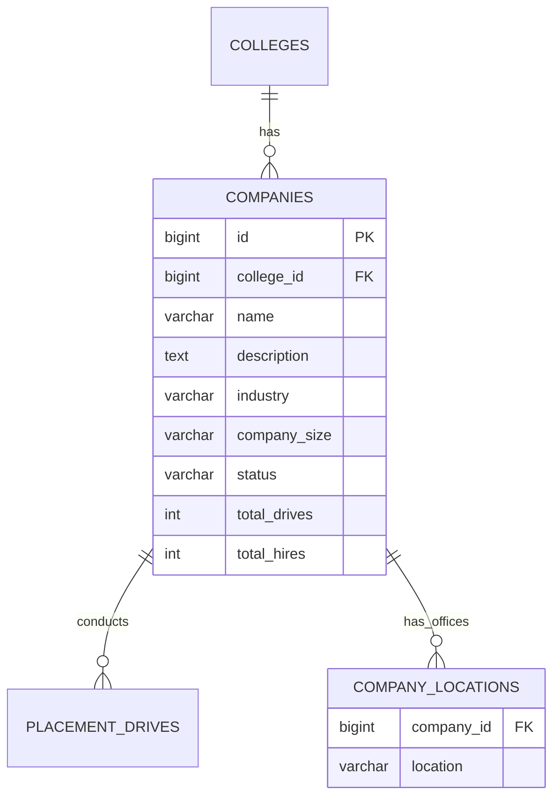
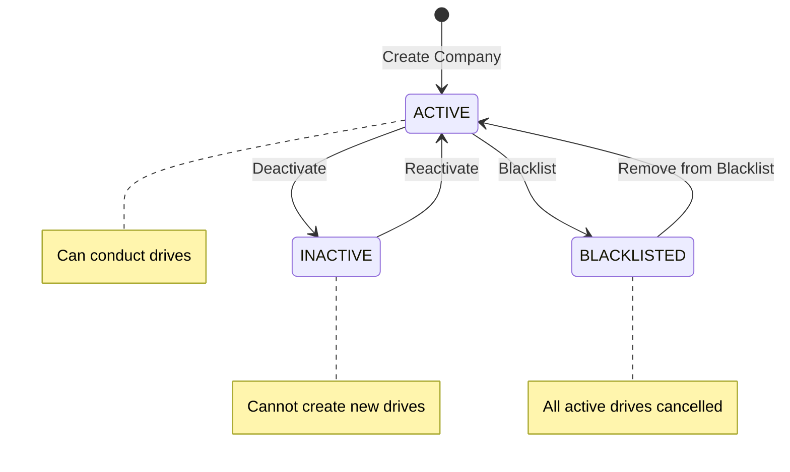
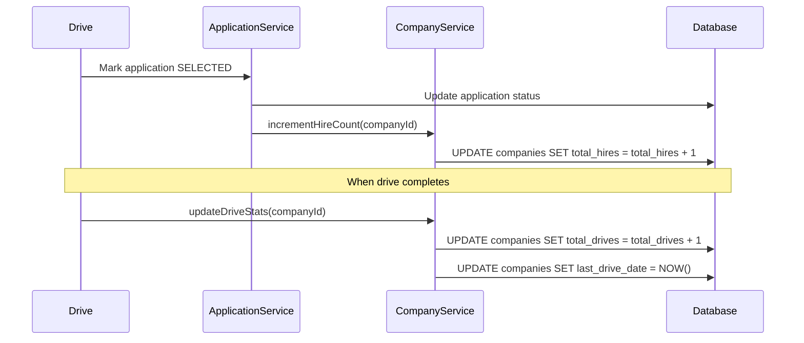

# Companies Feature

## Overview

The Companies module manages company profiles that participate in placement drives. Companies are college-scoped resources, meaning each college maintains its own company relationships.

---

## Entity Model

### Company

```java
@Entity
@Table(name = "companies")
public class Company extends BaseEntity {

    @Id
    @GeneratedValue(strategy = GenerationType.IDENTITY)
    private Long id;

    @ManyToOne(fetch = FetchType.LAZY)
    @JoinColumn(name = "college_id", nullable = false)
    private College college;

    // Basic Info
    @Column(nullable = false)
    private String name;

    @Column(columnDefinition = "TEXT")
    private String description;

    @Column(name = "website_url")
    private String websiteUrl;

    @Column(name = "logo_url")
    private String logoUrl;

    // Industry & Size
    @Column
    private String industry;

    @Column(name = "company_size")
    @Enumerated(EnumType.STRING)
    private CompanySize companySize;

    // Location
    @Column
    private String headquarters;

    @ElementCollection
    @CollectionTable(name = "company_locations")
    private Set<String> locations = new HashSet<>();

    // Contact
    @Column(name = "hr_contact_name")
    private String hrContactName;

    @Column(name = "hr_contact_email")
    private String hrContactEmail;

    @Column(name = "hr_contact_phone")
    private String hrContactPhone;

    // Status
    @Column(nullable = false)
    @Enumerated(EnumType.STRING)
    private CompanyStatus status = CompanyStatus.ACTIVE;

    // Relationship Stats
    @Column(name = "total_drives")
    private Integer totalDrives = 0;

    @Column(name = "total_hires")
    private Integer totalHires = 0;

    @Column(name = "last_drive_date")
    private LocalDate lastDriveDate;

    // Relationships
    @OneToMany(mappedBy = "company", fetch = FetchType.LAZY)
    private List<PlacementDrive> drives = new ArrayList<>();
}
```

### Enums

```java
public enum CompanySize {
    STARTUP,        // 1-50 employees
    SMALL,          // 51-200 employees
    MEDIUM,         // 201-1000 employees
    LARGE,          // 1001-5000 employees
    ENTERPRISE      // 5000+ employees
}

public enum CompanyStatus {
    ACTIVE,
    INACTIVE,
    BLACKLISTED
}
```

---

## Database Schema

```sql
CREATE TABLE companies (
    id                  BIGSERIAL PRIMARY KEY,
    college_id          BIGINT NOT NULL REFERENCES colleges(id),

    -- Basic Info
    name                VARCHAR(255) NOT NULL,
    description         TEXT,
    website_url         VARCHAR(500),
    logo_url            VARCHAR(500),

    -- Industry & Size
    industry            VARCHAR(100),
    company_size        VARCHAR(50),

    -- Location
    headquarters        VARCHAR(255),

    -- Contact
    hr_contact_name     VARCHAR(255),
    hr_contact_email    VARCHAR(255),
    hr_contact_phone    VARCHAR(50),

    -- Status
    status              VARCHAR(50) NOT NULL DEFAULT 'ACTIVE',

    -- Stats
    total_drives        INTEGER DEFAULT 0,
    total_hires         INTEGER DEFAULT 0,
    last_drive_date     DATE,

    -- Audit
    created_at          TIMESTAMP NOT NULL DEFAULT NOW(),
    updated_at          TIMESTAMP,

    UNIQUE(college_id, name)
);

-- Company locations (multiple office locations)
CREATE TABLE company_locations (
    company_id          BIGINT NOT NULL REFERENCES companies(id) ON DELETE CASCADE,
    location            VARCHAR(255) NOT NULL
);

-- Indexes
CREATE INDEX idx_companies_college ON companies(college_id);
CREATE INDEX idx_companies_status ON companies(status);
CREATE INDEX idx_companies_industry ON companies(industry);
CREATE INDEX idx_companies_name ON companies(name);
```

---

## ER Diagram



---

## API Endpoints

### Create Company

```http
POST /api/v1/companies
Authorization: Bearer <coordinator_token>
Content-Type: application/json

{
  "name": "Tech Corp",
  "description": "Leading technology solutions provider...",
  "websiteUrl": "https://techcorp.com",
  "industry": "Information Technology",
  "companySize": "LARGE",
  "headquarters": "Bangalore, India",
  "locations": ["Bangalore", "Hyderabad", "Pune"],
  "hrContactName": "Jane Smith",
  "hrContactEmail": "hr@techcorp.com",
  "hrContactPhone": "+91-9876543210"
}
```

**Response:**
```json
{
  "success": true,
  "data": {
    "id": 1,
    "name": "Tech Corp",
    "industry": "Information Technology",
    "companySize": "LARGE",
    "status": "ACTIVE",
    "totalDrives": 0,
    "totalHires": 0,
    "createdAt": "2026-01-11T10:30:00"
  },
  "message": "Company created successfully"
}
```

### List Companies

```http
GET /api/v1/companies?status=ACTIVE&industry=IT&page=0&size=10
Authorization: Bearer <token>
```

**Response:**
```json
{
  "success": true,
  "data": {
    "content": [
      {
        "id": 1,
        "name": "Tech Corp",
        "industry": "Information Technology",
        "companySize": "LARGE",
        "totalDrives": 5,
        "totalHires": 42,
        "lastDriveDate": "2025-12-15"
      }
    ],
    "page": 0,
    "size": 10,
    "totalElements": 25,
    "totalPages": 3
  }
}
```

### Get Company Details

```http
GET /api/v1/companies/{companyId}
Authorization: Bearer <token>
```

### Update Company

```http
PUT /api/v1/companies/{companyId}
Authorization: Bearer <coordinator_token>
Content-Type: application/json

{
  "description": "Updated description...",
  "hrContactEmail": "newemail@techcorp.com"
}
```

### Get Company Drives

```http
GET /api/v1/companies/{companyId}/drives?status=COMPLETED
Authorization: Bearer <token>
```

### Get Company Statistics

```http
GET /api/v1/companies/{companyId}/stats
Authorization: Bearer <coordinator_token>
```

**Response:**
```json
{
  "success": true,
  "data": {
    "companyId": 1,
    "companyName": "Tech Corp",
    "totalDrives": 5,
    "activeDrives": 1,
    "totalApplications": 250,
    "totalHires": 42,
    "averagePackage": 1200000,
    "highestPackage": 2000000,
    "hiresByYear": {
      "2024": 15,
      "2025": 27
    },
    "topHiringDepartments": [
      {"department": "CSE", "count": 25},
      {"department": "IT", "count": 12},
      {"department": "ECE", "count": 5}
    ]
  }
}
```

### Update Company Status

```http
PATCH /api/v1/companies/{companyId}/status
Authorization: Bearer <admin_token>
Content-Type: application/json

{
  "status": "BLACKLISTED",
  "reason": "Violated recruitment guidelines"
}
```

---

## Service Layer

### CompanyService Interface

```java
public interface CompanyService {

    CompanyDTO createCompany(CreateCompanyRequest request);

    CompanyDTO getCompanyById(Long id);

    Page<CompanyDTO> getCompanies(CompanyFilterRequest filter, Pageable pageable);

    CompanyDTO updateCompany(Long id, UpdateCompanyRequest request);

    void updateCompanyStatus(Long id, CompanyStatus status, String reason);

    void deleteCompany(Long id);

    CompanyStatsDTO getCompanyStats(Long id);

    List<PlacementDriveDTO> getCompanyDrives(Long id, DriveStatus status);
}
```

### CompanyServiceImpl

```java
@Service
@RequiredArgsConstructor
@Transactional
public class CompanyServiceImpl implements CompanyService {

    private final CompanyRepository companyRepository;
    private final OrganizationScopeService scopeService;

    @Override
    public CompanyDTO createCompany(CreateCompanyRequest request) {
        ScopeContext scope = scopeService.getCurrentUserScope();
        Long collegeId = scope.getCollegeId();

        // Check for duplicate name within college
        if (companyRepository.existsByCollegeIdAndName(collegeId, request.getName())) {
            throw new DuplicateResourceException(
                "Company with name '" + request.getName() + "' already exists"
            );
        }

        Company company = Company.builder()
            .collegeId(collegeId)
            .name(request.getName())
            .description(request.getDescription())
            .websiteUrl(request.getWebsiteUrl())
            .industry(request.getIndustry())
            .companySize(request.getCompanySize())
            .headquarters(request.getHeadquarters())
            .locations(request.getLocations())
            .hrContactName(request.getHrContactName())
            .hrContactEmail(request.getHrContactEmail())
            .hrContactPhone(request.getHrContactPhone())
            .status(CompanyStatus.ACTIVE)
            .build();

        Company saved = companyRepository.save(company);
        return toDTO(saved);
    }

    @Override
    public Page<CompanyDTO> getCompanies(CompanyFilterRequest filter, Pageable pageable) {
        ScopeContext scope = scopeService.getCurrentUserScope();

        return companyRepository.findByCollegeIdAndFilters(
            scope.getCollegeId(),
            filter.getStatus(),
            filter.getIndustry(),
            filter.getSearchTerm(),
            pageable
        ).map(this::toDTO);
    }

    @Override
    @PreAuthorize("hasRole('ADMIN')")
    public void updateCompanyStatus(Long id, CompanyStatus status, String reason) {
        Company company = getCompanyEntity(id);

        CompanyStatus oldStatus = company.getStatus();
        company.setStatus(status);

        companyRepository.save(company);

        // Log status change
        log.info("Company {} status changed from {} to {}. Reason: {}",
            id, oldStatus, status, reason);

        // If blacklisted, cancel active drives
        if (status == CompanyStatus.BLACKLISTED) {
            cancelActiveCompanyDrives(company);
        }
    }
}
```

---

## Repository Queries

### CompanyRepository

```java
@Repository
public interface CompanyRepository extends JpaRepository<Company, Long> {

    boolean existsByCollegeIdAndName(Long collegeId, String name);

    // Find with filters
    @Query("""
        SELECT c FROM Company c
        WHERE c.college.id = :collegeId
        AND (:status IS NULL OR c.status = :status)
        AND (:industry IS NULL OR c.industry = :industry)
        AND (:searchTerm IS NULL OR LOWER(c.name) LIKE LOWER(CONCAT('%', :searchTerm, '%')))
        """)
    Page<Company> findByCollegeIdAndFilters(
        @Param("collegeId") Long collegeId,
        @Param("status") CompanyStatus status,
        @Param("industry") String industry,
        @Param("searchTerm") String searchTerm,
        Pageable pageable
    );

    // Top hiring companies
    @Query("""
        SELECT c FROM Company c
        WHERE c.college.id = :collegeId
        AND c.status = 'ACTIVE'
        ORDER BY c.totalHires DESC
        """)
    List<Company> findTopHiringCompanies(
        @Param("collegeId") Long collegeId,
        Pageable pageable
    );

    // Companies with active drives
    @Query("""
        SELECT DISTINCT c FROM Company c
        JOIN c.drives d
        WHERE c.college.id = :collegeId
        AND d.status IN ('UPCOMING', 'ONGOING')
        """)
    List<Company> findWithActiveDrives(@Param("collegeId") Long collegeId);

    // Statistics
    @Query("""
        SELECT new com.placementpro.dto.CompanyStatsDTO(
            c.id,
            c.name,
            c.totalDrives,
            c.totalHires,
            COUNT(DISTINCT d.id),
            AVG(d.salaryMax)
        )
        FROM Company c
        LEFT JOIN c.drives d
        WHERE c.id = :companyId
        GROUP BY c.id, c.name, c.totalDrives, c.totalHires
        """)
    CompanyStatsDTO getCompanyStats(@Param("companyId") Long companyId);
}
```

---

## Company Lifecycle



---

## Statistics Update Workflow



---

## Error Responses

| Scenario | Status | Message |
|----------|--------|---------|
| Company not found | 404 | "Company not found: 123" |
| Duplicate name | 409 | "Company with name 'Tech Corp' already exists" |
| Invalid status | 400 | "Invalid company status: UNKNOWN" |
| Access denied | 403 | "Access denied to company in different college" |
| Cannot delete with drives | 400 | "Cannot delete company with existing drives" |

---

## Industry Categories

Standard industry categories used:

| Category | Examples |
|----------|----------|
| Information Technology | Software, SaaS, IT Services |
| Finance & Banking | Banks, NBFCs, FinTech |
| Consulting | Management, Strategy |
| E-Commerce | Online Retail, Marketplaces |
| Manufacturing | Automotive, Electronics |
| Healthcare | Pharma, HealthTech |
| Telecommunications | Telecom, Network |
| Energy | Oil & Gas, Renewables |
| FMCG | Consumer Goods |
| Others | Miscellaneous |

---

## Related Documentation

- [Placement Drives](drives.md)
- [Applications Feature](applications.md)
- [Analytics Feature](analytics.md)
