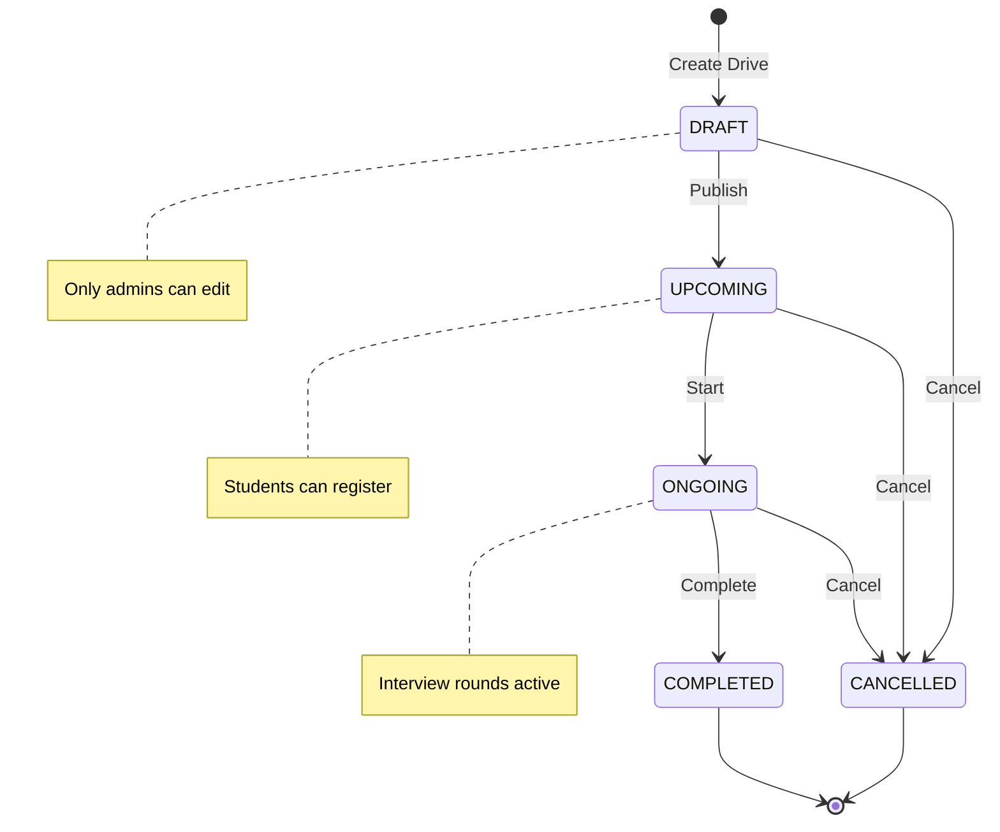
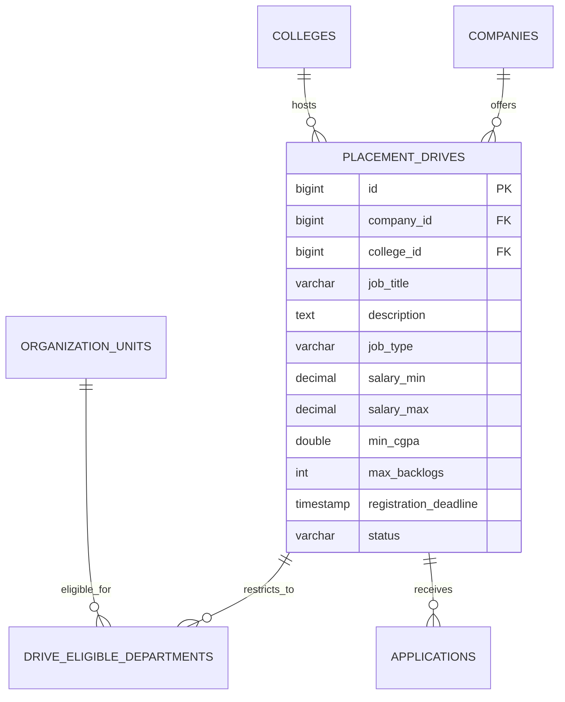
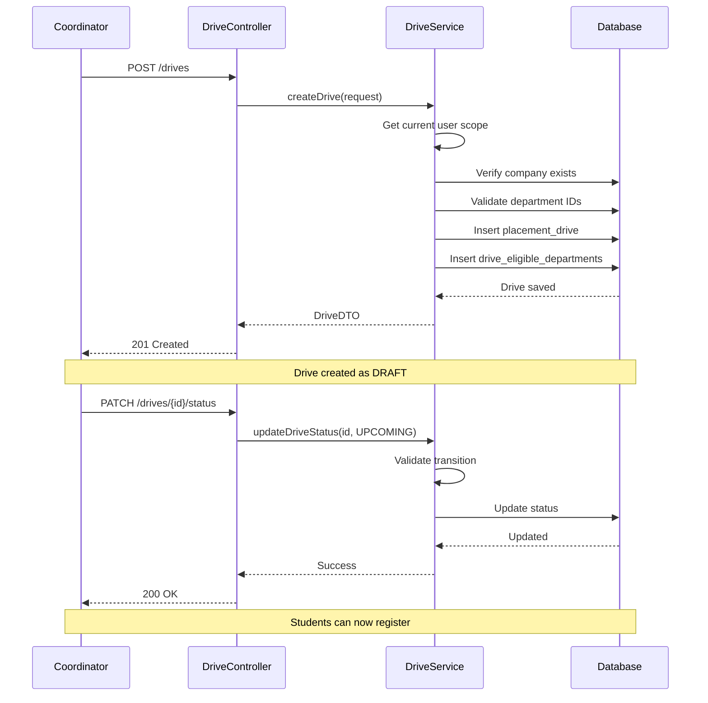

# Placement Drives Feature

## Overview

Placement Drives represent job opportunities from companies. This module manages the complete lifecycle from creation to completion, including eligibility verification, registration, and result tracking.

---

## Drive Lifecycle



### Status Definitions

| Status | Description | Allowed Actions |
|--------|-------------|-----------------|
| `DRAFT` | Being prepared, not visible to students | Edit, Publish, Cancel |
| `UPCOMING` | Published, registration open | Register, Edit, Start, Cancel |
| `ONGOING` | Active interviews in progress | Update results, Complete, Cancel |
| `COMPLETED` | All rounds finished | View results |
| `CANCELLED` | Drive abandoned | View only |

---

## Entity Model

### PlacementDrive

```java
@Entity
@Table(name = "placement_drives")
public class PlacementDrive extends BaseEntity {

    @Id
    @GeneratedValue(strategy = GenerationType.IDENTITY)
    private Long id;

    @ManyToOne(fetch = FetchType.LAZY)
    @JoinColumn(name = "company_id", nullable = false)
    private Company company;

    @ManyToOne(fetch = FetchType.LAZY)
    @JoinColumn(name = "college_id", nullable = false)
    private College college;

    // Job Details
    @Column(name = "job_title", nullable = false)
    private String jobTitle;

    @Column(columnDefinition = "TEXT")
    private String description;

    @Column(name = "job_type", nullable = false)
    @Enumerated(EnumType.STRING)
    private JobType jobType;  // FULL_TIME, INTERNSHIP, CONTRACT

    // Compensation
    @Column(name = "salary_min")
    private BigDecimal salaryMin;

    @Column(name = "salary_max")
    private BigDecimal salaryMax;

    @Column(name = "stipend")  // For internships
    private BigDecimal stipend;

    // Skills
    @ElementCollection
    @CollectionTable(name = "drive_required_skills")
    private Set<String> requiredSkills;

    @ElementCollection
    @CollectionTable(name = "drive_preferred_skills")
    private Set<String> preferredSkills;

    // Eligibility Criteria
    @Column(name = "min_cgpa")
    private Double minCgpa;

    @Column(name = "max_backlogs")
    private Integer maxBacklogs;

    @ManyToMany
    @JoinTable(
        name = "drive_eligible_departments",
        joinColumns = @JoinColumn(name = "drive_id"),
        inverseJoinColumns = @JoinColumn(name = "department_id")
    )
    private Set<OrganizationUnit> eligibleDepartments;

    // Timeline
    @Column(name = "registration_deadline", nullable = false)
    private LocalDateTime registrationDeadline;

    @Column(name = "drive_date")
    private LocalDate driveDate;

    // Status
    @Column(nullable = false)
    @Enumerated(EnumType.STRING)
    private DriveStatus status = DriveStatus.DRAFT;

    // Audit
    @ManyToOne(fetch = FetchType.LAZY)
    @JoinColumn(name = "created_by")
    private User createdBy;
}
```

### DriveStatus Enum

```java
public enum DriveStatus {
    DRAFT,
    UPCOMING,
    ONGOING,
    COMPLETED,
    CANCELLED
}

public enum JobType {
    FULL_TIME,
    INTERNSHIP,
    CONTRACT
}
```

---

## Database Schema

```sql
CREATE TABLE placement_drives (
    id                      BIGSERIAL PRIMARY KEY,
    company_id              BIGINT NOT NULL REFERENCES companies(id),
    college_id              BIGINT NOT NULL REFERENCES colleges(id),

    -- Job Details
    job_title               VARCHAR(255) NOT NULL,
    description             TEXT,
    job_type                VARCHAR(50) NOT NULL DEFAULT 'FULL_TIME',

    -- Compensation
    salary_min              DECIMAL(12, 2),
    salary_max              DECIMAL(12, 2),
    stipend                 DECIMAL(12, 2),

    -- Skills (stored as arrays)
    required_skills         TEXT[],
    preferred_skills        TEXT[],

    -- Eligibility
    min_cgpa                DOUBLE PRECISION DEFAULT 0.0,
    max_backlogs            INTEGER DEFAULT 0,

    -- Timeline
    registration_deadline   TIMESTAMP NOT NULL,
    drive_date              DATE,

    -- Status
    status                  VARCHAR(50) NOT NULL DEFAULT 'DRAFT',

    -- Audit
    created_by              BIGINT REFERENCES users(id),
    created_at              TIMESTAMP NOT NULL DEFAULT NOW(),
    updated_at              TIMESTAMP
);

-- Eligible departments junction table
CREATE TABLE drive_eligible_departments (
    drive_id        BIGINT NOT NULL REFERENCES placement_drives(id) ON DELETE CASCADE,
    department_id   BIGINT NOT NULL REFERENCES organization_units(id) ON DELETE CASCADE,
    PRIMARY KEY (drive_id, department_id)
);

-- Indexes
CREATE INDEX idx_drives_college ON placement_drives(college_id);
CREATE INDEX idx_drives_company ON placement_drives(company_id);
CREATE INDEX idx_drives_status ON placement_drives(status);
CREATE INDEX idx_drives_deadline ON placement_drives(registration_deadline);
```

---

## ER Diagram



---

## API Endpoints

### Create Drive (Coordinator/Admin)

```http
POST /api/v1/drives
Authorization: Bearer <coordinator_token>
Content-Type: application/json

{
  "companyId": 1,
  "jobTitle": "Software Engineer",
  "description": "Backend development position...",
  "jobType": "FULL_TIME",
  "salaryMin": 800000,
  "salaryMax": 1200000,
  "requiredSkills": ["Java", "Spring Boot", "SQL"],
  "preferredSkills": ["Docker", "AWS"],
  "minCgpa": 7.0,
  "maxBacklogs": 0,
  "eligibleDepartmentIds": [1, 2, 3],
  "registrationDeadline": "2026-02-15T23:59:59",
  "driveDate": "2026-02-20"
}
```

**Response:**
```json
{
  "success": true,
  "data": {
    "id": 123,
    "company": {
      "id": 1,
      "name": "Tech Corp"
    },
    "jobTitle": "Software Engineer",
    "status": "DRAFT",
    "registrationDeadline": "2026-02-15T23:59:59",
    "createdAt": "2026-01-11T10:30:00"
  },
  "message": "Drive created successfully"
}
```

### List Drives

**For Students (filtered by eligibility):**
```http
GET /api/v1/drives?status=UPCOMING&eligible=true
Authorization: Bearer <student_token>
```

**For Coordinators (all drives in scope):**
```http
GET /api/v1/drives?page=0&size=10&sort=registrationDeadline,asc
Authorization: Bearer <coordinator_token>
```

### Get Drive Details

```http
GET /api/v1/drives/{driveId}
Authorization: Bearer <token>
```

### Update Drive

```http
PUT /api/v1/drives/{driveId}
Authorization: Bearer <coordinator_token>
Content-Type: application/json

{
  "jobTitle": "Senior Software Engineer",
  "salaryMax": 1500000
}
```

### Change Drive Status

```http
PATCH /api/v1/drives/{driveId}/status
Authorization: Bearer <coordinator_token>
Content-Type: application/json

{
  "status": "UPCOMING"
}
```

### Get Drive Statistics

```http
GET /api/v1/drives/{driveId}/stats
Authorization: Bearer <coordinator_token>
```

**Response:**
```json
{
  "success": true,
  "data": {
    "driveId": 123,
    "totalApplications": 150,
    "pendingApplications": 50,
    "shortlistedCount": 80,
    "selectedCount": 20,
    "rejectedCount": 50,
    "withdrawnCount": 10,
    "eligibleStudents": 200,
    "registrationRate": 75.0
  }
}
```

---

## Service Layer

### DriveService Interface

```java
public interface DriveService {

    DriveDTO createDrive(CreateDriveRequest request);

    DriveDTO getDriveById(Long id);

    Page<DriveDTO> getDrives(DriveFilterRequest filter, Pageable pageable);

    DriveDTO updateDrive(Long id, UpdateDriveRequest request);

    void updateDriveStatus(Long id, DriveStatus status);

    void deleteDrive(Long id);

    DriveStatsDTO getDriveStats(Long id);

    List<DriveDTO> getUpcomingDrivesForStudent(Long studentId);
}
```

### DriveServiceImpl

```java
@Service
@RequiredArgsConstructor
@Transactional
public class DriveServiceImpl implements DriveService {

    private final DriveRepository driveRepository;
    private final CompanyRepository companyRepository;
    private final OrganizationScopeService scopeService;

    @Override
    public DriveDTO createDrive(CreateDriveRequest request) {
        // Get current user's college
        ScopeContext scope = scopeService.getCurrentUserScope();
        Long collegeId = scope.getCollegeId();

        Company company = companyRepository.findById(request.getCompanyId())
            .orElseThrow(() -> new ResourceNotFoundException("Company not found"));

        PlacementDrive drive = PlacementDrive.builder()
            .company(company)
            .collegeId(collegeId)
            .jobTitle(request.getJobTitle())
            .description(request.getDescription())
            .jobType(request.getJobType())
            .salaryMin(request.getSalaryMin())
            .salaryMax(request.getSalaryMax())
            .requiredSkills(request.getRequiredSkills())
            .preferredSkills(request.getPreferredSkills())
            .minCgpa(request.getMinCgpa())
            .maxBacklogs(request.getMaxBacklogs())
            .registrationDeadline(request.getRegistrationDeadline())
            .driveDate(request.getDriveDate())
            .status(DriveStatus.DRAFT)
            .build();

        // Set eligible departments
        if (request.getEligibleDepartmentIds() != null) {
            Set<OrganizationUnit> departments =
                organizationUnitRepository.findAllById(request.getEligibleDepartmentIds());
            drive.setEligibleDepartments(departments);
        }

        PlacementDrive saved = driveRepository.save(drive);
        return toDTO(saved);
    }

    @Override
    public Page<DriveDTO> getDrives(DriveFilterRequest filter, Pageable pageable) {
        ScopeContext scope = scopeService.getCurrentUserScope();

        return driveRepository.findByCollegeIdAndFilters(
            scope.getCollegeId(),
            filter.getStatus(),
            filter.getCompanyId(),
            filter.getFromDate(),
            filter.getToDate(),
            pageable
        ).map(this::toDTO);
    }
}
```

---

## Repository Queries

### DriveRepository

```java
@Repository
public interface DriveRepository extends JpaRepository<PlacementDrive, Long> {

    // Find by college (scope enforcement)
    @Query("SELECT d FROM PlacementDrive d WHERE d.college.id = :collegeId")
    Page<PlacementDrive> findByCollegeId(
        @Param("collegeId") Long collegeId,
        Pageable pageable
    );

    // Find with filters
    @Query("""
        SELECT d FROM PlacementDrive d
        WHERE d.college.id = :collegeId
        AND (:status IS NULL OR d.status = :status)
        AND (:companyId IS NULL OR d.company.id = :companyId)
        AND (:fromDate IS NULL OR d.registrationDeadline >= :fromDate)
        AND (:toDate IS NULL OR d.registrationDeadline <= :toDate)
        """)
    Page<PlacementDrive> findByCollegeIdAndFilters(
        @Param("collegeId") Long collegeId,
        @Param("status") DriveStatus status,
        @Param("companyId") Long companyId,
        @Param("fromDate") LocalDateTime fromDate,
        @Param("toDate") LocalDateTime toDate,
        Pageable pageable
    );

    // Upcoming drives for student (with department eligibility)
    @Query("""
        SELECT d FROM PlacementDrive d
        JOIN d.eligibleDepartments dept
        WHERE d.college.id = :collegeId
        AND d.status = 'UPCOMING'
        AND d.registrationDeadline > :now
        AND dept.id = :departmentId
        """)
    List<PlacementDrive> findUpcomingEligibleDrives(
        @Param("collegeId") Long collegeId,
        @Param("departmentId") Long departmentId,
        @Param("now") LocalDateTime now
    );

    // Count applications by status
    @Query("""
        SELECT new com.placementpro.dto.DriveStatsDTO(
            d.id,
            COUNT(a),
            SUM(CASE WHEN a.status = 'PENDING' THEN 1 ELSE 0 END),
            SUM(CASE WHEN a.status = 'SHORTLISTED' THEN 1 ELSE 0 END),
            SUM(CASE WHEN a.status = 'SELECTED' THEN 1 ELSE 0 END),
            SUM(CASE WHEN a.status = 'REJECTED' THEN 1 ELSE 0 END)
        )
        FROM PlacementDrive d
        LEFT JOIN Application a ON a.drive.id = d.id
        WHERE d.id = :driveId
        GROUP BY d.id
        """)
    DriveStatsDTO getDriveStats(@Param("driveId") Long driveId);
}
```

---

## Scope Enforcement

### Multi-Tenancy

Drives are isolated by `college_id`:

```java
@Override
@PreAuthorize("hasAnyRole('COORDINATOR', 'ADMIN')")
public DriveDTO getDriveById(Long id) {
    ScopeContext scope = scopeService.getCurrentUserScope();

    return driveRepository.findById(id)
        .filter(drive -> drive.getCollege().getId().equals(scope.getCollegeId()))
        .map(this::toDTO)
        .orElseThrow(() -> new ResourceNotFoundException("Drive not found: " + id));
}
```

---

## Drive Creation Workflow



---

## Status Transition Rules

```java
public class DriveStatusMachine {

    private static final Map<DriveStatus, Set<DriveStatus>> ALLOWED_TRANSITIONS = Map.of(
        DriveStatus.DRAFT, Set.of(DriveStatus.UPCOMING, DriveStatus.CANCELLED),
        DriveStatus.UPCOMING, Set.of(DriveStatus.ONGOING, DriveStatus.CANCELLED),
        DriveStatus.ONGOING, Set.of(DriveStatus.COMPLETED, DriveStatus.CANCELLED),
        DriveStatus.COMPLETED, Set.of(),
        DriveStatus.CANCELLED, Set.of()
    );

    public void validateTransition(DriveStatus current, DriveStatus target) {
        if (!ALLOWED_TRANSITIONS.get(current).contains(target)) {
            throw new InvalidStateTransitionException(
                "Cannot transition from " + current + " to " + target
            );
        }
    }
}
```

---

## Error Responses

| Scenario | Status | Message |
|----------|--------|---------|
| Company not found | 404 | "Company not found: 123" |
| Invalid department ID | 400 | "Department not found: 456" |
| Invalid status transition | 400 | "Cannot transition from DRAFT to COMPLETED" |
| Deadline in past | 400 | "Registration deadline must be in the future" |
| Not authorized | 403 | "Access denied to drive in different college" |
| Drive not found | 404 | "Drive not found: 789" |

---

## Notifications

When drive status changes:

| Event | Recipients | Channel |
|-------|-----------|---------|
| Drive published (→ UPCOMING) | Eligible students | Email + In-app |
| Registration closing soon | Registered students | Email |
| Drive starting (→ ONGOING) | Registered students | Email + SMS |
| Results announced | All applicants | Email |
| Drive cancelled | All applicants | Email |

---

## Related Documentation

- [Applications Feature](applications.md)
- [Eligibility Feature](eligibility.md)
- [Companies Feature](companies.md)
- [ER Diagram](../database/ER-DIAGRAM.md)
