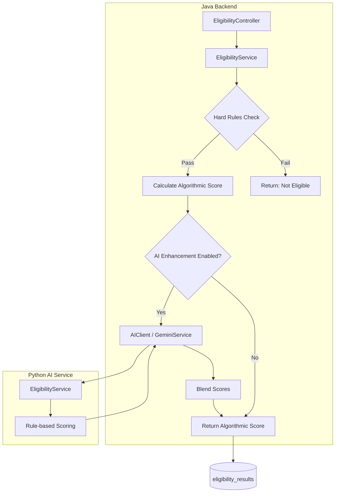

# Eligibility Feature

## Overview

The Eligibility module determines whether students meet placement drive requirements using a **rule-first, AI-second** approach. Hard business rules are checked first, followed by a weighted scoring algorithm with optional AI enhancement.

---

## Architecture



---

## Eligibility Check Flow

### Hard Rules (Rule-First)

These must pass before scoring:

| Rule | Condition | Fail Message |
|------|-----------|--------------|
| CGPA | `student.cgpa >= drive.minCgpa` | "CGPA below minimum" |
| Backlogs | `student.backlogs <= drive.maxBacklogs` | "Too many backlogs" |
| Department | `student.department IN drive.eligibleDepartments` | "Department not eligible" |
| Deadline | `now <= drive.registrationDeadline` | "Registration closed" |
| Status | `drive.status IN ['UPCOMING', 'ONGOING']` | "Drive not active" |

### Scoring Algorithm (AI-Second)

After hard rules pass:

```
Total Score = (
    CGPA Score × 0.40 +
    Skills Score × 0.35 +
    Experience Score × 0.25
)

Eligible = Total Score >= 50.0
```

---

## Score Components

### 1. CGPA Score (40% weight)

```python
def calculate_cgpa_score(cgpa, min_cgpa):
    if cgpa < min_cgpa:
        return (cgpa / min_cgpa) * 50  # Penalized
    else:
        return 50 + ((cgpa - min_cgpa) / (10.0 - min_cgpa)) * 50
```

| Student CGPA | Min Required | Score |
|--------------|--------------|-------|
| 9.0 | 7.0 | 83.33 |
| 8.0 | 7.0 | 66.67 |
| 7.0 | 7.0 | 50.00 |
| 6.5 | 7.0 | 46.43 |

### 2. Skills Score (35% weight)

```python
def calculate_skills_score(student_skills, required_skills, preferred_skills):
    required_matches = count_matches(student_skills, required_skills)
    required_score = (required_matches / len(required_skills)) * 70  # Max 70

    if preferred_skills:
        preferred_matches = count_matches(student_skills, preferred_skills)
        preferred_score = (preferred_matches / len(preferred_skills)) * 30  # Max 30
    else:
        preferred_score = 30  # Full bonus if no preferred skills

    return required_score + preferred_score
```

### 3. Experience Score (25% weight)

```python
def calculate_experience_score(projects_count, internship_months):
    # Projects: 0-5 = 0-50 points
    project_score = min(projects_count * 10, 50)

    # Internship: 0-6+ months = 0-50 points
    internship_score = min(internship_months * 8.33, 50)

    return project_score + internship_score
```

---

## API Endpoints

### Check Eligibility

```http
GET /api/v1/eligibility/check?studentId=1&driveId=2
Authorization: Bearer <token>
```

**Response:**
```json
{
  "success": true,
  "data": {
    "studentId": 1,
    "driveId": 2,
    "isEligible": true,
    "score": 75.5,
    "cgpaScore": 83.33,
    "skillsScore": 70.0,
    "experienceScore": 65.0,
    "reasons": ["Student meets all eligibility criteria"],
    "skillGaps": ["Machine Learning", "Docker"],
    "calculatedAt": "2026-01-11T10:30:00"
  }
}
```

### Current Student Eligibility

```http
GET /api/v1/eligibility/my/{driveId}
Authorization: Bearer <student_token>
```

### Drive Eligibility Results (Coordinator)

```http
GET /api/v1/eligibility/drive/{driveId}
Authorization: Bearer <coordinator_token>
```

---

## Entity Model

### EligibilityResult

```java
@Entity
@Table(name = "eligibility_results")
public class EligibilityResult extends BaseEntity {

    @Column(name = "student_id", nullable = false)
    private Long studentId;

    @Column(name = "drive_id", nullable = false)
    private Long driveId;

    @Column(name = "is_eligible", nullable = false)
    private Boolean isEligible;

    @Column(nullable = false)
    private Double score;

    // Component scores
    @Column(name = "cgpa_score")
    private Double cgpaScore;

    @Column(name = "skills_score")
    private Double skillsScore;

    @Column(name = "experience_score")
    private Double experienceScore;

    // AI explanations
    @Column(columnDefinition = "TEXT")
    private String reasons;  // JSON or comma-separated

    @Column(name = "skill_gaps", columnDefinition = "TEXT")
    private String skillGaps;  // Missing skills

    @Column(name = "calculated_at", nullable = false)
    private LocalDateTime calculatedAt;
}
```

---

## Database Schema

```sql
CREATE TABLE eligibility_results (
    id                  BIGSERIAL PRIMARY KEY,
    student_id          BIGINT NOT NULL REFERENCES student_profiles(id) ON DELETE CASCADE,
    drive_id            BIGINT NOT NULL REFERENCES placement_drives(id) ON DELETE CASCADE,

    is_eligible         BOOLEAN NOT NULL DEFAULT FALSE,
    score               DOUBLE PRECISION NOT NULL,

    cgpa_score          DOUBLE PRECISION,
    skills_score        DOUBLE PRECISION,
    experience_score    DOUBLE PRECISION,

    reasons             TEXT,
    skill_gaps          TEXT,

    calculated_at       TIMESTAMP NOT NULL DEFAULT NOW(),
    created_at          TIMESTAMP NOT NULL DEFAULT NOW(),
    updated_at          TIMESTAMP
);

CREATE INDEX idx_eligibility_student ON eligibility_results(student_id);
CREATE INDEX idx_eligibility_drive ON eligibility_results(drive_id);
```

---

## Caching Strategy

### Result Caching

Eligibility results are cached for 1 hour:

```java
@Override
public EligibilityResultDTO checkEligibility(Long studentId, Long driveId) {
    // Check for existing recent result
    return eligibilityRepository.findByStudentIdAndDriveId(studentId, driveId)
        .filter(existing -> existing.getCalculatedAt().isAfter(LocalDateTime.now().minusHours(1)))
        .map(this::toDTO)
        .orElseGet(() -> calculateAndSaveEligibility(student, drive));
}
```

### Cache Invalidation

Results are recalculated when:
- Drive requirements change
- Student profile updates (CGPA, skills, etc.)
- Coordinator triggers manual recalculation

---

## AI Integration

### Option 1: Python AI Service

```java
@CircuitBreaker(name = "aiService", fallbackMethod = "fallbackScore")
public AIResponseDTO calculateEligibilityScore(EligibilityRequestDTO request) {
    return restTemplate.postForObject(
        aiServiceBaseUrl + "/eligibility/score",
        request,
        AIResponseDTO.class
    );
}
```

### Option 2: Gemini AI Enhancement

```java
@Value("${gemini.api-key:#{null}}")
private String geminiApiKey;

private Double calculateFinalScore(StudentProfile student, PlacementDrive drive) {
    Double algoScore = calculateAlgorithmicScore(student, drive);

    if (geminiApiKey != null && !geminiApiKey.isEmpty()) {
        Double aiScore = geminiService.enhanceScore(student, drive);
        // Blend: 70% algorithmic + 30% AI
        return algoScore * 0.70 + aiScore * 0.30;
    }

    return algoScore;
}
```

### Fallback Behavior

When AI service is unavailable:

```java
public AIResponseDTO fallbackScore(EligibilityRequestDTO request, Exception e) {
    log.warn("AI service unavailable, using algorithmic score only");
    return AIResponseDTO.builder()
        .success(false)
        .score(0.0)  // Will use algorithmic score
        .reasons(List.of("AI enhancement unavailable"))
        .build();
}
```

---

## Service Implementation

### DriveEligibilityService

Used for application validation:

```java
@Service
public class DriveEligibilityService {

    public void validateApplication(Long studentId, Long driveId) {
        StudentProfile student = studentRepository.findById(studentId)...;
        PlacementDrive drive = driveRepository.findById(driveId)...;

        // Hard rule checks
        validateCGPA(student.getCgpa(), drive.getMinCgpa());
        validateBacklogs(student.getBacklogs(), drive.getMaxBacklogs());
        validateDepartment(student.getDepartment(), drive.getEligibleDepartments());
        validateDeadline(drive.getRegistrationDeadline());
        validateDriveStatus(drive.getStatus());
    }

    private void validateCGPA(Double studentCgpa, Double minCgpa) {
        if (minCgpa != null && studentCgpa < minCgpa) {
            throw new EligibilityException("CGPA " + studentCgpa +
                " is below minimum required " + minCgpa);
        }
    }
}
```

---

## Batch Recalculation

Coordinators can trigger eligibility recalculation for all students:

```http
POST /api/v1/eligibility/drive/{driveId}/recalculate
Authorization: Bearer <coordinator_token>
```

```java
@Override
public void recalculateEligibilityForDrive(Long driveId) {
    PlacementDrive drive = driveRepository.findById(driveId)...;
    Long collegeId = drive.getCollege().getId();

    List<StudentProfile> students = studentRepository.findByCollegeId(collegeId);

    for (StudentProfile student : students) {
        calculateAndSaveEligibility(student, drive);
    }
}
```

---

## Skill Gap Analysis

### Request

```http
POST /api/v1/skills/gap-analysis
Content-Type: application/json

{
  "currentSkills": ["Python", "SQL"],
  "requiredSkills": ["Python", "SQL", "Java", "Spring Boot"],
  "preferredSkills": ["Docker", "Kubernetes"],
  "targetRole": "Backend Developer"
}
```

### Response

```json
{
  "success": true,
  "missingSkills": ["Java", "Spring Boot"],
  "missingPreferredSkills": ["Docker", "Kubernetes"],
  "recommendations": [
    "Priority: Learn these required skills - Java, Spring Boot",
    "Complete Java certification on Oracle Academy",
    "Optional: Consider learning - Docker, Kubernetes"
  ],
  "matchPercentage": 50.0
}
```

---

## Error Responses

| Scenario | Status | Message |
|----------|--------|---------|
| CGPA below minimum | 400 | "CGPA 6.5 is below minimum required 7.0" |
| Too many backlogs | 400 | "Active backlogs (3) exceed maximum allowed (0)" |
| Department not eligible | 400 | "Department 'ME' is not eligible for this drive" |
| Deadline passed | 400 | "Registration deadline has passed" |
| Student not found | 404 | "Student not found: 123" |
| Drive not found | 404 | "Drive not found: 456" |

---

## Configuration

### application.yml

```yaml
# AI Service
ai-service:
  base-url: http://localhost:8000/api/v1

# Gemini (optional)
gemini:
  api-key: ${GEMINI_API_KEY:}

# Scoring weights
eligibility:
  weights:
    cgpa: 0.40
    skills: 0.35
    experience: 0.25
  threshold: 50.0
  cache-hours: 1
```

---

## Related Documentation

- [AI Service](../ai-service/README.md)
- [Applications Feature](applications.md)
- [Placement Drives](drives.md)
