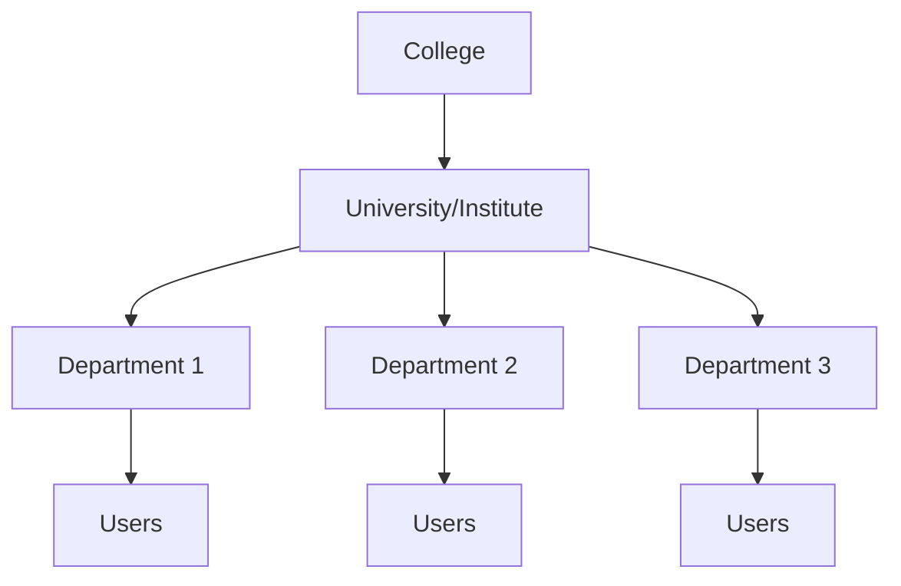

# Multi-Tenancy Feature

Documentation for the multi-tenant college isolation system in PlacementPro.

## Overview

PlacementPro is a multi-tenant platform where:

- Each **college** is a separate tenant
- Users belong to one college (except SUPER_ADMIN)
- Data is isolated between colleges
- Authentication includes college context

## Tenant Model

```
┌─────────────────────────────────────────────────────────────────────────────┐
│                         MULTI-TENANCY ARCHITECTURE                          │
└─────────────────────────────────────────────────────────────────────────────┘

                              ┌───────────────────────┐
                              │    SUPER_ADMIN        │
                              │  (Platform Level)     │
                              │  • Sees all colleges  │
                              │  • No college_id      │
                              └───────────┬───────────┘
                                          │
               ┌──────────────────────────┼──────────────────────────┐
               │                          │                          │
               ▼                          ▼                          ▼
    ┌──────────────────┐       ┌──────────────────┐       ┌──────────────────┐
    │    College A     │       │    College B     │       │    College C     │
    │   (Tenant 1)     │       │   (Tenant 2)     │       │   (Tenant 3)     │
    └────────┬─────────┘       └────────┬─────────┘       └────────┬─────────┘
             │                          │                          │
    ┌────────┴────────┐        ┌────────┴────────┐        ┌────────┴────────┐
    │                 │        │                 │        │                 │
    │  • Users        │        │  • Users        │        │  • Users        │
    │  • Students     │        │  • Students     │        │  • Students     │
    │  • Drives       │        │  • Drives       │        │  • Drives       │
    │  • Applications │        │  • Applications │        │  • Applications │
    │                 │        │                 │        │                 │
    └─────────────────┘        └─────────────────┘        └─────────────────┘
```

## Database Schema

### College Entity

```java
@Entity
@Table(name = "colleges")
public class College {
    @Id
    @GeneratedValue(strategy = GenerationType.IDENTITY)
    private Long id;

    @Column(nullable = false)
    private String name;

    @Column(unique = true, nullable = false)
    private String code;

    @Column(name = "is_active")
    private Boolean isActive = true;

    @OneToMany(mappedBy = "college")
    private List<User> users;
}
```

### User-College Relationship

```java
@Entity
@Table(name = "users")
public class User {
    @Id
    @GeneratedValue(strategy = GenerationType.IDENTITY)
    private Long id;

    @ManyToOne(fetch = FetchType.LAZY)
    @JoinColumn(name = "college_id")
    private College college;  // NULL for SUPER_ADMIN

    @Column(nullable = false)
    @Enumerated(EnumType.STRING)
    private UserRole role;
}
```

### Unique Constraint

```sql
-- Users are unique per college (same email can exist in different colleges)
CONSTRAINT uq_users_email_college UNIQUE(email, college_id)
```

## JWT Claims

The JWT token includes college context:

```json
{
  "sub": "user@college.edu",
  "uid": 123,
  "role": "COORDINATOR",
  "cid": 1,       // <-- College ID
  "ver": 1,
  "iat": 1704067200,
  "exp": 1704153600
}
```

## Data Isolation

### Query Filtering

```java
@Service
public class StudentService {

    public List<Student> getStudents() {
        CustomUserDetails user = getCurrentUser();

        // SUPER_ADMIN sees all
        if (user.getRole() == UserRole.SUPER_ADMIN) {
            return studentRepository.findAll();
        }

        // Others see only their college
        return studentRepository.findByCollegeId(user.getCollegeId());
    }
}
```

### Repository Methods

```java
public interface StudentRepository extends JpaRepository<Student, Long> {

    List<Student> findByCollegeId(Long collegeId);

    Optional<Student> findByIdAndCollegeId(Long id, Long collegeId);

    boolean existsByEmailAndCollegeId(String email, Long collegeId);
}
```

## Authentication Flow

### Login with College Context

```java
@Transactional
public LoginResponseDTO login(LoginRequestDTO request) {
    User user = userRepository.findByEmailWithCollege(request.getEmail())
        .orElseThrow(() -> new AuthenticationException("Invalid credentials"));

    // Verify password...

    // Check college is active (non-super-admin only)
    if (user.getRole() != UserRole.SUPER_ADMIN) {
        College college = user.getCollege();
        if (college == null || !college.getIsActive()) {
            throw new CollegeInactiveException("College is not active");
        }
    }

    // Generate token with college ID
    String token = jwtTokenProvider.generateToken(user);

    return LoginResponseDTO.builder()
        .token(token)
        .collegeId(user.getCollege() != null ? user.getCollege().getId() : null)
        // ...
        .build();
}
```

### Eager College Loading

```java
public interface UserRepository extends JpaRepository<User, Long> {

    @Query("SELECT u FROM User u LEFT JOIN FETCH u.college WHERE u.email = :email")
    Optional<User> findByEmailWithCollege(@Param("email") String email);
}
```

## Role-Based Access per Tenant

### SUPER_ADMIN (Platform)

- Access to all colleges
- No college_id in token (null)
- Can create/manage colleges
- Can manage any user

### ADMIN (College)

- Access to their college only
- college_id in token
- Can manage college settings
- Can manage users within college

### COORDINATOR (College)

- Access to their college only
- Can manage drives for college
- Can view students in college

### STUDENT (College)

- Access to their college only
- Can view/apply to drives in college
- Can manage own profile

## Frontend Handling

### Storing College Context

```javascript
const storeAuthData = (token, userData) => {
    localStorage.setItem('authToken', token);
    localStorage.setItem('userId', userData.id);
    localStorage.setItem('userRole', userData.role);
    if (userData.collegeId) {
        localStorage.setItem('collegeId', userData.collegeId);
    }
};
```

### Using College in API Calls

```javascript
const api = {
    getStudents: async () => {
        const token = localStorage.getItem('authToken');
        // College filtering happens on backend based on token
        const response = await fetch(`${API_URL}/api/v1/students`, {
            headers: {
                'Authorization': `Bearer ${token}`,
            },
        });
        return response.json();
    },
};
```

## Security Considerations

### Data Isolation

1. **Always filter by college_id** in non-SUPER_ADMIN queries
2. **Validate ownership** before operations
3. **Include college_id in unique constraints** where applicable

### Access Control

```java
@PreAuthorize("@securityService.canAccessCollege(#collegeId)")
public void updateCollegeSettings(Long collegeId, SettingsDTO settings) {
    // Only allowed if user belongs to this college or is SUPER_ADMIN
}
```

### Cross-Tenant Protection

```java
public Student getStudent(Long studentId) {
    Student student = studentRepository.findById(studentId)
        .orElseThrow(() -> new NotFoundException("Student not found"));

    CustomUserDetails user = getCurrentUser();

    // Ensure tenant match (unless SUPER_ADMIN)
    if (user.getRole() != UserRole.SUPER_ADMIN
        && !student.getCollegeId().equals(user.getCollegeId())) {
        throw new AccessDeniedException("Cannot access student from another college");
    }

    return student;
}
```

## Testing Multi-Tenancy

### Test Colleges

| Code | Name | Status |
|------|------|--------|
| TU001 | Test University | Active |

### Test Users

| Email | College | Role |
|-------|---------|------|
| student@test.edu | TU001 | STUDENT |
| coordinator@test.edu | TU001 | COORDINATOR |
| admin@test.edu | TU001 | ADMIN |
| superadmin@platform.com | NULL | SUPER_ADMIN |

### Integration Test

```java
@Test
void student_cannot_access_other_college_data() {
    // Login as student from College A
    String tokenA = login("student@collegeA.edu", "password");

    // Try to access student from College B
    mockMvc.perform(get("/api/v1/students/999")  // Student from College B
            .header("Authorization", "Bearer " + tokenA))
        .andExpect(status().isForbidden());
}
```

## Organization Hierarchy

Within each college, there's a hierarchical structure:



### OrganizationUnit Types

| Type | Level | Example |
|------|-------|----------|
| UNIVERSITY | Top | "State University" |
| INSTITUTE | Middle | "Institute of Technology" |
| DEPARTMENT | Leaf | "Computer Science", "Electronics" |

### Scope Resolution

The `OrganizationScopeService` resolves user's operational scope:

```java
@Service
public class OrganizationScopeService {

    public ScopeContext getCurrentUserScope() {
        CustomUserDetails user = getCurrentUser();

        return ScopeContext.builder()
            .collegeId(user.getCollegeId())
            .organizationUnitId(user.getOrganizationUnitId())
            .scopeLevel(determineScopeLevel(user))
            .build();
    }
}
```

### Scope Levels

| Level | Description | Use Case |
|-------|-------------|----------|
| SELF | Only own data | Student viewing profile |
| CHILDREN | Direct children | Coordinator in department |
| SUBTREE | Full descendant tree | Admin across departments |

## Related Documentation

- [ER Diagram](../database/ER-DIAGRAM.md) - Database schema with organization tables
- [Backend Overview](../backend/README.md) - Module architecture
- [Business Workflows](../workflows/BUSINESS-WORKFLOWS.md) - Scope resolution workflow
