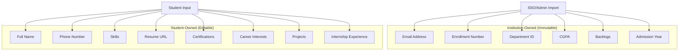
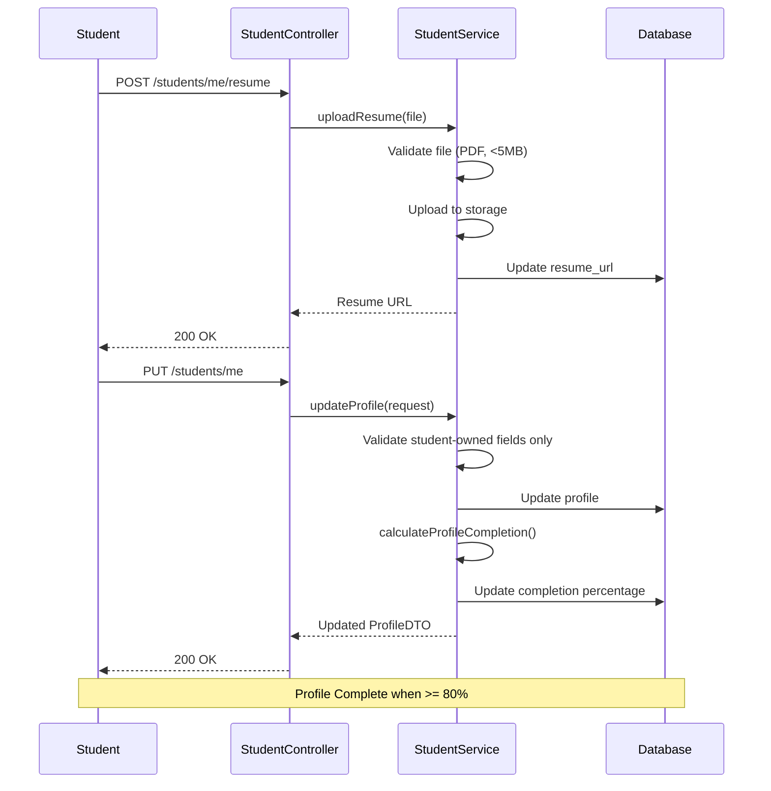
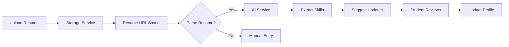

# Student Profiles Feature

## Overview

The Student Profiles module manages student information within the placement system. It enforces a **dual-ownership model** where institution-sourced data is immutable while student-provided data is editable.

---

## Data Ownership Model



---

## Entity Model

### StudentProfile

```java
@Entity
@Table(name = "student_profiles")
public class StudentProfile extends BaseEntity {

    @Id
    @GeneratedValue(strategy = GenerationType.IDENTITY)
    private Long id;

    @OneToOne(fetch = FetchType.LAZY)
    @JoinColumn(name = "user_id", nullable = false, unique = true)
    private User user;

    @ManyToOne(fetch = FetchType.LAZY)
    @JoinColumn(name = "college_id", nullable = false)
    private College college;

    @ManyToOne(fetch = FetchType.LAZY)
    @JoinColumn(name = "department_id", nullable = false)
    private OrganizationUnit department;

    // === Institution-Owned Fields (Immutable) ===

    @Column(name = "enrollment_no", nullable = false, unique = true)
    private String enrollmentNo;

    @Column(nullable = false)
    private Double cgpa;

    @Column(nullable = false)
    private Integer backlogs = 0;

    @Column(name = "admission_year", nullable = false)
    private Integer admissionYear;

    @Column(name = "graduation_year", nullable = false)
    private Integer graduationYear;

    // === Student-Owned Fields (Editable) ===

    @Column(name = "full_name")
    private String fullName;

    @Column(name = "phone_number")
    private String phoneNumber;

    @ElementCollection
    @CollectionTable(name = "student_skills")
    private Set<String> skills = new HashSet<>();

    @Column(name = "resume_url")
    private String resumeUrl;

    @ElementCollection
    @CollectionTable(name = "student_certifications")
    private List<String> certifications = new ArrayList<>();

    @Column(name = "career_interests", columnDefinition = "TEXT")
    private String careerInterests;  // JSON or comma-separated

    @Column(name = "projects_count")
    private Integer projectsCount = 0;

    @Column(name = "internship_months")
    private Integer internshipMonths = 0;

    @Column(name = "linkedin_url")
    private String linkedinUrl;

    @Column(name = "github_url")
    private String githubUrl;

    @Column(name = "portfolio_url")
    private String portfolioUrl;

    // Profile completion
    @Column(name = "profile_complete", nullable = false)
    private Boolean profileComplete = false;

    @Column(name = "profile_completion_percentage")
    private Integer profileCompletionPercentage = 0;
}
```

---

## Database Schema

```sql
CREATE TABLE student_profiles (
    id                      BIGSERIAL PRIMARY KEY,
    user_id                 BIGINT NOT NULL UNIQUE REFERENCES users(id) ON DELETE CASCADE,
    college_id              BIGINT NOT NULL REFERENCES colleges(id),
    department_id           BIGINT NOT NULL REFERENCES organization_units(id),

    -- Institution-Owned (Immutable)
    enrollment_no           VARCHAR(50) NOT NULL UNIQUE,
    cgpa                    DOUBLE PRECISION NOT NULL,
    backlogs                INTEGER NOT NULL DEFAULT 0,
    admission_year          INTEGER NOT NULL,
    graduation_year         INTEGER NOT NULL,

    -- Student-Owned (Editable)
    full_name               VARCHAR(255),
    phone_number            VARCHAR(20),
    resume_url              VARCHAR(500),
    career_interests        TEXT,
    projects_count          INTEGER DEFAULT 0,
    internship_months       INTEGER DEFAULT 0,
    linkedin_url            VARCHAR(500),
    github_url              VARCHAR(500),
    portfolio_url           VARCHAR(500),

    -- Profile Status
    profile_complete        BOOLEAN NOT NULL DEFAULT FALSE,
    profile_completion_percentage INTEGER DEFAULT 0,

    -- Audit
    created_at              TIMESTAMP NOT NULL DEFAULT NOW(),
    updated_at              TIMESTAMP
);

-- Skills (many-to-many concept as collection)
CREATE TABLE student_skills (
    student_profile_id      BIGINT NOT NULL REFERENCES student_profiles(id) ON DELETE CASCADE,
    skill                   VARCHAR(100) NOT NULL,
    PRIMARY KEY (student_profile_id, skill)
);

-- Certifications
CREATE TABLE student_certifications (
    student_profile_id      BIGINT NOT NULL REFERENCES student_profiles(id) ON DELETE CASCADE,
    certification           VARCHAR(255) NOT NULL,
    obtained_date           DATE
);

-- Indexes
CREATE INDEX idx_students_college ON student_profiles(college_id);
CREATE INDEX idx_students_department ON student_profiles(department_id);
CREATE INDEX idx_students_enrollment ON student_profiles(enrollment_no);
CREATE INDEX idx_students_cgpa ON student_profiles(cgpa);
```

---

## API Endpoints

### Get Current Student Profile

```http
GET /api/v1/students/me
Authorization: Bearer <student_token>
```

**Response:**
```json
{
  "success": true,
  "data": {
    "id": 123,
    "userId": 456,
    "email": "john.doe@college.edu",
    "enrollmentNo": "2022CSE001",
    "department": {
      "id": 1,
      "name": "Computer Science"
    },
    "cgpa": 8.5,
    "backlogs": 0,
    "admissionYear": 2022,
    "graduationYear": 2026,
    "fullName": "John Doe",
    "phoneNumber": "+91-9876543210",
    "skills": ["Java", "Python", "SQL", "Spring Boot"],
    "resumeUrl": "https://storage.example.com/resumes/john-doe.pdf",
    "certifications": ["AWS Certified", "Oracle Java SE 11"],
    "projectsCount": 5,
    "internshipMonths": 3,
    "profileComplete": true,
    "profileCompletionPercentage": 85
  }
}
```

### Update Student Profile

```http
PUT /api/v1/students/me
Authorization: Bearer <student_token>
Content-Type: application/json

{
  "fullName": "John Doe",
  "phoneNumber": "+91-9876543210",
  "skills": ["Java", "Python", "SQL", "Spring Boot", "Docker"],
  "resumeUrl": "https://storage.example.com/resumes/john-doe-v2.pdf",
  "certifications": ["AWS Certified", "Oracle Java SE 11", "Docker Certified"],
  "careerInterests": "Backend Development, Cloud Architecture",
  "projectsCount": 6,
  "internshipMonths": 3,
  "linkedinUrl": "https://linkedin.com/in/johndoe",
  "githubUrl": "https://github.com/johndoe"
}
```

### Upload Resume

```http
POST /api/v1/students/me/resume
Authorization: Bearer <student_token>
Content-Type: multipart/form-data

file: <resume.pdf>
```

**Response:**
```json
{
  "success": true,
  "data": {
    "resumeUrl": "https://storage.example.com/resumes/2022CSE001-resume.pdf",
    "uploadedAt": "2026-01-11T10:30:00"
  }
}
```

### List Students (Coordinator)

```http
GET /api/v1/students?page=0&size=20&department=1&minCgpa=7.0
Authorization: Bearer <coordinator_token>
```

### Get Student by ID (Coordinator)

```http
GET /api/v1/students/{studentId}
Authorization: Bearer <coordinator_token>
```

### Admin Update (Institution Fields)

```http
PUT /api/v1/admin/students/{studentId}
Authorization: Bearer <admin_token>
Content-Type: application/json

{
  "cgpa": 8.7,
  "backlogs": 0
}
```

---

## Service Layer

### StudentService Interface

```java
public interface StudentService {

    StudentProfileDTO getCurrentStudentProfile();

    StudentProfileDTO getStudentById(Long id);

    StudentProfileDTO updateProfile(UpdateStudentProfileRequest request);

    String uploadResume(MultipartFile file);

    Page<StudentProfileDTO> getStudents(StudentFilterRequest filter, Pageable pageable);

    void adminUpdateStudent(Long id, AdminUpdateStudentRequest request);

    Integer calculateProfileCompletion(StudentProfile profile);
}
```

### StudentServiceImpl

```java
@Service
@RequiredArgsConstructor
@Transactional
public class StudentServiceImpl implements StudentService {

    private final StudentRepository studentRepository;
    private final OrganizationScopeService scopeService;
    private final StorageService storageService;

    @Override
    public StudentProfileDTO getCurrentStudentProfile() {
        User currentUser = SecurityUtils.getCurrentUser();

        return studentRepository.findByUserId(currentUser.getId())
            .map(this::toDTO)
            .orElseThrow(() -> new ResourceNotFoundException(
                "Student profile not found for user: " + currentUser.getEmail()
            ));
    }

    @Override
    public StudentProfileDTO updateProfile(UpdateStudentProfileRequest request) {
        User currentUser = SecurityUtils.getCurrentUser();
        StudentProfile profile = studentRepository.findByUserId(currentUser.getId())
            .orElseThrow(() -> new ResourceNotFoundException("Profile not found"));

        // Only update student-owned fields
        if (request.getFullName() != null) {
            profile.setFullName(request.getFullName());
        }
        if (request.getPhoneNumber() != null) {
            profile.setPhoneNumber(request.getPhoneNumber());
        }
        if (request.getSkills() != null) {
            profile.setSkills(new HashSet<>(request.getSkills()));
        }
        if (request.getCertifications() != null) {
            profile.setCertifications(request.getCertifications());
        }
        // ... other student-owned fields

        // Recalculate profile completion
        profile.setProfileCompletionPercentage(calculateProfileCompletion(profile));
        profile.setProfileComplete(profile.getProfileCompletionPercentage() >= 80);

        StudentProfile saved = studentRepository.save(profile);
        return toDTO(saved);
    }

    @Override
    public Integer calculateProfileCompletion(StudentProfile profile) {
        int score = 0;
        int totalFields = 10;

        if (profile.getFullName() != null && !profile.getFullName().isEmpty()) score++;
        if (profile.getPhoneNumber() != null && !profile.getPhoneNumber().isEmpty()) score++;
        if (profile.getSkills() != null && !profile.getSkills().isEmpty()) score++;
        if (profile.getResumeUrl() != null && !profile.getResumeUrl().isEmpty()) score++;
        if (profile.getCertifications() != null && !profile.getCertifications().isEmpty()) score++;
        if (profile.getCareerInterests() != null && !profile.getCareerInterests().isEmpty()) score++;
        if (profile.getProjectsCount() != null && profile.getProjectsCount() > 0) score++;
        if (profile.getLinkedinUrl() != null && !profile.getLinkedinUrl().isEmpty()) score++;
        if (profile.getGithubUrl() != null && !profile.getGithubUrl().isEmpty()) score++;
        if (profile.getPortfolioUrl() != null && !profile.getPortfolioUrl().isEmpty()) score++;

        return (score * 100) / totalFields;
    }

    @Override
    @PreAuthorize("hasAnyRole('COORDINATOR', 'ADMIN')")
    public Page<StudentProfileDTO> getStudents(StudentFilterRequest filter, Pageable pageable) {
        ScopeContext scope = scopeService.getCurrentUserScope();

        return studentRepository.findByCollegeIdAndFilters(
            scope.getCollegeId(),
            filter.getDepartmentId(),
            filter.getMinCgpa(),
            filter.getMaxBacklogs(),
            filter.getGraduationYear(),
            pageable
        ).map(this::toDTO);
    }
}
```

---

## Repository Queries

### StudentRepository

```java
@Repository
public interface StudentRepository extends JpaRepository<StudentProfile, Long> {

    Optional<StudentProfile> findByUserId(Long userId);

    Optional<StudentProfile> findByEnrollmentNo(String enrollmentNo);

    // Scope-aware queries
    @Query("""
        SELECT s FROM StudentProfile s
        WHERE s.college.id = :collegeId
        AND (:departmentId IS NULL OR s.department.id = :departmentId)
        AND (:minCgpa IS NULL OR s.cgpa >= :minCgpa)
        AND (:maxBacklogs IS NULL OR s.backlogs <= :maxBacklogs)
        AND (:graduationYear IS NULL OR s.graduationYear = :graduationYear)
        """)
    Page<StudentProfile> findByCollegeIdAndFilters(
        @Param("collegeId") Long collegeId,
        @Param("departmentId") Long departmentId,
        @Param("minCgpa") Double minCgpa,
        @Param("maxBacklogs") Integer maxBacklogs,
        @Param("graduationYear") Integer graduationYear,
        Pageable pageable
    );

    // Find by skills
    @Query("""
        SELECT DISTINCT s FROM StudentProfile s
        JOIN s.skills skill
        WHERE s.college.id = :collegeId
        AND skill IN :skills
        """)
    List<StudentProfile> findByCollegeIdAndSkillsIn(
        @Param("collegeId") Long collegeId,
        @Param("skills") Set<String> skills
    );

    // Count by department
    @Query("""
        SELECT s.department.name, COUNT(s)
        FROM StudentProfile s
        WHERE s.college.id = :collegeId
        GROUP BY s.department.name
        """)
    List<Object[]> countByDepartment(@Param("collegeId") Long collegeId);

    // Eligible for drive
    @Query("""
        SELECT s FROM StudentProfile s
        WHERE s.college.id = :collegeId
        AND s.cgpa >= :minCgpa
        AND s.backlogs <= :maxBacklogs
        AND s.department.id IN :departmentIds
        """)
    List<StudentProfile> findEligibleForDrive(
        @Param("collegeId") Long collegeId,
        @Param("minCgpa") Double minCgpa,
        @Param("maxBacklogs") Integer maxBacklogs,
        @Param("departmentIds") Set<Long> departmentIds
    );
}
```

---

## Profile Completion Workflow



---

## Resume Parsing Integration



### Resume Parser API

```http
POST /api/v1/resume/parse
Content-Type: multipart/form-data

file: <resume.pdf>
```

**Response:**
```json
{
  "success": true,
  "extractedData": {
    "name": "John Doe",
    "email": "john@example.com",
    "phone": "+91-9876543210",
    "skills": ["Python", "Java", "Machine Learning", "SQL"],
    "education": [
      {
        "degree": "B.Tech Computer Science",
        "institution": "XYZ College",
        "year": 2026
      }
    ],
    "experience": [
      {
        "title": "Software Intern",
        "company": "Tech Corp",
        "duration": "3 months"
      }
    ],
    "certifications": ["AWS Cloud Practitioner"]
  }
}
```

---

## Validation Rules

### Phone Number
```java
@Pattern(regexp = "^\\+?[1-9]\\d{9,14}$", message = "Invalid phone number")
private String phoneNumber;
```

### Skills
```java
@Size(max = 30, message = "Maximum 30 skills allowed")
private Set<String> skills;
```

### Resume URL
```java
@URL(message = "Invalid resume URL")
@Size(max = 500)
private String resumeUrl;
```

---

## Error Responses

| Scenario | Status | Message |
|----------|--------|---------|
| Profile not found | 404 | "Student profile not found" |
| Invalid phone format | 400 | "Invalid phone number format" |
| Resume too large | 400 | "Resume file exceeds 5MB limit" |
| Invalid file type | 400 | "Only PDF files are accepted" |
| Attempt to modify CGPA | 403 | "Cannot modify institution-owned field: cgpa" |
| Enrollment conflict | 409 | "Enrollment number already exists" |

---

## Admin Operations

### Bulk Import Students

```http
POST /api/v1/admin/students/import
Authorization: Bearer <admin_token>
Content-Type: multipart/form-data

file: <students.csv>
```

**CSV Format:**
```csv
enrollment_no,email,department,cgpa,backlogs,admission_year,graduation_year
2022CSE001,john@college.edu,CSE,8.5,0,2022,2026
2022CSE002,jane@college.edu,CSE,9.0,0,2022,2026
```

### Update CGPA/Backlogs (After Semester)

```http
PATCH /api/v1/admin/students/batch-update
Authorization: Bearer <admin_token>
Content-Type: application/json

{
  "updates": [
    {"enrollmentNo": "2022CSE001", "cgpa": 8.7, "backlogs": 0},
    {"enrollmentNo": "2022CSE002", "cgpa": 9.1, "backlogs": 0}
  ]
}
```

---

## Related Documentation

- [Authentication](authentication.md)
- [Applications Feature](applications.md)
- [Eligibility Feature](eligibility.md)
- [Multi-Tenancy](multi-tenancy.md)
