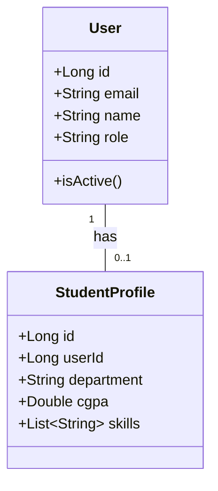

cm# UML Diagrams

This directory is reserved for UML-based project documentation.

## Planned Diagrams

### Class Diagrams
- [ ] Backend module class diagrams
- [ ] AI service class diagrams
- [ ] Frontend component diagrams

### Sequence Diagrams
- [ ] User authentication flow
- [ ] Eligibility check flow
- [ ] Drive application flow

### Use Case Diagrams
- [ ] Student use cases
- [ ] TPO/Admin use cases

### Activity Diagrams
- [ ] Placement drive lifecycle
- [ ] Application status transitions

## Tools for Creating Diagrams

- **Mermaid** - Text-based diagrams in Markdown
- **PlantUML** - Code-based UML generation
- **Draw.io** - Visual diagramming tool

## Example Mermaid Class Diagram

---

*Diagrams will be added during detailed design phase.*
