# Business Workflows

## Overview

This document details the key business workflows in PlacementPro, including sequence diagrams and state transitions.

---

## 1. User Authentication Workflow

### Login Flow

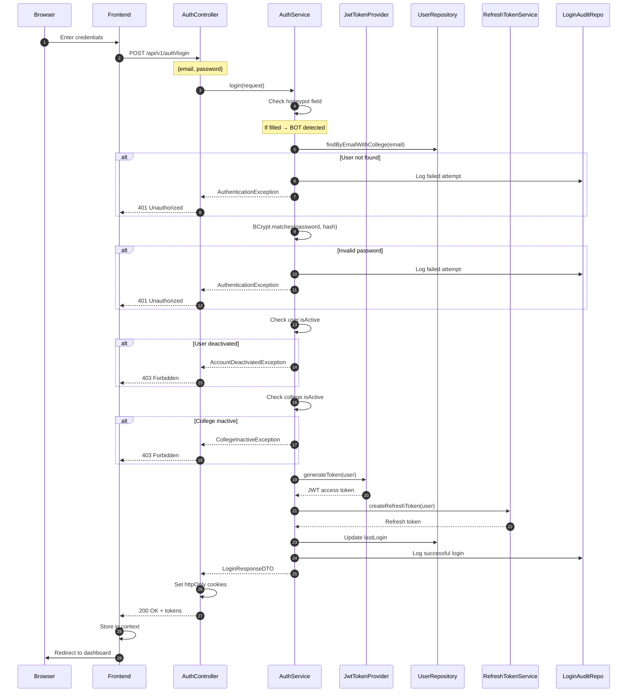

### Token Refresh Flow

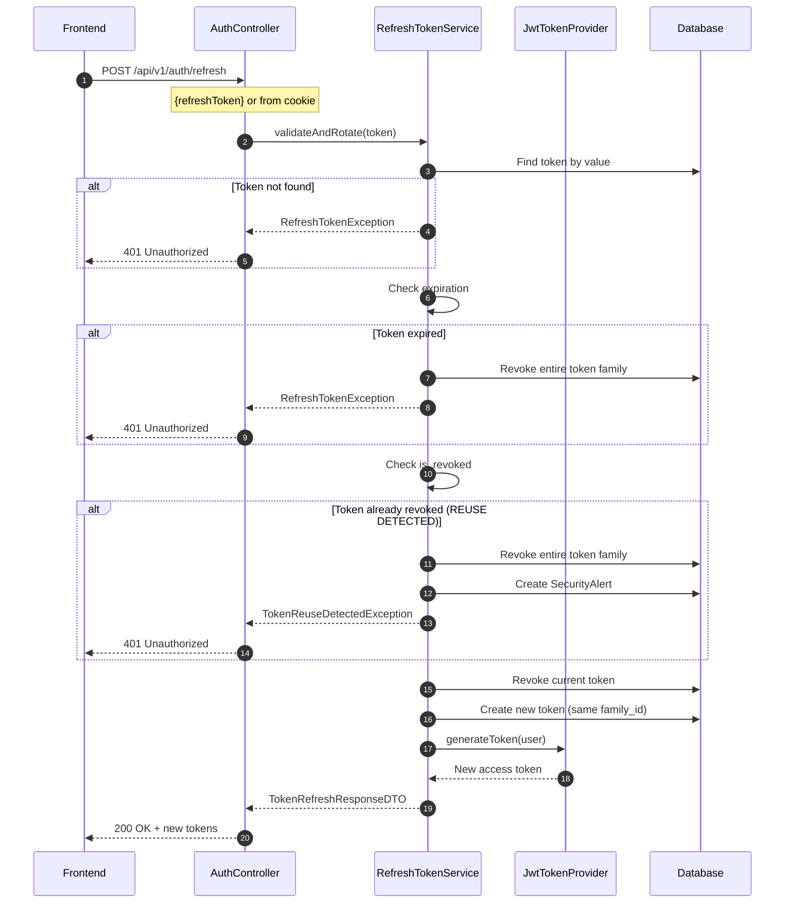

---

## 2. Placement Drive Workflow

### Drive Creation Flow

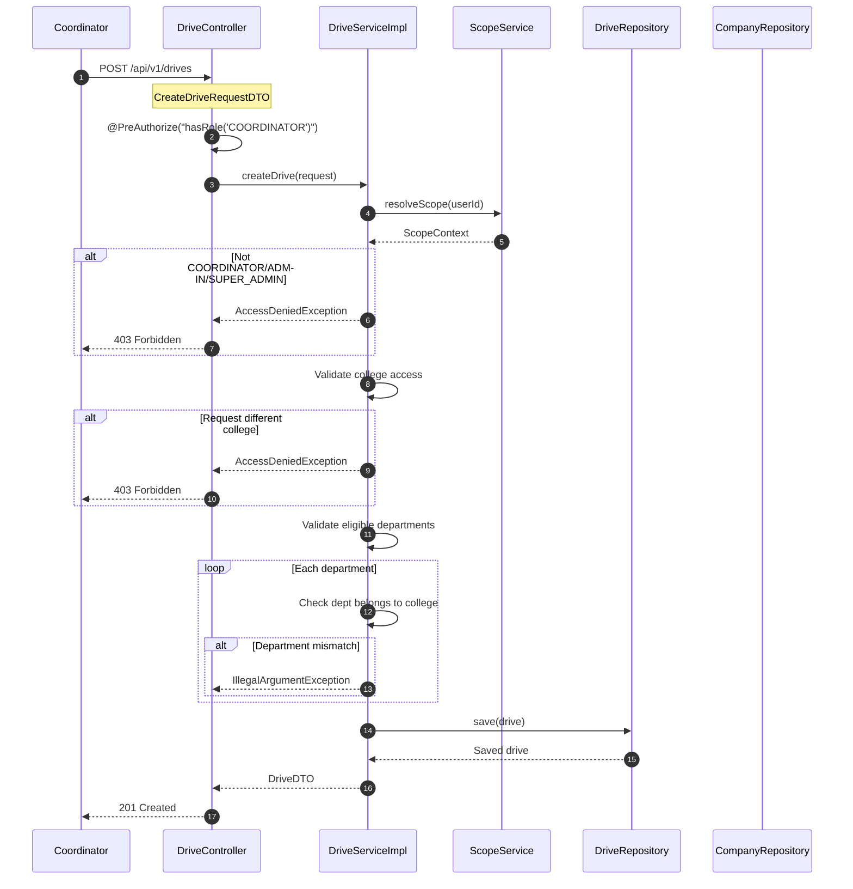

### Drive Status Lifecycle

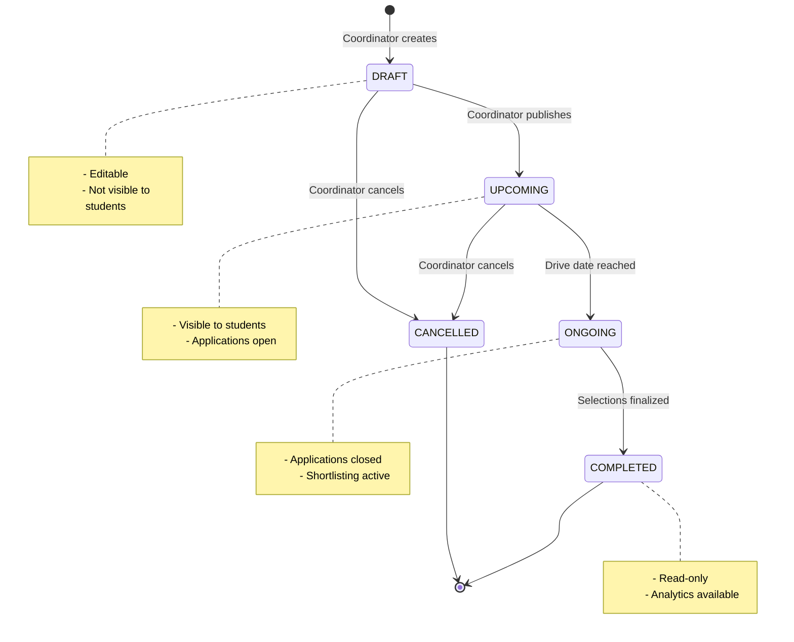

---

## 3. Application Workflow

### Student Application Flow

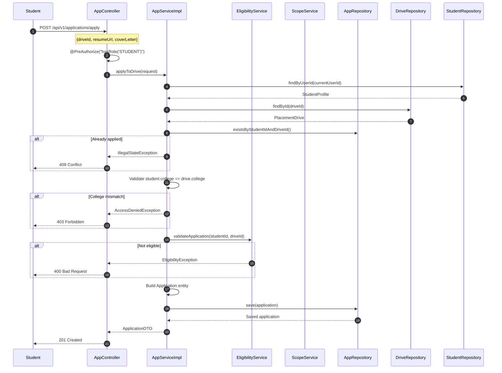

### Application Status Workflow

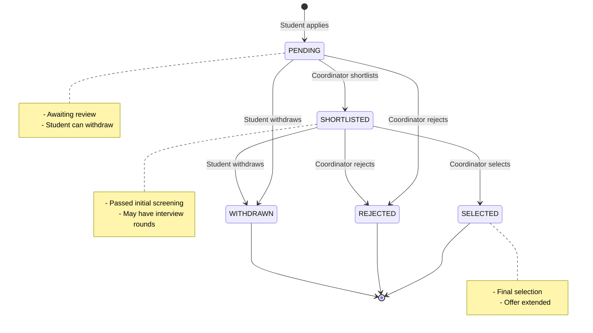

### Status Update Flow

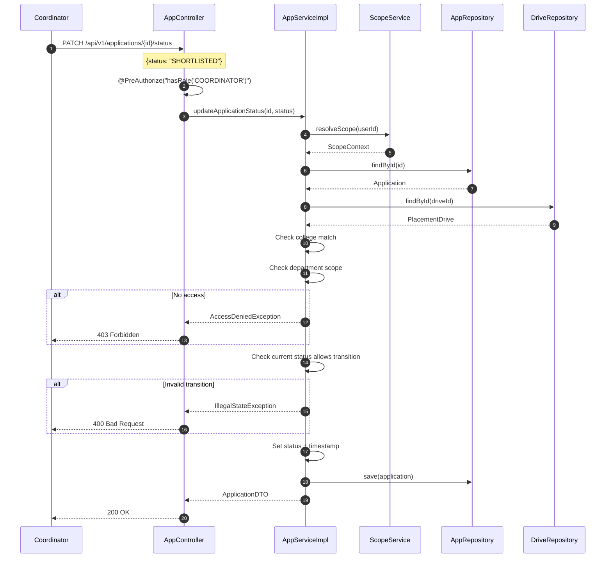

---

## 4. Eligibility Check Workflow

### Eligibility Calculation Flow

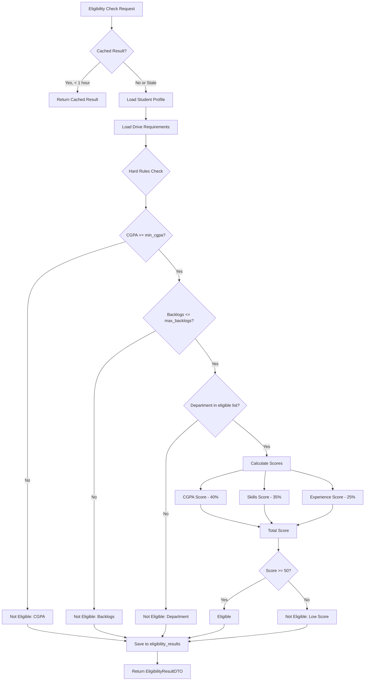

### AI Enhancement Flow (Optional)

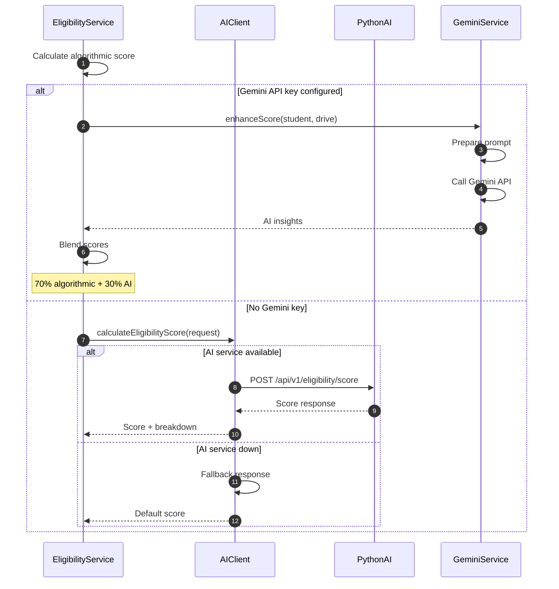

---

## 5. Scope Resolution Workflow

### Scope Resolution Algorithm

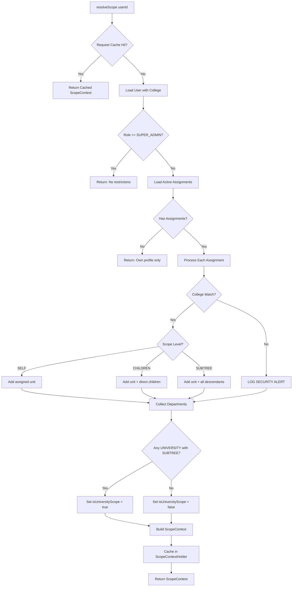

### Scope-Based Data Access

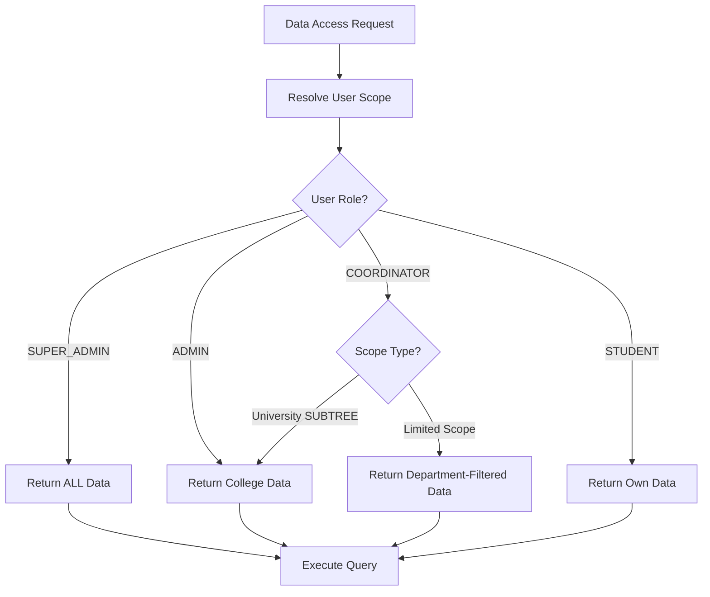

---

## 6. Password Reset Workflow

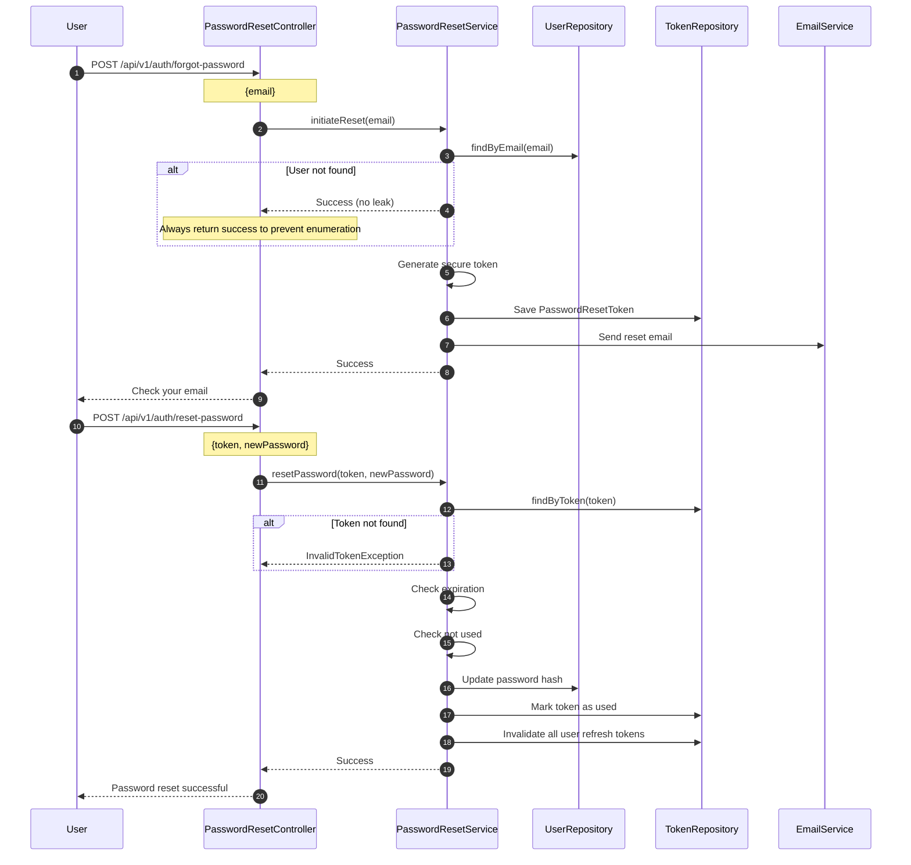

---

## Related Documentation

- [Authentication Feature](../backend/README.md#auth-module)
- [Authorization Feature](../backend/README.md#security-module)
- [API Specifications](../api-specs.md)
- [Database Schema](database/ER-DIAGRAM.md)
